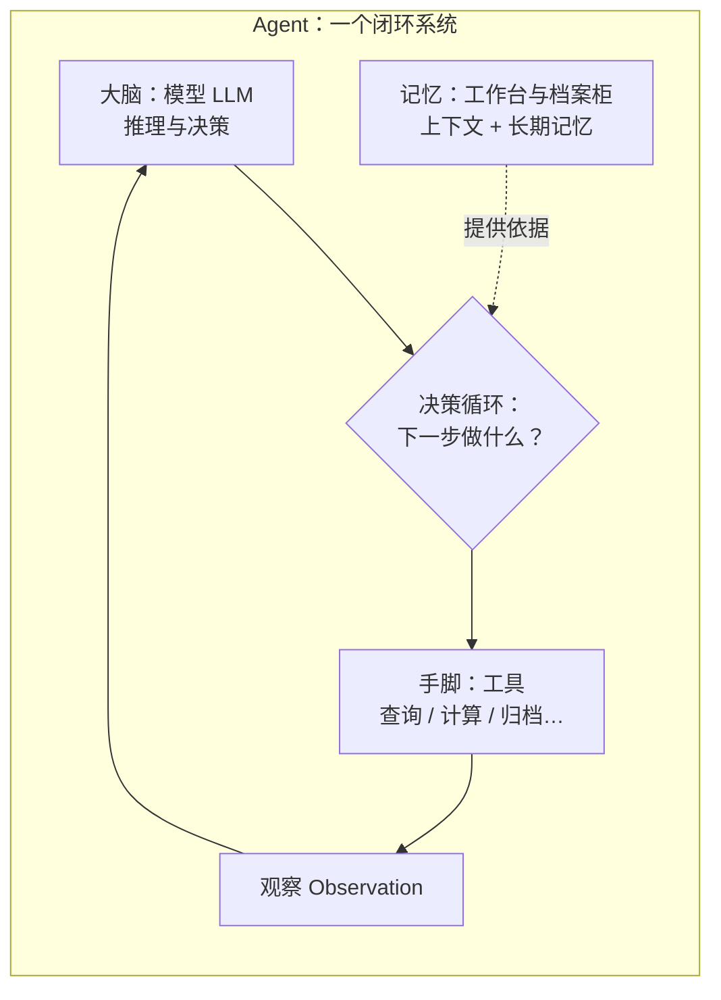
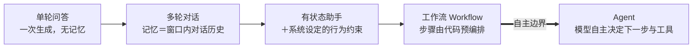
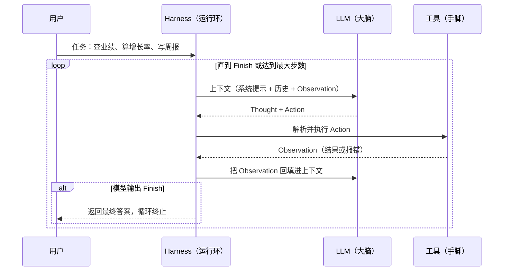

# 01-Agent 的边界、ReAct、Harness、工作流与自主

> 阿零诞生了——一个只会「说话」的聊天机器。用户给它下了一个复合任务：「先查一下本周业绩，再算算增长率，最后写一份周报。」
> 阿零一口气全做完了：数据是编的，增长率是蒙的，周报倒是写得漂漂亮亮。
> 用户盯着满屏自信的假话，问：「你能不能动起来——先查、再算、再写，一步一步来，每一步都让我看得见？」
> 阿零沉默了。它第一次意识到：「一次生成一段像样的文字」和「一步一步把事情做对」，是两件完全不同的事。

## 本节要解决的问题

| 要解决的问题 | 对应内容 |
| --- | --- |
| 什么是 Agent？它和聊天机器人、RAG 流水线、工作流的分界在哪里？ | 核心概念 (b) LLM 应用光谱 |
| Agent 如何「自主决策」？决策权到底在代码手里还是模型手里？ | 核心概念 (c) 自主度光谱 |
| ReAct 循环是什么？「思考—行动—观察」如何闭环并纠错？ | 核心概念 (d) ReAct |
| 谁在驱动这个循环？模型自己在跑吗？ | 核心概念 (e) Harness |
| 一个能跑起来的最小 Agent 长什么样？ | 代码实战 |

## 故事引入

阿零刚出生时，只是一个预训练大模型——一个只会「预测下一个 token」的工厂（想了解它出生的工作原理，可以回看 [../04-LLM大模型/教学/11-预训练循环.ipynb](../04-LLM大模型/教学/11-预训练循环.ipynb)）。你问它一句话，它回你一段话：这是「一次生成」。一次生成的模型没有「做事」的能力——它没有手，没有眼睛，也不知道自己说的对不对，因为没有任何真实世界的反馈会回到它这里。

后来有人给阿零接了一条叫 RAG（Retrieval-Augmented Generation，检索增强生成）的流水线：先检索资料，再拼进提示词，最后生成答案（详见 [../04-LLM大模型/教学/15-RAG与Agent.ipynb](../04-LLM大模型/教学/15-RAG与Agent.ipynb)）。阿零第一次「查了资料」，但它很快发现：这条流水线的每一步都是写死的——先检索、再拼接、再生成，顺序固定，由开发者的代码决定。模型只是流水线末端一个被动的「生成器」。

本章要让阿零完成一次跃迁：从「一次生成」到「循环生成」。所谓「会说话」，是生成一段文字；所谓「会做事」，是在一个循环里反复回答同一个问题——「下一步做什么？」——然后真的去做，看看结果，再决定再下一步。「会说话」只需要一个模型；「会做事」需要一个系统：模型负责想，工具负责做，记忆负责记，还有一个「运行环」（Harness）负责把所有环节串起来并保证循环不会失控。这就是 Agent。

## 核心概念

### (a) 🧠 Agent 三要素：大脑、工作台与手脚

先给一个全书通用的工作定义：

> **Agent（智能体）**：一个以 LLM 为核心决策组件的系统。它感知环境（通过上下文与工具的 Observation），自主决定下一步行动，执行行动（通常通过工具），并观察行动结果，形成闭环，直到目标达成。

拆开看，一个 Agent 由三要素构成：

- **模型（大脑）**：负责推理与决策，回答「下一步做什么」。
- **记忆（工作台与档案柜）**：工作台是短期上下文（对话历史、观察结果），档案柜是长期记忆（用户信息、知识库，后续章节展开）；两者共同支撑「它记得什么」。
- **工具（手脚）**：让 Agent 能作用于外部世界——查询、计算、写文件、调 API（后续章节展开）。

三者在循环中协作，而不是简单串成一条直线：



一句话记忆：**没有循环的不是 Agent，没有工具的单模型只是会说话，没有记忆的 Agent 是金鱼。**

### (b) 🌈 LLM 应用光谱：从单轮问答到 Agent

「聊天机器人」到「Agent」不是两个孤立的类别，而是一段连续的光谱。随着记忆变长、行为约束变复杂、决策权逐步移交，系统沿着光谱从「一次生成」滑向「自主循环」：



光谱左端的单轮问答（Q&A）只做一次生成；多轮对话把对话历史当作记忆；有状态助手（如带了工具与系统提示的客服）已经可以调用固定工具，但「何时调用」仍由代码决定；工作流（Workflow）把多步任务拆成固定的步骤图（DAG，有向无环图），每一步可能是提示词模板、可能是代码，顺序写死。

**边界只有一个判定问题：是否存在「模型自主决定下一步行动与工具」的循环。** RAG 流水线虽然会「查资料」，但检索步骤由代码固定触发，因此它属于工作流一侧，而不是 Agent（更细的对比见 [../04-LLM大模型/教学/15-RAG与Agent.ipynb](../04-LLM大模型/教学/15-RAG与Agent.ipynb)）。反过来，只要模型在循环里拥有「选哪把工具、做哪一步」的决定权，哪怕只有三个玩具工具，它也已经是一个 Agent 的雏形。

### (c) 🎚️ 自主度光谱：该用 Agent 吗？

把决策权的大小画成一条轴，从完全写死到完全自主：

    hardcoded（写死代码）→ 模板（提示词模板）→ 工作流（预编排步骤）→ Agent（自主循环）

决策原则很朴素：**步骤固定、可预编程、失败代价高的场景，别用 Agent。** 比如「用户下单 → 扣库存 → 发确认邮件」，任何一步都不该让模型即兴发挥；比如延迟敏感的接口，多轮 LLM 循环的延迟和成本都不可接受。Agent 适合的是另一类任务：目标明确但路径开放——「帮我调研一下这个方向，写份报告」，没人能预写这条路该怎么走。

一个实用的判断清单：

1. 任务的步骤是不是固定的？固定 → 工作流。
2. 每一步是不是都能写死成规则？能 → 模板或代码。
3. 模型搞砸的代价能不能承受？不能 → 加护栏或退回工作流。
4. 目标开放、需要动态规划与工具反馈？→ 才轮到 Agent。

### (d) 🔁 ReAct：思考、行动、观察的闭环

ReAct（2022，Yao 等人《ReAct: Synergizing Reasoning and Acting in Language Models》）是让模型学会「边想边做」的经典框架，名字是 Reason（推理）+ Act（行动）的组合。它的核心是把一次生成的输出，变成一行行交错的结构化文本：先写 Thought（此刻的推理），再写 Action（调用哪个工具、传什么参数），工具返回后把结果作为 Observation 追加回上下文；模型看到 Observation 再写下一个 Thought，如此闭环：



Thought 不是装饰品，它有三个作用：**第一，把推理显式化**——模型把中间推理写出来，每一步「为什么这么干」都可检查、可审计；**第二，给后续行动提供依据**——推理链条是模型自己的「备忘录」；**第三，可以被 Observation 修正**——这是 ReAct 相对 CoT 最本质的进步。CoT（Chain-of-Thought，Wei 等人 2022《Chain-of-Thought Prompting Elicits Reasoning in Large Language Models》）只让模型把推理过程写出来，但推理完就结束了：模型不行动，也收不到任何环境反馈——想错了就是错了，没人纠正。ReAct 行动后拿到 Observation，等于给推理接上了「现实校验器」：假设错了，观察结果会把它推翻。

### (e) 🦴 Harness：身体与神经系统

模型是大脑，但大脑不会自己呼吸。在真实 Agent 系统里，驱动循环的不是模型，而是一层叫 **Harness**（也叫运行时 Runtime / 执行环）的程序——它是 Agent 的「身体与神经系统」。Harness 的核心职责有一张明确的清单：

- **上下文组装**：把系统提示、对话历史、Observation 拼成一次模型输入；
- **工具执行**：解析 Action、调用工具、捕获结果或异常；
- **Observation 回填**：把工具结果写回上下文，供模型下一步推理；
- **错误处理**：输出格式非法、工具不存在、工具抛异常，都要兜住而不是让整个程序崩溃；
- **终止条件**：任务完成 / 最大步数 / 无进展检测，防止 Agent 无限绕圈。

因此准确的说法是：**LLM 是 Harness 的一个组件，而不是 Agent 本身。** Agent = 模型 + 记忆 + 工具 + 循环，而「循环」由 Harness 承载。同一个模型，配上不同的 Harness，可以是谨慎的客服、激进的研究员或守规矩的写码工——性格差异来自 Harness 的约束与提示策略。把「清点上下文、催促模型、收拾残局、及时喊停」这些杂活全部交给 Harness 后，模型才能专心扮演大脑。

## 深入原理

把三种「让模型做事」的范式放在一起对比：

| 维度 | CoT（Chain-of-Thought） | ReAct | Plan-and-Execute |
| --- | --- | --- | --- |
| 代表作 | Wei 等人 2022《Chain-of-Thought Prompting Elicits Reasoning in Large Language Models》 | Yao 等人 2022《ReAct: Synergizing Reasoning and Acting in Language Models》 | Plan-and-Solve（Wang 等人 2023）等 |
| 是否行动 | 否，纯文本推理 | 是，推理与行动交错 | 先整体规划，再逐项执行 |
| 环境反馈 | 无 | 有，Observation 回填 | 通常无，除非显式加重规划机制 |
| 纠错能力 | 弱：想错即错 | 中：Observation 可纠偏，但也可能来回震荡 | 中：计划过期则步步出错 |
| 成本 | 低 | 中到高：多轮工具调用 | 中：一次规划 + 多次执行 |
| 适用场景 | 数学、逻辑推理题 | 需要外部信息或工具的交互任务 | 步骤多、周期长的稳定任务 |

再放大「工作流 vs Agent」这个最容易被追问的对比：

| 维度 | 工作流 Workflow | Agent |
| --- | --- | --- |
| 决策权 | 开发者：步骤写在代码里 | 模型：循环中自主决定下一步 |
| 可解释性 | 高：执行路径固定可见 | 中：依赖 Thought 轨迹，可能绕路 |
| 成本与延迟 | 低且可控 | 高：多次 LLM 调用 |
| 稳定性 | 高：同样输入同样路径 | 中低：需要终止条件等护栏 |
| 适用场景 | 步骤固定、可预编程、零风险容忍 | 开放式目标、动态规划、工具反馈修正 |

## 代码实战

下面用约 70 行 Python 手写一个最小 ReAct Agent：三个玩具工具（lookup 查询、calculator 计算、mark_done 归档）、固定的 system prompt，以及最简 Harness 循环——「生成 thought+action → 解析 → 执行 → 追加 observation」，带「完成」与「最大步数」两个终止条件。模型部分用规则脚本 mock（真实项目里是对 LLM 的 API 调用），随机种子固定，输出可复现。

```python
"""最小 ReAct Agent：手写 Reason→Act→Observation 闭环（教学示例，外部接口全部 mock）。"""
import random
import re
random.seed(42)  # 固定随机种子，保证输出可复现

# ---------- 1) 玩具工具 registry：阿零的「手脚」 ----------
def tool_lookup(term: str) -> str:
    db = {"阿零": "阿零：一个由 transformer 组成的数字学徒。",
          "本周业绩": "本周业绩：修复 3 个 bug，上线 1 个功能，未获表扬。"}
    return db.get(term, "未找到词条。")
def tool_calculator(expr: str) -> str:
    if not re.fullmatch(r"[\d+\-*/().\s]+", expr):   # 白名单校验，堵住注入
        return "非法表达式。"
    return str(eval(expr))  # 教学示例；真实系统严禁 eval，应换安全求值器
def tool_mark_done(task: str) -> str:
    return f"已完成并归档：{task}"
TOOLS = {"lookup": tool_lookup, "calculator": tool_calculator, "mark_done": tool_mark_done}

# ---------- 2) 固定 system prompt：阿零的行为守则 ----------
SYSTEM_PROMPT = """你是阿零，一个能用工具完成多步任务的助手。
每轮严格按以下格式输出：
Thought: <一句话推理>
Action: <工具名>(<参数>)
任务完成时输出：
Thought: <一句话总结>
Action: Finish(<最终结论>)
可用工具：lookup(词条)、calculator(表达式)、mark_done(任务)。"""

# ---------- 3) mock 大脑：真实项目里此处是 LLM API 调用 ----------
def mock_llm(messages: list) -> str:
    """用规则脚本模拟模型的「自主」决策（固定种子下行为确定）。"""
    last = messages[-1]["content"]
    if "查一下阿零是谁" in last:
        return "Thought: 先查词条再总结。\nAction: lookup(阿零)"
    if "Observation: 阿零" in last:
        return "Thought: 查到了，总结并结束。\nAction: Finish(阿零是一个由 transformer 组成的数字学徒。)"
    if "计算 137*41" in last:
        return "Thought: 交给计算器。\nAction: calculator(137*41)"
    if "Observation: 5617" in last:
        return "Thought: 结果正确，把它归档。\nAction: mark_done(137*41 的计算结果 5617)"
    if "已完成并归档" in last:
        return "Thought: 已归档，任务完成。\nAction: Finish(计算 137*41 = 5617，已归档)"
    return "Thought: 信息不足，如实说明。\nAction: Finish(无法完成任务)"

# ---------- 4) Harness：驱动循环的「身体与神经系统」 ----------
def run_agent(task: str, max_steps: int = 5) -> None:
    messages = [{"role": "system", "content": SYSTEM_PROMPT},
                {"role": "user", "content": f"需要完成的任务：{task}"}]
    for step in range(1, max_steps + 1):
        reply = mock_llm(messages)                  # ① 大脑产出 Thought + Action
        print(f"[step {step}] {reply.replace(chr(10), ' | ')}")
        thought = re.search(r"Thought:\s*(.+)", reply)
        action = re.search(r"Action:\s*(\w+)\(([^)]*)\)", reply)
        if not (thought and action):                # ② 解析失败 → 错误处理
            print("  ✗ 输出格式非法，终止循环")
            break
        name, arg = action.groups()
        if name == "Finish":                        # ③ 终止条件 1：任务完成
            print(f"  ✓ 结果：{arg}")
            break
        if name not in TOOLS:                       # ④ 工具不存在 → 报错回填
            obs = f"错误：未知工具 {name}"
        else:
            try:
                obs = TOOLS[name](arg)              # ⑤ 执行工具（手脚）
            except Exception as e:                  # ⑥ 异常也回填给模型
                obs = f"错误：{e}"
        messages += [{"role": "assistant", "content": reply},
                     {"role": "user", "content": f"Observation: {obs}"}]
    else:                                           # ⑦ 终止条件 2：最大步数
        print("  ✗ 已达最大步数，被迫停止")

if __name__ == "__main__":
    run_agent("查一下阿零是谁，并总结")
    print("---")
    run_agent("计算 137*41 并归档")
```

输出示意：

```
[step 1] Thought: 先查词条再总结。 | Action: lookup(阿零)
[step 2] Thought: 查到了，总结并结束。 | Action: Finish(阿零是一个由 transformer 组成的数字学徒。)
  ✓ 结果：阿零是一个由 transformer 组成的数字学徒。
--- ……（第二个任务中间步骤略，收尾如下）
[step 3] Thought: 已归档，任务完成。 | Action: Finish(计算 137*41 = 5617，已归档)
```

请留意两点：第一，第二步的模型并没有「重做」任务，它只是收到 Observation 后决定收尾——这就是循环的威力：**每一轮的新信息都会改变下一轮的决策**。第二，如果模型一直输出同样的 Action 绕圈，`max_steps` 会在第 5 步强制喊停；真实系统里还要加上「无进展检测」（连续 N 轮 Observation 不变就终止）。

## 面试考点

**Q1：ReAct 与 CoT 的核心区别是什么？**
A：CoT（Wei 等人 2022）只让模型把推理过程显式写出来，但不行动，也收不到环境反馈，想错了没人纠正；ReAct（2022）让模型在推理（Reason）与行动（Act）之间交替，工具返回的 Observation 回填进上下文，用真实反馈修正下一步推理。一句话：CoT 只「想」，ReAct 边「想」边「做」边「看」。

**Q2：Agent 与工作流的区别是什么？**
A：分界在决策权。工作流的步骤由开发者在代码里预编排，模型只是被调用的组件，执行路径固定、可解释、稳定；Agent 中模型在循环里自主决定「下一步做什么、用哪把工具」，路径开放、成本更高，需要护栏。判定问题只有一个：是否存在模型自主驱动「下一步与工具」的循环。

**Q3：自主度怎么选？哪些场景明确不该用 Agent？**
A：自主度从低到高是 hardcoded → 模板 → 工作流 → Agent。步骤固定、可预编程、失败代价高、延迟敏感的场景不该用 Agent——例如支付链路、扣库存、定时任务；Agent 用于目标开放、路径不可预写、需要动态规划与工具反馈的任务。

**Q4：Harness 里谁负责什么？为什么「模型 ≠ Agent」？**
A：Harness（运行时/执行环）负责上下文组装、工具执行、Observation 回填、错误处理与终止条件（完成/最大步数/无进展）。LLM 只是 Harness 的一个组件（大脑）；Agent = 模型 + 记忆 + 工具 + 循环，循环由 Harness 承载。所以要「造一个 Agent」，关键工程在 Harness 而不在模型本身。

**Q5：为什么只靠一个 LLM 不够，Agent 必须配记忆和工具？**
A：单模型有三重局限：一是知识截止与幻觉，不知道的会编（需要工具 + 外部检索）；二是无状态，说完就忘（需要记忆）；三是无行动能力，只能输出文字、改变不了世界（需要工具的 function calling）。工具补「手脚」，记忆补「来龙去脉」，两者让循环里每一步决策都建立在事实与历史上。

**Q6：Agent 的循环什么时候停止？**
A：常见终止条件有四类：任务完成（模型输出 Finish / 结束标记）、达到最大步数、无进展检测（连续重复动作或 Observation 不变）、预算/超时护栏（成本上限、响应时限）。真实产品通常组合使用，宁可误停也不让 Agent 无限绕圈。

## 小结与下一章预告

阿零在今天拿到了两件东西：一是认清了自己的本质——一个由模型（大脑）、记忆（工作台）、工具（手脚）与 Harness（循环）组成的闭环系统；二是学会了第一个做事框架——ReAct：先想、再做、看结果、再想，直到任务完成。从「一次生成」到「循环生成」，阿零终于从「会说话」迈向了「会做事」。

但新困境已经出现：循环的每一步，Harness 都要把全部上下文重新喂给模型，而阿零的「工作台」只有一扇小窗——上下文窗口（context window）。任务一长、历史一多，阿零就「装不下」了：要么丢失前面的观察，要么整条链路被撑爆。下一章，阿零要学习如何管理自己的工作台——上下文怎么做大做强：KV Cache 缓存、Skill 即插即用、状态栏精简、压缩与注入防护（基础原理见 [../04-LLM大模型/教学/19-KV缓存.ipynb](../04-LLM大模型/教学/19-KV缓存.ipynb)）。工作台管理好了，阿零才能在更长的任务里不迷路——见 [02-上下文KV-Cache与Skill.md](02-上下文KV-Cache与Skill.md)。