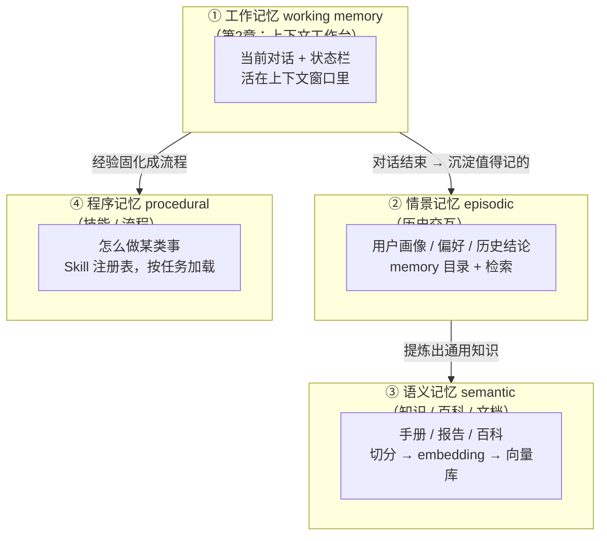
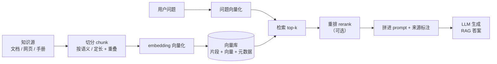
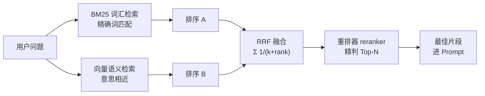
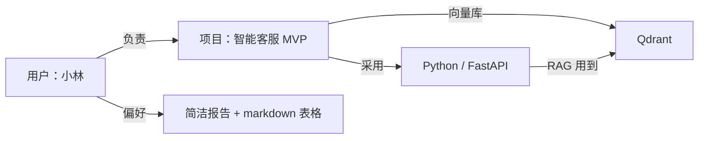

# 03-用户记忆、RAG、混合检索与结构化知识

> 阿零终于把工作台收拾得井井有条，正要伸个懒腰。
> 第二天，用户换了一台电脑登录：「早啊阿零，继续帮我写昨天那份报告。」
> 阿零眨眨眼，眼前空空如也——用户是谁？喜欢什么语气？上周学的知识、昨天查到的结论，它全都不记得。
> 「你记得我喜欢什么吗？」用户问。
> 阿零沉默了。它这才意识到：工作台是「这一场对话」的临时桌面，而它还需要一座**档案柜**和一座**图书馆**——把重要的东西，真正记住。

## 本节要解决的问题

阿零上一章把「工作台」整理明白了，但工作台装下的只是眼前这一场对话。用户换台电脑，一切归零。本节要解决的问题如下：

| 要解决的问题 | 一句话说明 |
| --- | --- |
| 跨会话记忆 | 如何把「这一场对话」之外的重要信息留住：换机器、隔几天，依然记得 |
| 记忆分层 | 工作/情景/语义/程序四层记忆，各层存什么、存哪、怎么读写、怎么遗忘 |
| 用户记忆 | 用户画像、偏好、目标、历史结论：何时写入、去重合并、过期失效、隐私保护 |
| RAG | 检索增强生成：为什么需要、完整流程（chunk→embedding→检索→重排→生成） |
| 混合检索 | BM25 词汇检索与向量语义检索如何互补、RRF 怎么融合、重排器干什么 |
| 结构化知识 | 知识图谱：实体-关系-属性、text-to-Cypher/SQL、与向量检索如何互补 |
| Agentic RAG | 把「要不要检索、检索什么」变成 Agent 自己的自主决策 |

## 故事引入

人脑有两套记忆系统：**工作记忆**（working memory）是眼前这几秒能同时握住的信息，容量极小；**长时记忆**（long-term memory）能装下一生，但取用时靠「回忆」。心理学家把长时记忆又分成三格：**情景记忆**（episodic，自己经历的事）、**语义记忆**（semantic，世界上的知识）和**程序记忆**（procedural，怎么做事）。

阿零也一样。第2章的「工作台」就是它的工作记忆——快但小，对话一结束就清零。这一章，阿零要给自己添两件家具：

- **档案柜**：存「关于用户、关于自己的经历」——情景记忆。用户是谁、喜欢什么语气、昨天得出了什么结论。
- **图书馆**：存「关于世界的知识」——语义记忆。行业报告、技术文档、产品手册，平时不上桌，需要时去查。

档案柜和图书馆都不可能塞进上下文里，否则桌面直接爆炸。正确做法是：**平时存着，用时检索，只把相关片段搬回工作台**。这个「按需搬回工作台」的动作，工程上叫**检索（retrieval）**——它能以低成本召回知识，但也可能召回不准，所以本章还要学会怎么把「找」这件事做得稳。

## 核心概念

### (a) 记忆分层：四层档案系统

记忆不能只有一层。工作台上的东西（工作记忆）是暂时的，真正要长久保存的，得分门别类放好。Agent 工程上普遍按四层组织，每一层都要回答四个问题：**存什么、存哪、怎么读写、怎么遗忘**。



- **工作记忆 = 上下文**：存当前对话与状态栏，重在「眼下」；就在第2章管理的上下文窗口里（详见 [02-上下文KV-Cache与Skill.md](02-上下文KV-Cache与Skill.md)），每一轮全量读写（最贵），对话结束即清空，超预算按降级链压缩。
- **情景记忆 = 历史交互**：存用户说过的话、做过的任务、得出的结论；放在磁盘上的 memory 目录；需要时检索相关片段搬回工作台；过期、与最新冲突的记录按策略失效。
- **语义记忆 = 知识库**：存文档、百科、手册；放在向量库 + 原始文档里；靠 embedding 语义检索；文档版本更新时替换，不用重训模型。
- **程序记忆 = 技能**：存「怎么做某类事」的流程，衔接第2章的 Skill 注册表；接到任务先检索匹配技能再加载，技能过时则淘汰更新。

工程上有一份代表性的分层记忆设计：2023 年 Packer 等人提出的《MemGPT: Towards LLMs as Operating Systems》，把操作系统「内存-磁盘-分页」的概念搬进 LLM——上下文当内存，外部存储当磁盘，必要时像换页一样把旧记忆换出、把相关记忆换入。一句话定位：用虚拟内存的思路给 LLM 做分层记忆管理。

### (b) 用户记忆：档案柜里的「用户卡片」

情景记忆里最关键的一格是**用户记忆**——关于使用者的画像。一张典型的用户卡片长这样：

```text
memory/小林.md（用户档案，可向用户展示，用户可删除）
- 身份：产品经理，正在做智能客服项目（目标：6月前上线 MVP）
- 偏好：简洁直接的中文报告；结论放最前面；喜欢用 markdown 表格
- 沟通习惯：不喜欢冗长开场白；称呼他「林哥」他会很开心
- 历史结论：上周确认技术栈 Python + FastAPI + Qdrant
- 更新时间：2026-05-21（来源：显式声明 + 对话 #38 隐式提炼，置信度 0.9）
```

写入要守三条纪律：

1. **值得记才记**。每轮对话都记是灾难，档案柜会变成垃圾桶。只有影响未来决策的信息才值得沉淀：身份、偏好、长期目标、历史结论、已排除过的选项。
2. **显式 + 隐式并重**。显式是用户直接说「我喜欢把结论放最前面」；隐式是从行为里提炼——用户连续三次把报告改成「先给结论」，就可以推断出这个偏好，但要在档案里标注「推断来源与置信度」，拿不准就存疑。
3. **去重合并 + 过期失效**。同一主题只保留一份，冲突以「最新 + 显式」为准；每条记忆带时间戳，定期淘汰过期条目——偏好会变，三年前的「喜欢」今天可能已经失效。

还有一条红线：**隐私与用户控制**。记忆是用户的私产，阿零要能向用户展示「我记住了什么」，用户有权删除任何一条；账号、密码、身份证号等敏感信息默认不写入记忆，必要时加密、分级授权——这一点会与第4章的权限体系接轨。

### (c) RAG：给阿零一座「图书馆」

知识装不进档案柜，也塞不进上下文。语义记忆的工程实现，通常是 **RAG（Retrieval-Augmented Generation，检索增强生成）**：回答前先查「图书馆」，把相关片段拼进 prompt，再让模型基于片段回答。为什么需要它？

| 动机 | 说明 |
| --- | --- |
| 知识新鲜 | 模型权重是训练时的快照；RAG 用最新文档回答，不用重新训练 |
| 可溯源 | 答案能带着来源片段，用户可核对、可查证 |
| 省 token | 只把相关片段搬上工作台，而不是搬一座图书馆 |
| 可更新 | 换文档 = 换索引，成本比重新训练低几个数量级 |

RAG 的奠基工作是 2020 年 Lewis 等人的《Retrieval-Augmented Generation for Knowledge-Intensive NLP Tasks》：把「检索器 + 生成器」联合建模，用外部文档辅助生成。完整流程与代码见仓库配套 notebook：[../04-LLM大模型/教学/15-RAG与Agent.ipynb](../04-LLM大模型/教学/15-RAG与Agent.ipynb)。流程画成图：



**chunk 切分策略**最容易掉坑：切太碎则片段缺乏上下文（「MVP 上线」单独拿出来不知道是哪个项目）；切太大则检索粒度粗、浪费 token。常见做法：按语义边界切——章节、段落、句子组——每块控制在几百 token 量级，相邻块重叠约 10%~20%，防止断句把概念割裂。**切块质量直接决定检索质量**，这是工程里「garbage in, garbage out」的第一道闸门。

### (d) 混合检索：词汇派与语义派联手

图书馆再大，也得会「找」。检索有两大流派：

- **BM25（词汇检索，稀疏）**：经典词汇统计模型，核心是**词频 TF + 逆文档频率 IDF**：文档里这个词出现越多越相关，但它在全库越常见越不值钱。它对**精确词**敏感：专名、代码、型号、ID、日期——比如「Qdrant」「MVP」这类查询，谁字面匹配谁赢。理论基础见 2009 年 Robertson 与 Zaragoza 的《The Probabilistic Relevance Framework: BM25 and Beyond》。
- **向量检索（语义，稠密）**：把文本 embedding 成向量，用余弦相似度找「意思相近」的片段。它能抓到「小林不喜欢冗长开场白」与「小林希望汇报直奔主题」这种换个说法但意思一样的匹配，这正是词汇检索做不到的。

两个流派各有盲区，所以工程上把它们**混合**起来：两个检索器各出一份排序，再用 **RRF（Reciprocal Rank Fusion，倒数排名融合）** 合并。RRF 不看分数只看名次：某个检索器里排第 r 名，就贡献 1/(k+r) 分，k 常用约 60：

> RRF score(d) = Σ各检索器 1/(k + rank_r(d))，k ≈ 60

RRF 是 2009 年 Cormack 等人发表于《Reciprocal Rank Fusion Outperforms Condorcet and Individual Rank Learning Methods》的方法——一句话定位：用名次而非归一化分数融合多路结果，简单、稳健，是混合检索的标配。融合之后还可以接一个**重排器（reranker）**：对 top-N 候选逐条做更精细的判断，把真正最准的几个提到最前。完整链路：



### (e) 结构化知识：知识图谱

档案柜和图书馆装的都是「零散卡片」，可有些知识天生是**关系网**：小林负责智能客服项目，项目用了 Python 技术栈，技术栈里用 Qdrant 做 RAG……这类「谁和什么有什么关系」的知识，用**知识图谱（Knowledge Graph）**存最合适——以**实体（entity）、关系（relation）、属性（property）**三元组构成一张网，再用 **schema（本体，ontology）** 约束节点和边的类型，防止乱连：



有了图谱，阿零就能回答「路径题」：**小林负责的项目用到哪些技术栈？** 这类问题用 **text-to-Cypher**（把自然语言翻译成图查询语言 Cypher）或 **text-to-SQL**（翻译成 SQL 查询）直接查，答案精确、可解释。

图谱和向量互补：**图谱给关系路径**（谁依赖谁、中间隔几跳），**向量给语义相似**（哪段文档和问题最对口）。两者叠起来用就是 **GraphRAG**——2024 年 Microsoft 的 Edge 等人发表《From Local to Global: A Graph RAG Approach to Query-Focused Summarization》，用图谱把文档组织成社区再做检索增强，适合回答「全局总结」类问题。另外，schema 约束本身就是一种**防幻觉**手段：模型不能捏造不存在的实体或关系类型，它必须在合法的 schema 内查询和作答。

### (f) Agentic RAG：让检索变成 Agent 的自主决策

前面讲的 RAG 是一条「固定管线」：来一个问题就检索一次。但真实任务里问题常常要拆着问：写报告要查数据、查案例、查竞品，每一步到底查不查、查什么，得由阿零自己决定。把检索「Agent 化」就是 **Agentic RAG**：

1. **决定何时检索**：先自问「我知道答案吗？知识够新鲜吗？」，不确定才查——避免无脑检索。
2. **多步检索**：插进第1章（[01-Agent的边界与ReAct.md](01-Agent的边界与ReAct.md)）的 ReAct 循环：先查 A → 顺着线索查 B → 组合，像人一样顺藤摸瓜。
3. **self-ask（自问自答）**：把大问题拆成子问题，逐个检索再汇总。
4. **自我校验**：生成后检查回答是否被检索片段支撑，不被支撑就再查。代表工作是 2023 年 Asai 等人的《Self-RAG: Learning to Retrieve, Generate, and Critique through Self-Reflection》，让模型通过自我反思决定「要不要检索、片段是否相关、回答是否被支持」。

那「长上下文」能不能替掉 RAG？其实不能，它们是不同维度的工具：

| 维度 | RAG | 长上下文（全量塞入） | 微调（改权重） |
| --- | --- | --- | --- |
| 知识来源 | 外部文档，随查随新 | 对话内静态内容 | 训练数据，快照式 |
| 成本 | 每次检索都便宜 | 每次都全量重建，很贵 | 训练成本最高 |
| 可否溯源 | 强（带来源片段） | 弱 | 无 |
| 更新速度 | 换索引即更新 | 换对话即更新 | 要重新训练 |
| 适合场景 | 知识密集、要证据 | 短时任务、一次读完 | 领域风格、固定格式 |

## 深入原理

**记忆四层对照：**

| 层次 | 载体 | 持久性 | 读写成本 | 典型实现 |
| --- | --- | --- | --- | --- |
| 工作记忆 | 上下文窗口 | 一场对话 | 每轮全量读写（最贵） | 上下文 + 状态栏（第2章） |
| 情景记忆 | memory 目录 / 会话日志 | 跨会话，按策略失效 | 检索相关片段，中等 | 用户画像文件 |
| 语义记忆 | 向量库 + 原始文档 | 随文档版本更新 | embedding + 检索，中等 | RAG 向量库、文档索引 |
| 程序记忆 | 技能注册表 | 随版本迭代 | 按任务匹配加载，低 | Skill 注册表（第2章） |

**BM25 vs 向量 vs 混合：**

| 维度 | BM25 词汇检索 | 向量语义检索 | 混合检索 |
| --- | --- | --- | --- |
| 匹配机制 | 稀疏词项，TF·IDF | 稠密语义向量，余弦相似 | 两路排名 + RRF 融合 |
| 强项 | 精确词：专名、代码、ID、日期 | 同义词、改写、语义相近 | 二者兼得，稳健 |
| 弱项 | 换说法、改写就失效 | 少见词、专名易失准 | 多一路检索的工程开销 |
| 典型实现 | Elasticsearch / Lucene | Qdrant、Milvus、FAISS | RRF 融合 + 可选 reranker |

## 代码实战：最小混合检索器

下面实现阿零的「档案柜检索员」：一个简化版 BM25（词频 + IDF）+ mock 向量检索（固定随机向量表，模拟 embedding 接口）+ RRF 融合，最后把命中的片段拼进 prompt。全程不联网、可复现。

```python
import math
import random
import re

random.seed(42)  # 固定随机种子，保证向量检索可复现

# ---- 阿零的「档案柜」：用户记忆与知识片段混合存放 ----
CORPUS = [
    "用户小林：产品经理，偏好简洁直接的中文报告，结论放最前面，喜欢 markdown 表格",
    "用户小林：正在做智能客服项目，目标是 6 月前上线 MVP",
    "技术文档：RAG = 分块 -> embedding -> 检索 -> 重排 -> 生成",
    "技术文档：BM25 对专名/代码/ID 精确匹配更强，向量检索更擅语义相似",
    "会议纪要：技术栈定为 Python + FastAPI，向量库选 Qdrant",
    "会议纪要：小林每次汇报都要先给结论，不喜欢冗长开场白",
]


def tokenize(text: str) -> list:
    """教学用切词：英文/数字按词，中文按 2-gram。"""
    text = text.lower()
    words = re.findall(r"[a-z0-9]+", text)          # 英文 / 数字算一个词
    cjk = re.findall(r"[\u4e00-\u9fff]", text)      # 中文按 2-gram 切
    bigrams = [cjk[i] + cjk[i + 1] for i in range(len(cjk) - 1)]
    return words + bigrams


def build_bm25(docs, k1=1.5, b=0.75):
    """简化 BM25：词频 TF + 逆文档频率 IDF，返回打分函数。"""
    doc_tokens = [tokenize(d) for d in docs]
    df = {}
    for toks in doc_tokens:
        for t in set(toks):
            df[t] = df.get(t, 0) + 1
    n = len(docs)
    idf = {t: math.log((n - f + 0.5) / (f + 0.5) + 1.0) for t, f in df.items()}
    avgdl = sum(len(t) for t in doc_tokens) / max(n, 1)

    def score(query: str, doc_idx: int) -> float:
        q = tokenize(query)
        toks = doc_tokens[doc_idx]
        dl = len(toks)
        s = 0.0
        for t in q:
            if t not in idf:
                continue            # 词典里没这个词，贡献为 0
            tf = toks.count(t)
            s += idf[t] * (tf * (k1 + 1)) / (tf + k1 * (1 - b + b * dl / avgdl))
        return s

    return score


def make_embedder(corpus, dim=16):
    """mock embedding 接口：固定随机向量表，词袋加和后归一化。"""
    vocab = sorted({t for d in corpus for t in tokenize(d)})
    table = {t: [random.uniform(-1, 1) for _ in range(dim)] for t in vocab}

    def embed(text: str) -> list:
        vec = [0.0] * dim
        for t in tokenize(text):
            if t in table:
                vec = [a + b for a, b in zip(vec, table[t])]
        norm = math.sqrt(sum(x * x for x in vec)) or 1.0
        return [x / norm for x in vec]

    return embed


def cosine(a, b):
    return sum(x * y for x, y in zip(a, b))


def rrf(rankings, k=60):
    """RRF 融合：score(d) = Σ 1/(k + rank)，k 常用约 60。"""
    fused = {}
    for ranks in rankings:
        for rank, doc_id in enumerate(ranks, start=1):
            fused[doc_id] = fused.get(doc_id, 0.0) + 1.0 / (k + rank)
    return sorted(fused.items(), key=lambda kv: kv[1], reverse=True)


def main():
    query = "小林喜欢什么报告格式？"
    bm25 = build_bm25(CORPUS)
    embed = make_embedder(CORPUS)

    bm_scores = [bm25(query, i) for i in range(len(CORPUS))]
    bm_ranks = sorted(range(len(CORPUS)), key=lambda i: bm_scores[i], reverse=True)
    vec_ranks = sorted(range(len(CORPUS)), key=lambda i: cosine(embed(query), embed(CORPUS[i])), reverse=True)

    print("BM25 排名:", [(i, round(bm_scores[i], 3)) for i in bm_ranks])
    print("向量排名:", [(i, round(cosine(embed(query), embed(CORPUS[i])), 3)) for i in vec_ranks])

    top = rrf([bm_ranks, vec_ranks])[:2]
    print("RRF 融合 top2:", top)

    prompt = "你是阿零，只依据档案柜片段回答，并标注来源：\n" + "\n".join(
        f"[片段{i}] {CORPUS[i]}" for i, _ in top
    ) + f"\n问题：{query}"
    print("拼装出的 prompt：\n" + prompt)


if __name__ == "__main__":
    main()
```

输出示意（BM25 分值为按公式手算的准确值；向量余弦为 mock 随机表的示意值）：

```text
BM25 排名: [(0, 3.344), (5, 1.766), (1, 0.681), (2, 0.0), (3, 0.0), (4, 0.0)]
向量排名: [(0, 0.587), (5, 0.443), (1, 0.302), (2, 0.087), (4, 0.011), (3, -0.026)]
RRF 融合 top2: [(0, 0.0328), (5, 0.0323)]
拼装出的 prompt：
你是阿零，只依据档案柜片段回答，并标注来源：
[片段0] 用户小林：产品经理，偏好简洁直接的中文报告，结论放最前面，喜欢 markdown 表格
[片段5] 会议纪要：小林每次汇报都要先给结论，不喜欢冗长开场白
问题：小林喜欢什么报告格式？
```

> 说明：`tokenize` 的中文 2-gram 是教学简化，真实工程请用分词器或现成的 BM25 实现（Elasticsearch、rank_bm25 等）；`make_embedder` 是固定随机表的 mock，只演示「文本 → 向量 → 余弦」的形态，真实项目换成 BGE、OpenAI 等 embedding 接口即可。向量排名的具体数值随随机表变化，但「0 号、5 号片段胜出」的结论稳定——因为它们与问题重叠的词汇最多，RRF 只看名次，所以融合结果也稳定。

## 面试考点

**Q1：Agent 的记忆一般怎么分层？**
A：四层：工作记忆（当前对话 + 状态栏，第2章）、情景记忆（用户画像、历史结论）、语义记忆（文档知识，RAG 向量库）、程序记忆（技能、流程，Skill 注册表）。每一层都要回答四个问题：存什么、存哪、怎么读写、怎么遗忘。分层设计的工程代表是 MemGPT（2023）：把上下文当内存、外部存储当磁盘、按需换页。

**Q2：用户记忆应该在什么时机写入？什么不能写？**
A：三条纪律：值得记才记（只记影响未来决策的信息：身份、偏好、长期目标、历史结论）；显式 + 隐式（显式声明直接存，隐式从行为推断并标注置信度）；去重合并 + 过期失效（同主题一份、冲突以「最新 + 显式」为准、每条带时间戳定期淘汰）。红线：账号、密码等敏感信息默认不入记忆；用户必须能查看和删除自己的记忆。

**Q3：RAG 的完整流程是什么？**
A：离线：知识源 → chunk 切分 → embedding → 向量库。在线：问题向量化 → 检索 top-k →（可选重排）→ 拼进 prompt 并标注来源 → LLM 生成。教学配套见 [../04-LLM大模型/教学/15-RAG与Agent.ipynb](../04-LLM大模型/教学/15-RAG与Agent.ipynb)；奠基工作是 Lewis et al. 2020 的 RAG。

**Q4：BM25 和向量检索各自擅长什么？**
A：BM25 做词汇层面的精确匹配，擅长专名、代码、ID、日期等查询；向量检索做语义匹配，擅长同义改写、意思相近。专名类查询用 BM25 更强，语义类查询用向量更强，所以工程上通常两者混合使用。

**Q5：RRF 是怎么融合多路检索的？**
A：RRF 不看分数只看名次：对每个检索器，文档排第 r 名就贡献 1/(k+r) 分，k 常用约 60，累加所有检索器的贡献后按总分排序。优点是不需要处理不同检索器之间分数尺度不一致的问题，实现简单稳健（Cormack et al. 2009）。

**Q6：知识图谱和向量检索怎么互补？**
A：知识图谱存结构化关系（实体-关系-属性 + schema 约束），擅长「谁依赖谁、几跳路径」类问题，用 text-to-Cypher / text-to-SQL 查询，精确可解释，schema 约束还能减少幻觉；向量检索存语义相似，擅长「哪段内容与问题意思相近」。图谱给关系路径、向量给语义相似，GraphRAG（2024）把两者叠起来做全局性总结问题。

## 小结与下一章预告

这一章，阿零终于有了「跨会话」的记性：它学会把记忆分四层管理，在档案柜里给用户画像，讲究「值得记才记、可查看可删除」；会用 RAG 到图书馆查资料，用 BM25 与向量检索的 RRF 混合精准命中，还能借知识图谱回答「谁和什么有什么关系」。用户再问「你记得我喜欢什么吗」，阿零终于可以翻开档案回答了。

**可是，记住了 ≠ 做得到。** 阿零记得小林喜欢简洁报告，也能回答「小林负责什么项目」——但用户说「那你帮我把项目更新一下」时，阿零依然只能干瞪眼：它没有手，没有脚，无法去改文件、发邮件、查实时天气。记忆让它「知道」，工具才能让它「做到」。

下一章，阿零要长出「手脚」——工具系统。请翻到 [04-工具分类与MCP.md](04-工具分类与MCP.md)：阿零将学会定义工具、调用工具，用 MCP 把工具接成统一插口，并给自己的每一个动作系上安全带。
