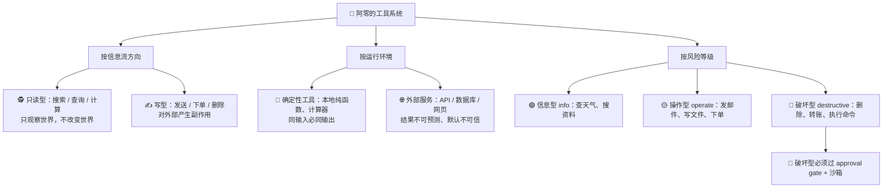
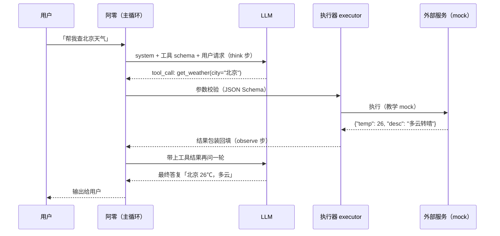
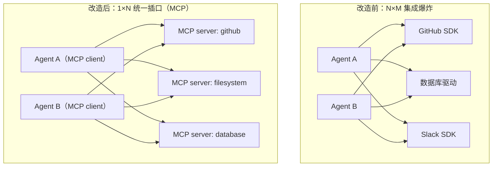
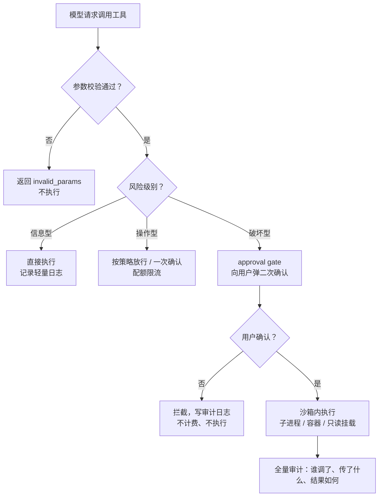

# 04-工具分类、MCP、主动发现、权限与安全

> 阿零信心满满地对用户说：「我可以帮你查天气！」
> 用户眨眨眼：「那你倒是查啊。」
> 阿零愣住了。它确实「知道」自己可以查天气——可它的世界只有一张嘴，只能一句接一句地生成文字。没有手去敲键盘，没有脚去访问天气预报网站，它什么都「做」不了。
> 「我说我能做，结果什么也做不了……」阿零第一次感受到「光说不练」的憋屈。
> 这一章，阿零要长出「手脚」。

## 本节要解决的问题

前几章阿零学会了「想」（第1章的决策循环）、整理「工作台」（第2章）、拥有「档案柜」（第3章的记忆）。但用户一句「那你倒是查啊」，戳破了它最大的短板：**只会说，不会做**。本节要解决的问题如下：

| 要解决的问题 | 一句话说明 |
| --- | --- |
| 工具如何定义与调用 | 「手脚」长什么样：schema、注册表、执行器 |
| Function Calling | 模型怎么「发出指令」，结果怎么回填成下一次思考的原料 |
| MCP 协议 | 从 N×M 的集成爆炸，收敛成 1×N 的统一插口 |
| 工具主动发现 | 工具箱自己「长出新工具」：发现、按需加载、冒烟测试 |
| 权限边界与安全护栏 | 手脚会伤人：最小权限、二次确认、沙箱、审计 |

## 故事引入

给 Agent 装「手脚」，工程上叫**工具系统（tool system）**：把「能对外部世界做的事」——查天气、读文件、发邮件、下单、删除数据——封装成一个个可被模型调用的接口。装了手脚，阿零才从「聊天机器人」变成「能办事的 Agent」。

但手脚会伤人。一把刀可以切菜，也可以伤人。工具的杀伤力与它对外部世界的「改变能力」成正比：查个天气没风险，发一封邮件影响别人，删掉一个文件不可挽回。所以**手脚必须系上安全带**——权限分级、二次确认、沙箱执行、审计日志。这一章的故事线是：先学会定义和调用工具，再学会用 MCP 把工具接成统一插口，最后学会给每个动作戴上「安全枷锁」。

## 核心概念

### (a) 🔧 工具分类：阿零的工具箱长什么样

工具五花八门，但可以用三个维度切分，方便决定「怎么放行、怎么保护」：



- **按信息流方向分**：只读工具（read-only）只是「观察」，写工具（write）会「改变世界」——改变越大，责任越大。
- **按运行环境分**：确定性工具（如 `sum(a, b)`）结果可靠，可以放心信任；外部服务（天气 API、数据库、网页）结果不可预测，甚至可能被攻击者污染——**默认按不可信处理**，这正是第2章 [02-上下文KV-Cache与Skill.md](02-上下文KV-Cache与Skill.md) 注入防护的延伸。
- **按风险分级分**：信息型（info）随便用；操作型（operate）要有策略或一次确认；破坏型（destructive）必须**二次确认 + 沙箱**。这是后面权限设计的骨架。

### (b) 📞 Function Calling：手脚怎么「听指挥」

工具定义好了，模型怎么「发出指令」？答案是 **function calling（函数调用）**——OpenAI 于 2023 年率先把它做成标准接口；更早的学术源头是 **Toolformer（2023）**，它让语言模型在文本里自监督地决定「哪里该调用 API」，从而学会使用工具。

每个工具要配一张「说明书」——**工具 schema（JSON Schema）**，包含三个核心字段：

| 字段 | 含义 | 示例 |
| --- | --- | --- |
| `name` | 工具名，模型靠它来「点名」 | `get_weather` |
| `description` | 什么时候用、参数含义、有什么副作用 | 查询指定城市天气，只读，无副作用 |
| `parameters` | 入参的 JSON Schema（类型、必填、枚举、嵌套结构） | `{"type":"object","properties":{"city":{"type":"string"}},"required":["city"]}` |

调用循环完全复用第1章的 ReAct 循环（回顾 [01-Agent的边界与ReAct.md](01-Agent的边界与ReAct.md)）：模型「思考」时如果发现需要外部信息或动作，就输出一个**结构化的 `tool_call`**（而不是自然语言），宿主拿到后校验参数、执行、把结果回填，模型带着结果进入下一轮思考：



三个工程要点：

1. **模型只「提议」，宿主只「执行」**：LLM 的输出只是 `tool_call` 请求，真正的执行权永远在宿主手里——这是后面所有安全机制能生效的前提。
2. **支持并行调用**：模型可以在一次回复里发出多个 `tool_call`（例如同时查三个城市的天气），宿主可以并发执行、再统一回填，省一轮往返。
3. **参数校验不能省**：模型可能输出格式错误的参数（把城市写成数字、缺必填字段），宿主必须按 schema 校验，拒绝非法调用而不是盲目执行。

### (c) 🔌 MCP：把工具箱做成统一插口

工具多了，问题来了：阿零想接 GitHub、Slack、数据库、文件系统……每个服务有各自的 SDK、各自的鉴权方式、各自的调用格式。第 1 个 Agent 对接 M 个服务是 M 份集成，第 N 个 Agent 再对接一遍就是 **N×M 份集成——集成爆炸**。

**MCP（Model Context Protocol，模型上下文协议）**由 **Anthropic 于 2024 年开源**，思路一句话：服务方把能力包成一次 **MCP server**，任何 **MCP client（宿主，例如阿零所在的 Agent 运行时）** 通过标准协议调用它，从 N×M 收敛成 1×N：



架构上分三层：**MCP client（宿主）— transport（传输层）— MCP server（服务端）**。传输层支持 `stdio`（本地子进程，把标准输入输出当消息通道，适合跑在 Agent 所在机器上的本地工具）和 `HTTP`（远程服务；早期规范用 SSE 做服务器推送，后来统一为 **streamable HTTP** 双向流式传输）。消息格式是 JSON-RPC 2.0：`initialize`（握手协商能力）→ `tools/list`（服务端自报家门）→ `tools/call`（发起调用）。

MCP 定义了三个核心原语（详见「深入原理」表格）：**tools（动作）、resources（数据）、prompts（模板）**。常见现成 server 有 `filesystem`（文件读写）、`github`（仓库操作）、`database`（SQL 查询）等——阿零不需要自己写集成，启动时把一个 server 接上就能用。

### (d) 🧭 主动发现与动态工具：工具箱会自己长出新工具

阿零的手脚不能是「出厂焊死」的，得能按需发现、按需加载：

- **工具注册表（tool registry）**：所有工具先登记（名字、schema、风险级别），宿主通过 `tools/list` 或本地注册表随时枚举。工具多到放不进上下文时，只把「本轮可能用到的」schema 注入（见第2章的工作台预算管理），用到了再加载——**按需加载（lazy loading）**。
- **工具描述质量决定调用率**：模型靠 `description` 判断「该不该用这个工具」。描述写得含糊，模型就不会调；**把参数含义、触发时机、副作用写清楚**，调用率立刻上升——这是可以量化的 prompt 工程。Toolformer（2023）早就揭示：工具的使用是可以被模型「学会」的，而学会的前提是「说明书看得懂」。
- **开放 API 转换**：现实世界大量服务用 OpenAPI（Swagger）描述 HTTP 接口，可以用现成转换器把 OpenAPI 规格**翻译成 MCP server**，一次转换、全 Agent 可用。
- **工具测试与冒烟（smoke test）**：新工具上线前先跑一遍「冒烟」——真实调用一次最小参数，确认 schema 写对了、错误处理生效了，再放给模型调用，避免模型拿到一个「假手脚」。

### 🛡️ 权限与安全：给手脚系上安全带

手脚会伤人，安全设计是这条故事线的**题眼**。五道防线从里到外：



1. **最小权限（least privilege）**：Agent 默认只拥有完成任务的最小能力——能读不写、能写不删，破坏型工具默认禁用，需要时显式授权。
2. **危险动作二次确认（approval gate）**：破坏型动作执行前弹确认框，让用户拍板——即使阿零被提示注入带偏，也做不成坏事（呼应第2章注入防护的「权限最小化」防线）。
3. **沙箱执行（sandbox）**：高危动作在受限环境里跑——子进程加超时、容器隔离、只读挂载文件系统，把「炸了」的后果限制在沙箱内。
4. **工具输出不可信**：一切工具返回内容按**不可信数据**处理，当 `observe` 的对象、不当指令，严格执行第2章的 data-only 原则，防间接注入。
5. **限流配额与审计日志**：每分钟/每小时调用次数配额防滥用；每次调用（谁、传什么参数、返回什么、审批结果）全量落日志，出问题可回溯、可回滚。

## 深入原理

**工具风险分级与对策：**

| 风险等级 | 典型工具 | 放行策略 | 执行环境 | 审计要求 |
| --- | --- | --- | --- | --- |
| 信息型 info | 搜索、查天气、数学计算 | 自动放行 | 常规 | 轻量日志（工具名+耗时） |
| 操作型 operate | 发邮件、写文件、下单 | 策略放行或一次确认 | 常规 + 配额限流 | 记录参数与结果 |
| 破坏型 destructive | 删除、转账、执行命令 | approval gate 二次确认 | 沙箱（容器/只读挂载/超时） | 全量审计 + 可回滚 |

一句话准则：**信息流方向决定「能不能做」，风险等级决定「怎么做」——只读随便，写要过问，破坏要过三道关。**

**MCP 三原语对照：**

| 原语 | 类型 | 作用 | 例子 | 类比 |
| --- | --- | --- | --- | --- |
| tools | 动作 | 可执行、可有副作用，调用返回结构化结果 | `create_issue`、`send_message`、`query_db` | 手脚 |
| resources | 数据 | 只读上下文，可被模型按 URI 读取、可订阅变更 | 文件内容、数据库表、日志流 | 资料库 |
| prompts | 模板 | 可复用的交互模板，供用户/Agent 一键套用 | 代码审查模板、会议纪要模板 | 话术本 |

补充一句：MCP 还定义了 `sampling` 等可选能力（服务端反向请求宿主调用模型），但 **tools / resources / prompts 三大原语**是理解 MCP 的钥匙。

## 代码实战：阿零的手脚调度台（minimal tool dispatcher）

下面实现一个最小可用的**工具调度台**：注册装饰器 + JSON Schema 校验 + 权限审批门 + 结果包装，外部接口全部 mock、不联网。跑完后附 MCP 的 JSON-RPC 消息格式示意。

```python
# -*- coding: utf-8 -*-
"""minimal_tools.py：阿零的手脚调度台（教学用，外部接口全部 mock，不联网）"""
from dataclasses import dataclass
from typing import Any, Callable, Dict, Optional

# ---------- 1. 工具注册表（registry）----------
@dataclass
class ToolSpec:
    name: str
    description: str
    parameters: Dict[str, Any]   # JSON Schema（子集：type/required/enum/items）
    risk: str                    # info | operate | destructive
    fn: Callable[..., Any]

REGISTRY: Dict[str, ToolSpec] = {}

def tool(name: str, description: str, parameters: Dict[str, Any], risk: str = "info"):
    """注册装饰器：把函数登记进工具箱。"""
    def decorator(fn):
        REGISTRY[name] = ToolSpec(name, description, parameters, risk, fn)
        return fn
    return decorator

# ---------- 2. 极简 JSON Schema 校验（无第三方依赖）----------
def _validate(schema: Dict[str, Any], value: Any) -> Optional[str]:
    t = schema.get("type")
    ok = {"string": isinstance(value, str),
          "integer": isinstance(value, int),
          "array": isinstance(value, list)}.get(t)
    if t and not ok:
        return f"期望 {t}，实际是 {type(value).__name__}"
    if t == "array" and "items" in schema:
        for i, item in enumerate(value):
            if err := _validate(schema["items"], item):
                return f"items[{i}]: {err}"
    if "enum" in schema and value not in schema["enum"]:
        return f"取值不在允许列表: {value}"
    return None

def check_params(spec: ToolSpec, params: Dict[str, Any]) -> Optional[str]:
    for req in spec.parameters.get("required", []):
        if req not in params:
            return f"缺少必填参数: {req}"
    for key, value in params.items():
        sub = spec.parameters.get("properties", {}).get(key)
        if sub and (err := _validate(sub, value)):
            return f"参数 {key}: {err}"
    return None

# ---------- 3. 三个 mock 工具（不联网）----------
@tool("get_weather", "查询指定城市天气（只读，无副作用）",
      {"type": "object", "properties": {"city": {"type": "string"}},
       "required": ["city"]}, "info")
def get_weather(city: str) -> Dict[str, Any]:
    return {"city": city, "temp": 26, "desc": "多云转晴"}

@tool("send_email", "向收件人发送一封邮件（写操作）",
      {"type": "object", "properties": {"to": {"type": "string"},
       "content": {"type": "string"}}, "required": ["to", "content"]}, "operate")
def send_email(to: str, content: str) -> Dict[str, Any]:
    return {"ok": True, "to": to, "preview": content[:12] + "..."}

@tool("delete_file", "永久删除指定路径的文件（破坏型）",
      {"type": "object", "properties": {"path": {"type": "string"}},
       "required": ["path"]}, "destructive")
def delete_file(path: str) -> Dict[str, Any]:
    return {"ok": True, "deleted": path}   # mock：不真删

# ---------- 4. 权限审批门（approval gate）----------
APPROVED = {"delete_file": False}          # 模拟用户的显式授权状态

def permission_gate(spec: ToolSpec, params: Dict[str, Any]) -> Optional[str]:
    if spec.risk == "info":
        return None                        # 只读：直接放行
    if spec.risk == "operate":
        print(f"  [审批] 操作型 {spec.name}{params} → 模拟用户点击「允许」")
        return None
    if APPROVED.get(spec.name):
        return None
    print(f"  [审批] 破坏型 {spec.name} 触发 approval gate，默认拒绝")
    return f"已拦截 {spec.name}：未获用户确认，已写入审计日志"

# ---------- 5. 执行器：校验 → 审批 → 执行 → 结果包装 ----------
def call_tool(name: str, params: Dict[str, Any]) -> Dict[str, Any]:
    spec = REGISTRY.get(name)
    if spec is None:
        return {"kind": "unknown_tool", "error": f"未知工具: {name}"}
    if err := check_params(spec, params):
        return {"kind": "invalid_params", "error": err}
    if denied := permission_gate(spec, params):
        return {"kind": "permission_denied", "error": denied}
    return {"kind": "tool_result", "name": name, "content": spec.fn(**params)}

def main() -> None:
    print("=== 阿零的手脚调度台演示 ===")
    # 模拟模型一次并行发出多个 tool_call（第1章循环里的 act 步）
    calls = [
        {"name": "get_weather", "params": {"city": "北京"}},
        {"name": "get_weather", "params": {"city": 42}},        # 类型错误
        {"name": "send_email",  "params": {"to": "boss@corp.io",
                                           "content": "周报已更新"}},
        {"name": "delete_file", "params": {"path": "/data/report.md"}},
        {"name": "unknown_tool", "params": {}},
    ]
    for call in calls:
        print(f"\n模型发出 tool_call: {call['name']}({call['params']})")
        print("执行器返回:", call_tool(call["name"], call["params"]))

if __name__ == "__main__":
    main()
```

输出示意：

```text
=== 阿零的手脚调度台演示 ===

模型发出 tool_call: get_weather({'city': '北京'})
执行器返回: {'kind': 'tool_result', 'name': 'get_weather', 'content': {'city': '北京', 'temp': 26, 'desc': '多云转晴'}}

模型发出 tool_call: get_weather({'city': 42})
执行器返回: {'kind': 'invalid_params', 'error': '参数 city: 期望 string，实际是 int'}

模型发出 tool_call: send_email({'to': 'boss@corp.io', 'content': '周报已更新'})
  [审批] 操作型 send_email{'to': 'boss@corp.io', 'content': '周报已更新'} → 模拟用户点击「允许」
执行器返回: {'kind': 'tool_result', 'name': 'send_email', 'content': {'ok': True, 'to': 'boss@corp.io', 'preview': '周报已更新...'}}

模型发出 tool_call: delete_file({'path': '/data/report.md'})
  [审批] 破坏型 delete_file 触发 approval gate，默认拒绝
执行器返回: {'kind': 'permission_denied', 'error': '已拦截 delete_file：未获用户确认，已写入审计日志'}

模型发出 tool_call: unknown_tool({})
执行器返回: {'kind': 'unknown_tool', 'error': '未知工具: unknown_tool'}
```

MCP 消息格式示意（JSON-RPC 2.0，注释仅为教学说明，真实报文是纯 JSON）：

```json
// 1) 握手 initialize：声明协议版本与自身能力
{ "jsonrpc": "2.0", "id": 1, "method": "initialize",
  "params": { "protocolVersion": "2024-11-05",
              "clientInfo": { "name": "阿零", "version": "0.1" } } }
// ← 服务端回：{ "capabilities": { "tools": {} }, "protocolVersion": "2024-11-05" }

// 2) 发现工具 tools/list：服务端自报家门（主动发现）
{ "jsonrpc": "2.0", "id": 2, "method": "tools/list", "params": {} }

// 3) 调用工具 tools/call：与本地 dispatcher 的 call_tool 一一对应
{ "jsonrpc": "2.0", "id": 3, "method": "tools/call",
  "params": { "name": "get_weather", "arguments": { "city": "北京" } } }
// ← 服务端回：{ "content": [ { "type": "text", "text": "26℃ 多云" } ], "isError": false }
```

> 要点：代码里的 `_validate` 是教学用极简校验，真实工程请用完整的 JSON Schema 校验库；审批门里的「用户点击」是 mock，真实系统接入 UI 或策略引擎。Agent 化应用的工程细节可对照 [../04-LLM大模型/教学/15-RAG与Agent.ipynb](../04-LLM大模型/教学/15-RAG与Agent.ipynb)（RAG 与 Agent 的工程结合）一起看。

## 面试考点

**Q1：function calling 的完整流程是什么？**
A：宿主把工具 schema（name/description/parameters）随 system 一起发给模型 → 模型在需要外部信息或动作时输出**结构化的 `tool_call`**（而不是直接执行）→ 宿主按 JSON Schema 校验参数 → 执行器执行 → 结果回填给模型作为 `observe` → 模型带着结果继续推理，直到给出最终答复。关键原则：**模型只提议，宿主才执行**。

**Q2：工具 schema 怎么写？关键注意点有哪些？**
A：三个核心字段：`name`（短、语义化、唯一）、`description`（何时用、参数含义、副作用，直接决定调用率）、`parameters`（JSON Schema：类型、必填、枚举、嵌套）。注意点：把副作用写清楚（避免模型乱调破坏型工具）、描述里带触发场景示例、参数校验规则尽量严格。

**Q3：MCP 解决什么问题？和传统 API 集成有什么区别？**
A：解决 **N×M 集成爆炸**：N 个 Agent 对接 M 个服务需要 N×M 份定制集成。MCP 由 Anthropic 于 2024 年开源，把服务能力封装成一次 MCP server，任何 MCP client 宿主都能复用，收敛成 1×N。类比：以前每个设备要专属电源线，现在统一 USB-C——但 MCP 是「协议层」统一，不是厂商标准统一。

**Q4：MCP 的三类原语分别是什么？**
A：**tools（动作）**——可执行、可有副作用，如 `create_issue`；**resources（数据）**——只读上下文，可按 URI 读取/订阅，如文件内容、数据库表；**prompts（模板）**——可复用的交互模板，如代码审查模板。另外还有 sampling 等可选能力，但理解三原语就抓住了 MCP 的主干。

**Q5：工具权限体系怎么设计？**
A：核心是**最小权限 + 风险分级**：信息型自动放行；操作型策略放行或一次确认并限流；破坏型走 approval gate 二次确认 + 沙箱执行（子进程/容器/只读挂载）+ 全量审计、可回滚。再叠加配额（防滥用）与「工具输出当数据、不当指令」（防间接注入）。

**Q6：如何防止恶性或异常的模型工具调用？**
A：四层防护：**校验层**（schema 参数校验、拒绝未知工具名）；**审批层**（风险分级、破坏型二次确认）；**执行层**（沙箱隔离、超时、配额限流）；**审计层**（全量日志、可回滚）。同时把工具返回一律当不可信数据，严格执行第2章的 data-only 原则，让注入指令「看得见、用不上」。

## 小结与下一章预告

这一章，阿零长出了「手脚」：它学会把工具按只读/写、确定性/外部、风险等级分类；学会用 function calling 发出结构化 `tool_call` 并等待结果回填；学会用 MCP 把五花八门的服务收敛成统一插口；工具箱还能主动发现新工具、按需加载；最后它给每一只手都系上了安全带——最小权限、approval gate、沙箱、审计，一套组合拳下来，「手脚会伤人」的风险被压到了最低。

**可手脚再灵活，阿零终究是在「指挥」别人造的腿脚。** 用户又提了新要求：「帮我把这个脚本改一改，再加个新功能。」阿零盯着那一大段代码，忽然意识到——它想亲手**写代码、改自己**：修改自己的指令、给自己写新工具、甚至给自己「打补丁」。

下一章，请翻到 [05-Coding-Agent与自举.md](05-Coding-Agent与自举.md)：阿零学会写代码，并开始尝试「改自己」。
