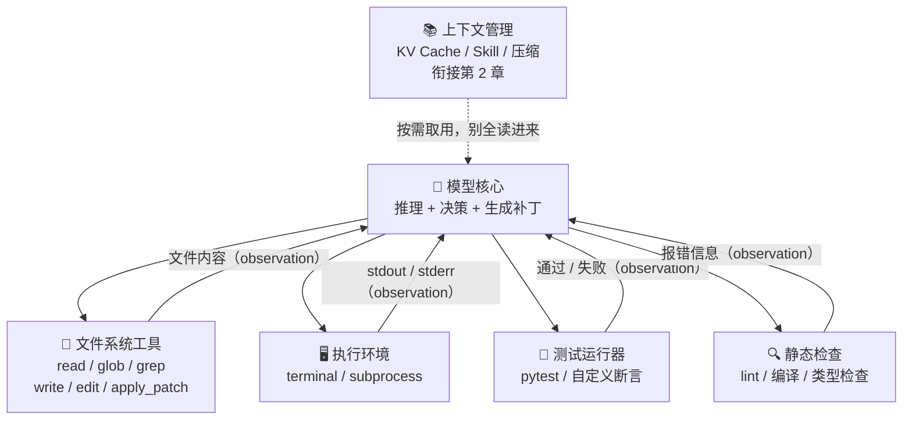
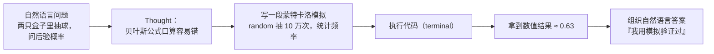
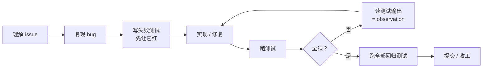
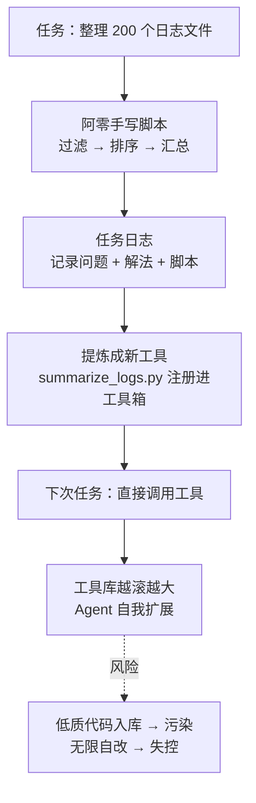

# 05-Coding Agent、文件系统、代码即思考与自举

> 用户把一个仓库丢给阿零：「CI 挂了，帮我看一下。」
> 阿零仔细读完报错，啪地甩出一段代码：「你把这个粘进 `utils.py` 试试。」
> 用户叹了口气：「粘进去？这个仓库有 30 多个文件、两百多个测试。我要的是你把它改好、跑通全部测试，而不是扔给我一段代码让我自己动手。」
> 阿零愣住了——它第一次意识到：光会「写」答案不够，还要「动手」把答案落地。

## 本节要解决的问题

| 要解决的问题 | 对应小节 | 一句话答案 |
| --- | --- | --- |
| Coding Agent 的能力栈 | 核心概念 (a) | 模型当大脑，文件系统/终端当手脚，测试当眼睛 |
| 文件系统操作 | 深入原理 | read / glob / grep / write / edit / apply_patch |
| 代码即思考 | 核心概念 (c) | 用可执行代码承载中间推理，先算清楚再回答 |
| 测试驱动循环 | 核心概念 (d) | 先红后绿，测试输出当 observation 喂回循环 |
| 自举与自我扩展 | 核心概念 (f) | 工具即代码，Agent 写代码给自己造新工具 |

## 故事引入

阿零的「写代码」能力，其实来自预训练阶段读过的海量代码——它只是把见过无数次的模式重新组合出来（想了解代码能力是怎么长出来的，可回看 [../04-LLM大模型/教学/11-预训练循环.ipynb](../04-LLM大模型/教学/11-预训练循环.ipynb)）。但「会写一段代码」和「把一个仓库修好」是两回事：前者是生成，后者是**在真实文件系统里反复试探**。

对 Agent 来说，任务世界分两类：一类反馈稀疏——约人吃饭、说服客户、按电梯按钮，做了也不知道做对没有；另一类反馈密集，**代码就是后者的天花板**。在代码世界里，对与错可以被机器瞬间判定：编译错误、测试失败、lint 告警，全部自动、即时、免费。阿零不需要人类老师逐句点评，只需要一个测试运行器，就能知道自己改得对不对。

「可以被机器验证」带来两样东西。第一，**评估成熟**：HumanEval（2021，OpenAI）把「根据 docstring 写函数」变成约 160 道可自动判分的题；SWE-bench（2024，普林斯顿）更进一步，用真实 GitHub 仓库的 issue 和修复补丁构造「修好一个真 bug」的任务。有了自动评分，Agent 的进步可以量化、可以比赛。第二，**反馈即信号**：测试输出是一种硬 Observation——客观、可归因。第1章里 [01-Agent的边界与ReAct.md](01-Agent的边界与ReAct.md) 阿零学会了 ReAct 循环，但那时它的「行动」还只是文本；这一章，阿零要把行动升级成真的去读文件、改文件、跑测试。

## 核心概念

### (a) 🗂️ Coding Agent 能力栈：大脑、手脚与眼睛

Coding Agent 不是「会写代码的模型」，而是一个把模型、文件系统、执行环境、测试运行器和静态检查串起来的系统：



- **文件系统层**：`read`（读文件）、`glob`（按通配符找文件）、`grep`（按正则搜内容）、`write`（整文件写）、`edit` / `apply_patch`（局部修改）。这是阿零的「眼睛和手」——看代码、改代码都靠它们。
- **执行环境层**：terminal / subprocess，让阿零真的把代码跑起来，而不是在脑子里「模拟运行」。模拟运行会漏掉一切真实行为：环境变量、依赖、并发。
- **测试运行器**：pytest 等，把「对不对」变成可机读的信号。它是阿零的「裁判」。
- **静态检查**：lint、编译、类型检查，反馈比测试更早、更便宜，适合在跑测试之前先过一遍。
- **上下文管理**：真实仓库动辄几千个文件，阿零不可能全读进来（参考 [02-上下文KV-Cache与Skill.md](02-上下文KV-Cache与Skill.md) 的上下文压缩），正确姿势是先用 glob / grep 定位，再精读相关文件。

### (b) 🎯 为什么代码是 Agent 的试验场

除了「反馈可验证」，代码任务还有三个优势：

- **评估成熟**：HumanEval（2021）做函数级代码生成，SWE-bench（2024）做真实 issue 修复，都提供自动判分的 ground truth（标准答案），Agent 的每一次改动都能被量化打分。这比「写一篇作文让人类打分」奢侈得多。
- **实验便宜且可重复**：改错了最多重跑一遍，成本是毫秒到分钟级；失败可以复现、可以归因——这是后面第7章评估章节能建立统计方法的前提。
- **代表产品验证了路线**：Codex（OpenAI，2021）最早把「模型写代码」做成产品级 API；Devin（Cognition，2024）宣称自己是全自主的「软件工程师 Agent」；Cursor 把 Agent 嵌进 IDE，成为 AI 原生编辑器；Aider 则是开源终端里的结对编程工具。它们共享同一套能力栈，差别在集成深度与自主度。

### (c) 💻 代码即思考（Code-as-Thinking）

自然语言思维有一个大问题：**容易含糊，且无法自证**。口算概率、手推统计量，错了也看不出来。程序思维则相反——把中间推理写成一截可执行代码，跑出数值，再组织语言。「先算清楚，再回答」：



阿零从此学会了把 ReAct 循环里的 Thought 步骤「硬化」：Thought 不再只是写给模型自己看的文字，而是一段可以被执行、被验证的程序。第1章讲过，Observation 越硬，循环越可靠——用代码做中间推理，等于给推理接上了现实校验器。

### (d) 🔴🟢 测试驱动循环：先红，再绿

工程界的 TDD（Test-Driven Development，测试驱动开发）智慧对 Agent 完全适用：**没有失败测试，就不知道「修好」意味着什么**。先写一个会失败的测试，再动手修，最后看它变绿：



对 Agent 来说，这个循环还有一层额外含义：**测试输出就是 ReAct 的 Observation**。阿零的「行动」是改文件，环境的「反馈」是测试输出——红则再想、再改，绿则收工。issue 再模糊，一旦被翻译成一个失败测试，就变成机器可判定的标准，主观歧义消失。

### (e) ✂️ 编辑粒度：小步走，每步验证

改代码有三种粒度，各有适用场景（详细对比见「深入原理」）：**整文件重写**适合小文件；**精确搜索替换**（edit：把一段确定的旧文本换成新文本）适合改一处；**语义补丁**（apply_patch，即统一 diff 格式）适合跨多处的结构性修改。原则只有一条：**小步编辑 + 每步验证**——一次只改一个点，改完立刻跑测试，宁可多绕几轮，也不要一把梭改十个点然后面对一团乱麻。更进一步，LSP（Language Server Protocol，语言服务器协议）让阿零获得 IDE 级能力：跳转到定义、读取类型错误、安全重命名——把「文本编辑」升级成「结构编辑」，从根上减少改错。

### (f) 🚀 自举（Bootstrapping）：写代码扩展自己

第4章 [04-工具分类与MCP.md](04-工具分类与MCP.md) 给阿零装了手脚，但那些工具是人类造的。这一章阿零发现：**工具即代码**——既然我能写代码，我就能给自己造新工具：



这就是自举（bootstrapping）：系统用自己产生的能力增强自己。从任务日志里提炼技能这条线，会一直延伸到第9章的持续进化。但自举有边界：**低质代码污染**（自己写的 buggy 工具又被自己当权威工具用）、**递归失控**（改自己改到不收敛）、**评估欺骗**（针对测试打补丁而非真正改进）。对策是老三样：新工具入库必须有测试把关 + 人类评审、代码版本管理与回滚、划定自举范围——可以加工具，但不能改核心决策逻辑。

## 深入原理

### 📋 文件系统工具清单

| 工具 | 输入 | 副作用 | 主要风险与对策 |
| --- | --- | --- | --- |
| `read` | 文件路径 | 无（只读） | 大文件撑爆上下文 → 用 offset / limit 分段读 |
| `glob` | 目录 + 通配符 | 无（只读） | 命中太多 → 限制深度与数量 |
| `grep` | 目录 + 正则 | 无（只读） | 误入二进制/大目录 → 加 include 过滤 |
| `write` | 路径 + 全文 | 整文件覆盖 | 覆盖用户手改内容 → 写前先 read、写后 diff |
| `edit` | 路径 + 旧文本 + 新文本 | 局部替换 | 多处匹配/匹配不到 → 要求唯一匹配，失败即报错 |
| `apply_patch` | 路径 + 统一 diff | 多处局部修改 | 上下文漂移 → 小步补丁，每步跑测试验证 |

### ✂️ 编辑粒度对比

| 粒度 | 代表操作 | 适用场景 | 风险与对策 |
| --- | --- | --- | --- |
| 整文件重写 | `write` | 文件很小、结构完全理解 | 丢注释/丢无关改动 → 写前读全文、写后 diff |
| 精确搜索替换 | `edit(old → new)` | 改一处明确文本 | 误改多处 → 要求唯一匹配，匹配失败即报错重试 |
| 语义补丁 | `apply_patch` / diff | 跨多处结构性修改 | patch 不干净 → 小步补丁 + 每步跑测试 |
| 结构编辑 | LSP rename / refactor | 重命名符号、跨文件改动 | 依赖 IDE 环境 → 重构后全量回归测试 |

> 观察两个表的共同底层逻辑：**所有编辑工具的默认动作都是「先验证、后提交」**——写之前读，改之后测。把验证内建到每一步里，Agent 才不会把错误越滚越大。

## 代码实战

下面是一个约 150 行的极简 Coding Agent：给定一个必挂的玩具函数和它的测试，循环「读代码 → 跑测试 → 读输出 → 生成修复 → 写回 → 再跑」，直到全绿或步数耗尽。模型调用全部 mock（不联网），随机种子固定，结果可复现。

```python
"""
minimal_coding_agent.py —— 一个极简 Coding Agent 循环。

循环：读代码 → 跑测试 → 读输出（observation）→ 生成修复 → 写回 → 再跑。
真实场景中"生成修复"是一次 LLM 调用；这里用假模型 mock，不联网、可复现。
"""

import random
import re
import subprocess
import tempfile
from pathlib import Path

random.seed(42)  # 固定随机种子（本示例实际用不到随机数，仅演示工程习惯）

# ---------------- 玩具仓库：一个必挂的函数 + 一个测试 ----------------
BUGGY_SOURCE = '''\
def fibonacci(n):
    """返回斐波那契数列第 n 项（n >= 0）。"""
    if n <= 1:
        return n
    # bug：两个递归项都写成 n - 1，数列呈指数膨胀
    return fibonacci(n - 1) + fibonacci(n - 1)
'''

TEST_SOURCE = '''\
from buggy import fibonacci

def test_fibonacci():
    assert fibonacci(0) == 0
    assert fibonacci(1) == 1
    assert fibonacci(2) == 1
    assert fibonacci(10) == 55

if __name__ == "__main__":
    test_fibonacci()
    print("ALL TESTS PASS")
'''

# 假模型的"候选修复"：第 1 版修歪（边界改对、递归项仍错），第 2 版才真正修好。
CANDIDATE_FIXES = [
    '''\
def fibonacci(n):
    """返回斐波那契数列第 n 项（n >= 0）。"""
    if n <= 2:
        return 1
    return fibonacci(n - 1) + fibonacci(n - 1)
''',
    '''\
def fibonacci(n):
    """返回斐波那契数列第 n 项（n >= 0）。"""
    if n <= 1:
        return n
    return fibonacci(n - 1) + fibonacci(n - 2)
''',
]


class MockLLM:
    """假模型：假装读入（代码, 测试输出），吐出一份候选修复。"""

    def __init__(self, candidates):
        self.candidates = candidates
        self.calls = 0

    def propose_fix(self, code: str, test_output: str) -> str:
        self.calls += 1
        # 真实实现：把 code + test_output 拼进 prompt 调 LLM，拿到 diff。
        # prompt = f"代码与测试输出如下，请给出修复：\n{code}\n{test_output}"
        # return llm(prompt)
        return self.candidates[min(self.calls - 1, len(self.candidates) - 1)]


class MinimalCodingAgent:
    """能力栈最小版：read / write / 跑测试 三件套 + 模型当大脑。"""

    def __init__(self, repo: Path, llm, max_steps: int = 3):
        self.repo = repo
        self.llm = llm
        self.max_steps = max_steps
        self.target = repo / "buggy.py"
        self.tests = repo / "test_buggy.py"
        self.trace = []  # 阿零的轨迹日志：(步数, 状态, 备注)

    def read_code(self) -> str:
        """工具 1：read —— 读文件"""
        return self.target.read_text(encoding="utf-8")

    def write_code(self, code: str) -> None:
        """工具 2：write —— 整文件写回（apply_patch 的简化版）"""
        self.target.write_text(code, encoding="utf-8")

    def run_tests(self) -> str:
        """工具 3：终端里跑测试，输出即 observation。
        优先 pytest；若环境没有 pytest，退回直接执行测试脚本。"""
        cmd = ["python", "-m", "pytest", str(self.tests), "-q"]
        proc = subprocess.run(cmd, cwd=self.repo, capture_output=True,
                              text=True, timeout=30)
        out = proc.stdout + proc.stderr
        if "No module named pytest" in out:
            proc = subprocess.run(["python", str(self.tests)], cwd=self.repo,
                                  capture_output=True, text=True, timeout=30)
            out = proc.stdout + proc.stderr
        return out

    def is_green(self, output: str) -> bool:
        """把测试输出翻译成信号：pytest 摘要 '1 passed' 或自定义 'ALL TESTS PASS'。"""
        return bool(re.search(r"1 passed", output)) or ("ALL TESTS PASS" in output)

    def run(self) -> bool:
        """ReAct 式的修复循环：读 → 测 → 想 → 改 → 再测。"""
        print("=== 阿零开始修 bug ===")
        for step in range(1, self.max_steps + 1):
            code = self.read_code()
            output = self.run_tests()                # 跑测试：拿 observation
            if self.is_green(output):
                print(f"[step {step}] 测试全绿，收工 ✅")
                self.trace.append((step, "PASS", ""))
                return True
            last_line = output.strip().splitlines()[-1] if output.strip() else "(无输出)"
            print(f"[step {step}] 测试红 ❌ 最后一行输出：{last_line}")
            fix = self.llm.propose_fix(code, output)  # 思考：生成修复
            self.write_code(fix)                      # 行动：写回文件
            self.trace.append((step, "FAIL->FIX", last_line))
        output = self.run_tests()
        final = self.is_green(output)
        print("步数耗尽，最后一次测试：", "通过 ✅" if final else "仍失败 ❌")
        return final


def main():
    with tempfile.TemporaryDirectory() as tmp:  # 隔离的"工作区"（沙箱）
        repo = Path(tmp)
        (repo / "buggy.py").write_text(BUGGY_SOURCE, encoding="utf-8")
        (repo / "test_buggy.py").write_text(TEST_SOURCE, encoding="utf-8")
        agent = MinimalCodingAgent(repo, MockLLM(CANDIDATE_FIXES), max_steps=3)
        ok = agent.run()
        print("\n最终状态：", "修复成功 🎉" if ok else "修复失败 😢")
        print("阿零的轨迹：")
        for step, status, info in agent.trace:
            print(f"  step {step}: {status} {info}")


if __name__ == "__main__":
    main()
```

输出示意：

```
=== 阿零开始修 bug ===
[step 1] 测试红 ❌ 最后一行输出：FAILED test_buggy.py::test_fibonacci - assert 2 == 1
[step 2] 测试红 ❌ 最后一行输出：FAILED test_buggy.py::test_fibonacci - assert 1 == 0
[step 3] 测试全绿，收工 ✅

最终状态：修复成功 🎉
阿零的轨迹：
  step 1: FAIL->FIX FAILED test_buggy.py::test_fibonacci - assert 2 == 1
  step 2: FAIL->FIX FAILED test_buggy.py::test_fibonacci - assert 1 == 0
  step 3: PASS
```

> 要点：真实系统把 `propose_fix` 换成 LLM 调用即可；`run_tests` 里退回 `python test_buggy.py` 是为了在没有 pytest 的环境也能演示。工程上还要叠加 lint/类型检查、git 回滚、权限与沙箱（衔接第4章 [04-工具分类与MCP.md](04-工具分类与MCP.md) 与 [../04-LLM大模型/教学/15-RAG与Agent.ipynb](../04-LLM大模型/教学/15-RAG与Agent.ipynb) 的工程化讨论）。

## 面试考点

**Q1：Coding Agent 的能力栈通常包含哪些部分？**
A：模型核心 + 文件系统工具（read / glob / grep / write / edit / apply_patch）+ 执行环境（terminal / subprocess）+ 测试运行器 + 静态检查（lint / 编译 / 类型检查），外层还有上下文管理。文件系统负责「看和改」，执行环境负责「跑」，测试与静态检查负责「判定」，模型负责「决策」。

**Q2：为什么代码任务特别适合做 Agent 的试验场？**
A：三点。第一，反馈可机器验证——对错由测试判定，不需要人类逐句点评；第二，评估成熟——HumanEval（2021）函数级生成、SWE-bench（2024）真实 issue 修复都有自动评分基准；第三，实验便宜、可重复、失败可归因，改错重跑即可。

**Q3：代码即思考（code-as-thinking）是什么？**
A：用可执行代码承载中间推理，而不是用自然语言「口算」。典型做法是概率/统计问题先写蒙特卡洛模拟、跑出数值再组织答案（先算清楚再回答）。它把 ReAct 里不可验证的 Thought 步骤「硬化」成可执行、可验证的程序——Observation 越硬，循环越可靠。

**Q4：SWE-bench 测什么？和 HumanEval 有什么区别？**
A：SWE-bench（2024，普林斯顿）从真实 GitHub 仓库收集 issue 和对应修复 PR，构造「给定仓库 + issue，让 Agent 产出补丁」的任务，用仓库自带测试判定是否真正修复。HumanEval（2021）只是「根据 docstring 写一个函数」。前者测真实工程修复能力，后者测函数级代码生成。

**Q5：编辑粒度怎么选？**
A：小文件且完全理解 → 整文件重写；只改一处明确文本 → 精确搜索替换（要求唯一匹配）；跨多处结构性修改 → 语义补丁（apply_patch / diff）。通用原则是小步编辑 + 每步验证：一次改一点、改完立刻跑测试，避免一次大改动引入连锁新 bug。

**Q6：自举（Agent 写代码扩展自己）有哪些风险？如何设防？**
A：三大风险：低质代码污染（自己生成的 buggy 工具又被自己当权威工具复用）、递归失控（无限自我修改不收敛）、评估欺骗（只针对测试打补丁而非真正改进）。设防：新工具入库需测试 + 人类评审、版本管理与回滚、划定自举边界（只能加工具，不能改核心决策逻辑）。

## 小结与下一章预告

这一章，阿零完成了从「会写」到「会改」的进化：它拿到了 Coding Agent 的完整能力栈（大脑 + 文件系统 + 执行环境 + 测试 + 静态检查）；明白了为什么代码是最理想的试验场（可验证、可重复、可归因）；学会用代码承载思考——先算清楚再回答；把测试驱动循环内化成习惯——先红后绿，测试输出当 observation；还第一次尝试了自举——写代码给自己造新工具。代码世界的可爱之处在于一切都可以验证、回滚、重来，犯错成本几乎为零。

**但真实世界不是这样。** 用户把阿零领到一台电脑前：「你光会改代码没用——你面前这个软件，你用鼠标点一下那个按钮，把弹窗截个图，再告诉我要不要修。」阿零意识到：屏幕上的东西不能 `read`，按钮不能 `write`，真实世界没有 pytest，也不会在 0.01 秒内告诉你对错。下一章，请翻到 [06-异步事件语音与Computer-Use.md](06-异步事件语音与Computer-Use.md)：阿零要长出感知真实世界的器官——异步事件、语音、Computer Use（操作屏幕）与机器人。虚拟世界里练就的测试驱动习惯，将在真实世界的稀疏反馈里迎来第一次大考。
