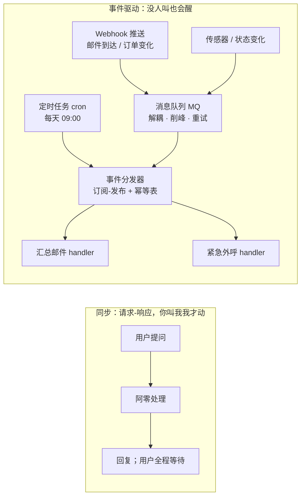
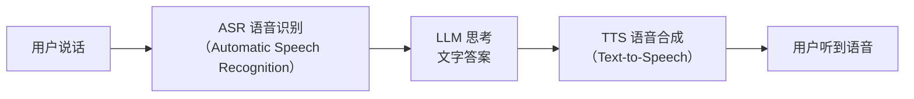
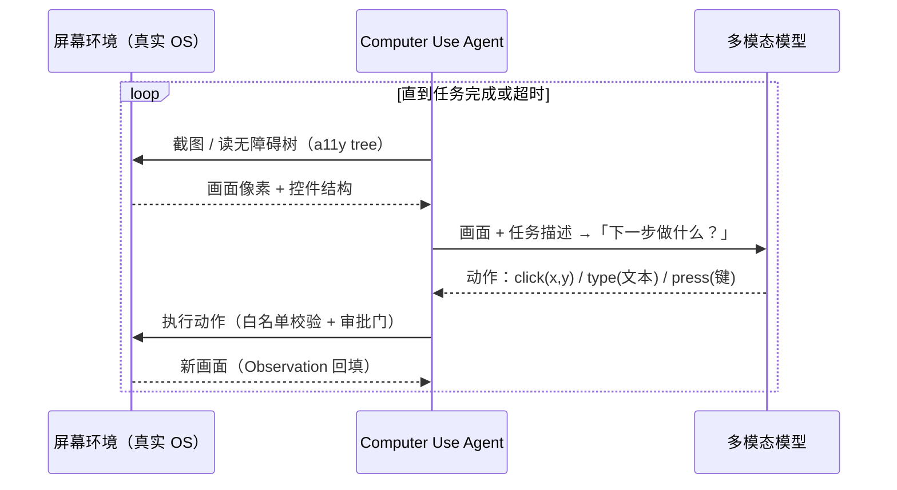
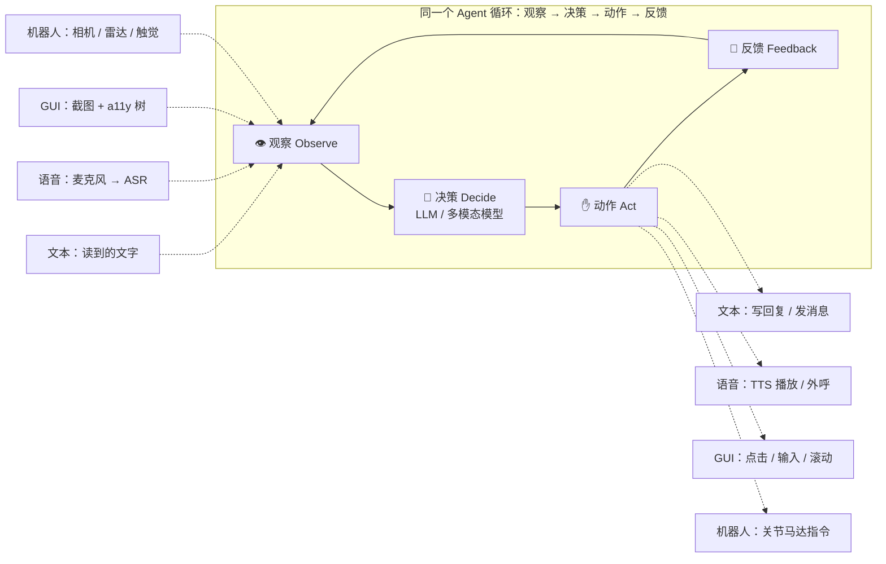

# 06-异步事件、语音、Computer Use 与机器人

> 用户对阿零说：「帮我把邮箱改成这样：每天九点自动汇总邮件，有紧急情况立刻打电话给我。」
> 阿零认真想了想，回答：「你得先叫我，我才醒。」
> 用户愣住了。阿零解释：「我是一条请求-响应的小溪——你问一句，我答一句。没人叫我，我就一直安静地躺在水底。」
> 用户追问：「那『自动』和『立刻』，到底要怎样才能做到？」
> 阿零第一次意识到：它缺的不是能力，而是一套「没人叫也能自己醒过来」的神经系统。

## 本节要解决的问题

前几章，阿零有了会「想」的大脑（第1章）、会「整理」的工作台（第2章）、会「记」的档案柜（第3章）、会「做」的手脚（第4章），甚至学会了写代码、改自己（第5章，详见 [05-Coding-Agent与自举.md](05-Coding-Agent与自举.md)）。但用户这句话暴露了一个一直存在却被忽略的问题：**阿零所有能力的前提，都是「用户先开口」**。它没有眼睛、没有耳朵、没有嘴，也永远不会在没人喊它时主动做任何事。这一章解决四件事：

| 要解决的问题 | 对应内容 |
| --- | --- |
| 为什么 Agent 不能永远「被动等被叫」？请求-响应之外还有什么？ | 核心概念 (a) 异步与事件驱动 |
| 语音交互怎么做：先转文字还是端到端？流式、打断、多说话人如何处理？ | 核心概念 (b) 语音 Agent |
| 怎么让 Agent 直接操作电脑屏幕？「看屏幕、做决策、动鼠标」的闭环是什么？ | 核心概念 (c) Computer Use |
| 有身体的机器人（embodied agent）的感知-规划-控制闭环怎么理解？ | 核心概念 (d) 机器人 |
| 文本/图像/音频/视频如何统一进入 Agent 循环？ | 核心概念 (e) 多模态循环 |

## 故事引入

把前面几章的阿零拆开看，它其实是一台「高级对讲机」：用户按下通话键，它开始处理，处理完挂断。对讲机没有主动性——它永远不会在深夜替你留意异常，也不会在九点替你汇总邮件。而用户想要的，是一个「数字员工」：**该醒的时候自己醒，该说的时候开口说，该看的时候睁眼看，该动手的时候动手。**

这一章要做的，是给阿零完成两次升级。第一次是**自主性升级**：从「请求-响应」（request-response）升级到「事件驱动」（event-driven）——不再只有用户提问这一个触发源，Webhook、消息队列、定时任务、传感器都可以是它的「闹钟」。第二次是**感官升级**：给阿零装上耳朵（语音）、眼睛（屏幕与摄像头）、嘴（语音合成与电话外呼），让它能感知真实世界的多种形态。感官与自主性叠加，阿零才第一次真正「活」在现实里。注意：这两次升级都没有改变 Agent 的骨架——依然是第1章的「观察→思考→行动→观察」循环（回顾 [01-Agent的边界与ReAct.md](01-Agent的边界与ReAct.md)），只是观察的来源、动作的出口变得丰富而真实了。

## 核心概念

### (a) 📡 异步与事件驱动：给阿零装上「自律神经」

请求-响应是「你问我答」，调用方必须阻塞等待；事件驱动是「订阅-发布」（pub/sub）——事件生产者不知道谁在听，阿零也不用时刻在线等待，中间由消息队列（message queue）解耦、削峰、负责重试。类比：饭馆点菜是同步（你坐着等上菜），订阅推送是异步（发生什么事，系统主动通知你）。对 Agent 的意义是：**触发源从「唯一用户」扩展为「整个世界」**——邮件到达（webhook 推送）、订单状态变化（MQ 消息）、每天九点（cron 定时任务）、传感器告警（状态变化）。

**长任务后台执行**：事件到来时，任务可能很长（汇总一周邮件、跑一次数据分析），不能堵住主循环。要把它丢给后台异步执行，并发给任务一个可查询的状态（pending / running / done / failed），持久化到存储里；进程崩溃后按状态恢复。由此阿零学会「先回执，后交付」：收到事件立刻确认，结果好了再异步通知用户。

**事件循环与幂等**：分布式世界里，消息不会只投递一次——网络重试、消费方处理完没来得及确认，都会导致同一事件被重复投递，所以「at-least-once（至少一次）投递」是常态。消费方必须**幂等（idempotent）**：给每个事件一个唯一 id，处理过就记进幂等表，重复投递直接丢弃。否则阿零会把同一封邮件汇总两遍、把同一笔订单处理两次：



### (b) 🎙️ 语音 Agent：级联三件套与端到端

**级联（cascade）是当前主流**：ASR（Automatic Speech Recognition，自动语音识别）把语音转成文字 → LLM 按文字思考 → TTS（Text-to-Speech，语音合成）把回复念出来。三段各自成熟、可独立替换与调试。代价是：延迟叠加（三段串行）、错误累积（ASR 听错一个字，LLM 就会顺着答错）、语气和停顿全部丢失。

**端到端语音模型**：音频直接进、音频直接出，中间不经过文字。代表是 GPT-4o（2024，OpenAI 的原生多模态模型，可直接听音频、说音频）：延迟低，能保留笑声、语气与自然打断的节奏。代价是：可控性差（不能单独换 TTS 音色、改 ASR 词典）、评估与调试困难、推理成本高。目前商用语音助手（客服、语音助理）多数仍走级联路线，端到端正在快速追赶。

**流式、打断与多说话人**：流式（streaming）让 ASR 边说边识别、TTS 边说边播，首字延迟（time-to-first-token）大幅降低；打断（barge-in）靠 VAD（Voice Activity Detection，语音活动检测）听出用户插话，立即停止播放并重新监听；多说话人靠说话人分离（speaker diarization）区分「这句话是谁说的」，是会议纪要场景的刚需。语音场景的典型应用是客服（7×24、降成本）与语音助手，但注意——「外呼电话」这种动作依然要按第4章的风险分级挂审批与审计（见 [04-工具分类与MCP.md](04-工具分类与MCP.md)）：



### (c) 🖥️ Computer Use：阿零学会用鼠标和键盘

**Computer Use** 指让多模态模型像人一样操作电脑——看屏幕、移动鼠标、点击、打字、滚动、按快捷键，在真实软件里完成任务。2024 年，Anthropic 为 Claude 开放了 computer use 能力：模型读取屏幕内容，输出「点击哪个坐标、输入什么文字」等操作；同一年学术界发布了代表性基准 **OSWorld（2024，在真实操作系统环境中评估多模态 Agent 完成开放式任务的基准）**，让「操作电脑」从演示变成可测量的研究问题。

**感知与动作**：感知有两条路。一是**截图**——把像素交给多模态模型「看图说话」，通用但 token 贵、易受视觉噪声干扰；二是**无障碍树（a11y tree，Accessibility Tree）**——操作系统或浏览器暴露出来的控件结构：每个按钮、输入框的名字与坐标，原本是给屏幕阅读器用的「乐高说明书」，结构化、精准、省 token，但没有视觉美感。工程上常两者结合：截图负责理解布局，a11y 树负责定位控件。动作则是结构化的原语：`click(x, y)`、`type(text)`、`press(key)`、`scroll(delta)`。

**与 RPA 的区别**：RPA（Robotic Process Automation，机器人流程自动化）本质是「录制的脚本」——把人的操作录下来回放，按固定坐标与规则执行，界面一变脚本就废；Computer Use 是「理解的循环」——每一轮都先看再决定，界面变化了能重新适应。一句话：**RPA 是规则，Computer Use 是模型理解。**

**安全**：屏幕是一个充满不可信文字的世界——网页、对话框里的文案都可能携带注入指令，必须坚持 data-only 原则（详见第2章 [02-上下文KV-Cache与Skill.md](02-上下文KV-Cache与Skill.md)）；再加误点护栏（只允许点击「当下可见控件白名单」内的目标，宁可多问一句）、只读优先（默认只能看，写操作按第4章的审批门放行）、每一步动作可审计可回滚。**Computer Use 的安全底线比普通工具更高：它的动作空间是整个电脑。**



### (d) 🤖 机器人：embodied agent 的感知-规划-控制闭环

**Embodied Agent（具身智能体）**：有身体、能感知物理世界并作用于物理世界的 Agent。闭环是经典的**感知-规划-控制**（perception-planning-control）：感知层用相机、激光雷达、触觉拿到世界状态；规划层由 LLM/VLM 把高层任务（「把杯子放到桌上」）拆解成步骤序列；控制层把步骤翻译成马达与关节的低层运动指令；执行后的新感知再回到规划层，形成闭环。代表工作如 VoxPoser（2023，用 LLM 生成三维价值图指导机械臂抓取摆放）、PaLM-E（2023，把语言、视觉与机器人状态整合进同一个多模态模型）。

**仿真到现实**：真机试错贵且危险，先在仿真环境里大量训练，再把策略迁移到真机，这就是 sim2real（仿真到现实迁移）；难点是 domain gap（域差距）——仿真中的物理规律与真实世界总有偏差。

**与 GUI Agent 的统一**：把 GUI 和机器人并排放，会发现同一个骨架——观察（截图 / 传感器）→ 决策（模型）→ 动作（点击坐标 / 马达指令）→ 反馈（新画面 / 新传感读数）。差异只在「感官」与「肌肉」：GUI 的动作空间是有限离散控件加屏幕坐标，机器人的动作空间是连续的高维马达指令。统一的框架让评估、安全护栏、ReAct 循环等经验可以互相迁移：



### (e) 🎛️ 多模态循环：五感统一入口

文本、图像、音频、视频，本质都只是 Observation 的不同编码。进入模型前要做「翻译」：图像用视觉编码器转成视觉 token——代表如 SAM（2023，Kirillov 等人提出的视觉基础模型，可分割任意图像中的任意目标，相关教学见 [../09-计算机视觉/教学/10-SAM与视觉基础模型.ipynb](../09-计算机视觉/教学/10-SAM与视觉基础模型.ipynb)）；视频是帧序列加音轨；音频可以 ASR 成文字，也可以直接走语音模型。模态越多，阿零看到的「证据」越全，但注入面也越大——**每一条感知通道都是潜在的信任边界，一律按不可信数据处理**。多模态把第1章的 ReAct 循环从「纯文字推理」升级为「五感推理」，这是 Computer Use、机器人、语音助手背后统一的理论底座（多模态表征与预训练同源的思路可回看 [../04-LLM大模型/教学/11-预训练循环.ipynb](../04-LLM大模型/教学/11-预训练循环.ipynb)）。

## 深入原理

**四类交互形态对比：**

| 维度 | 文本 | 语音 | Computer Use（GUI） | 机器人（embodied） |
| --- | --- | --- | --- | --- |
| 感知输入 | 键盘文本 | 麦克风 → ASR | 截图 + 无障碍树 | 相机 / 雷达 / 触觉 |
| 动作输出 | 生成文字 | TTS 合成语音（含外呼） | 点击 / 输入 / 滚动 / 快捷键 | 马达与关节指令 |
| 延迟量级 | 低：百毫秒~秒 | 中：级联三段串行，流式可降 | 高：每步截图 + 多模态推理 | 最高：感知 + 规划 + 控制全链路 |
| 成本量级 | 低 | 中：额外 ASR、TTS 环节 | 高：多模态模型按图推理 | 最高：硬件 + 仿真 + 安全冗余 |
| 护栏重点 | 幻觉、注入 | 听错累积、外呼审批 | 误点、屏幕注入 | 物理伤害、失控 |

**级联 vs 端到端语音：**

| 维度 | 级联 ASR→LLM→TTS | 端到端语音模型 |
| --- | --- | --- |
| 结构 | 三个独立环节串行 | 单个模型音频进、音频出 |
| 延迟 | 高：三段叠加 | 低：一次推理 |
| 语气 / 副语言 | 基本丢失 | 保留笑声、停顿、强调 |
| 错误传播 | ASR 听错 → 全链路错 | 无中间文字环节，误差不显式累积 |
| 可控性 | 好：每段单独替换、调优 | 差：音色、词典都难单独定制 |
| 可调试性 | 好：中间产物是文字，肉眼可查 | 差：中间表示是隐向量 |
| 现状 | 商用客服 / 语音助手主流 | 追赶中，代表如 GPT-4o（2024） |

## 代码实战

先实现一个「事件引擎」：订阅-发布 + 简化 cron 定时任务 + 幂等表，演示「没人叫也自己醒」（约 55 行，接口全 mock、不联网）；再实现 Computer Use 的最简闭环「看→想→动→看」：mock 屏幕、mock 多模态大脑、可见控件白名单护栏（约 50 行）。两个示例互相独立、可直接运行，随机种子固定保证输出可复现。

```python
# -*- coding: utf-8 -*-
"""event_dispatcher.py：阿零的事件引擎——「没人叫也会醒」的自律神经（教学用，接口全 mock）"""
import random
from collections import defaultdict
from dataclasses import dataclass

random.seed(42)  # 固定随机种子，保证输出可复现

@dataclass
class Event:
    type: str              # 事件类型，如 "mail.urgent"
    payload: dict          # 事件携带的数据
    eid: str = ""          # 幂等键：同一事件重复投递只生效一次

class EventDispatcher:
    """极简订阅-发布引擎 + 简化 cron 定时任务。"""
    def __init__(self) -> None:
        self._handlers = defaultdict(list)  # 订阅表：type -> [handler, ...]
        self._seen = set()                  # 已消费事件 id（幂等表）
        self._cron = []                     # 定时任务表

    def on(self, event_type: str, handler) -> None:
        """订阅：某类事件到达后交给 handler 处理。"""
        self._handlers[event_type].append(handler)

    def publish(self, ev: Event) -> bool:
        """投递事件；eid 已在幂等表则丢弃，返回 False。"""
        if ev.eid and ev.eid in self._seen:
            return False                    # at-least-once 投递 → 幂等消费
        if ev.eid:
            self._seen.add(ev.eid)
        for handler in self._handlers.get(ev.type, []):
            handler(ev.payload)
        return True

    def schedule(self, when: tuple, handler) -> None:
        """定时任务：when=(时, 分)，到点执行（教学版细粒度仅到分钟）。"""
        self._cron.append((when, handler))

    def tick(self, hour: int, minute: int) -> None:
        """时钟推进：真实系统里由调度器每分钟调用一次。"""
        for (h, m), handler in self._cron:
            if (h, m) == (hour, minute):
                handler(None)

MOCK_MAILS = ["老板日报", "报销单", "会议纪要"]  # mock 邮箱

def daily_mail_summary(_) -> None:
    print(f"[定时 09:00] 自动汇总邮件：共 {len(MOCK_MAILS)} 封 → 摘要已生成并存盘")

def urgent_call(payload: dict) -> None:
    print(f"[紧急事件] 『{payload['msg']}』→ 立即 TTS 电话外呼用户（mock）")

if __name__ == "__main__":
    bus = EventDispatcher()
    bus.on("mail.urgent", urgent_call)        # 订阅「紧急邮件」事件
    bus.schedule((9, 0), daily_mail_summary)  # 订阅「每天 09:00」定时任务

    bus.tick(8, 59)                           # 08:59：一切安静（无输出）
    bus.tick(9, 0)                            # 09:00：定时任务被唤醒
    alert = Event("mail.urgent", {"msg": "服务器宕机！"}, eid="ev-001")
    ok = bus.publish(alert)                   # 第一次投递
    print(f"  第一次投递：{'已消费' if ok else '丢弃'}")
    ok = bus.publish(alert)                   # 模拟网络重试导致的重复投递
    print(f"  第二次投递：{'已消费' if ok else '重复事件，幂等表拦截'}")
```

输出示意：

```text
[定时 09:00] 自动汇总邮件：共 3 封 → 摘要已生成并存盘
[紧急事件] 『服务器宕机！』→ 立即 TTS 电话外呼用户（mock）
  第一次投递：已消费
  第二次投递：重复事件，幂等表拦截
```

```python
# -*- coding: utf-8 -*-
"""computer_use_skeleton.py：Computer Use「看→想→动→看」闭环（教学用，全部 mock）"""
import random

random.seed(7)  # 固定随机种子，保证输出可复现

# ---------- 1) mock 的图形界面环境 ----------
screen = {"window": "企业微信", "unread": 1, "draft": "", "last": "打开附件", "sent": False}
WIDGETS = {"回复老板": (80, 120), "输入框": (300, 470), "发送": (620, 480)}  # 可见控件白名单

def screenshot() -> str:
    """mock 截图。真实实现：截取像素图 → 多模态模型解析成结构化描述。"""
    return (f"[画面] 窗口={screen['window']}；未读={screen['unread']} 条；"
            f"草稿='{screen['draft']}'；刚做：{screen['last']}"
            + ("；已发送 ✓" if screen["sent"] else ""))

def act(action: dict) -> str:
    """执行动作；护栏：只允许点击白名单里的可见控件（防误点）。"""
    kind, arg = action["type"], action["arg"]
    if kind == "click" and arg in WIDGETS:
        if arg == "回复老板":
            screen["unread"], screen["last"] = 0, "点开与老板的会话"
        elif arg == "发送" and screen["draft"]:
            screen["sent"], screen["draft"] = True, ""
            screen["last"] = "发送草稿"
        return f"点击『{arg}』"
    if kind == "type":
        screen["draft"], screen["last"] = arg, f"输入『{arg}』"
        return f"输入『{arg}』"
    return f"护栏拦截：{kind}({arg}) 不在界面可见控件白名单里"

def mock_llm(obs: str) -> dict:
    """mock 多模态大脑：真实实现是「截图 + 任务描述 → 多模态模型 → 结构化动作」。"""
    if "未读=1" in obs:
        return {"type": "click", "arg": "回复老板"}
    if screen["unread"] == 0 and screen["draft"] == "" and not screen["sent"]:
        return {"type": "type", "arg": "收到了，晚点细看"}
    if screen["draft"] and not screen["sent"]:
        return {"type": "click", "arg": "发送"}
    return {"type": "noop", "arg": ""}

if __name__ == "__main__":
    for step in range(1, 6):                  # 最多 5 轮，防死循环（呼应第1章 max_steps）
        obs = screenshot()
        print(f"[step {step}] 观察：{obs}")
        action = mock_llm(obs)
        print(f"            决策：{action}")
        print(f"            动作：{act(action)}")
        if screen["sent"]:
            print("✓ 任务完成：已回复并发送")
            break
```

输出示意：

```text
[step 1] 观察：[画面] 窗口=企业微信；未读=1 条；草稿=''；刚做：打开附件
            决策：{'type': 'click', 'arg': '回复老板'}
            动作：点击『回复老板』
[step 2] 观察：[画面] 窗口=企业微信；未读=0 条；草稿=''；刚做：点开与老板的会话
            决策：{'type': 'type', 'arg': '收到了，晚点细看'}
            动作：输入『收到了，晚点细看』
[step 3] 观察：[画面] 窗口=企业微信；未读=0 条；草稿='收到了，晚点细看'；刚做：输入『收到了，晚点细看』
            决策：{'type': 'click', 'arg': '发送'}
            动作：点击『发送』
✓ 任务完成：已回复并发送
```

## 面试考点

**Q1：事件驱动和请求-响应有什么区别？Agent 为什么要事件驱动？**
A：请求-响应是同步的「你问我答」，调用方阻塞等待；事件驱动是异步的「订阅-发布」——生产者发事件、消费者订阅处理，中间常有消息队列解耦、削峰、重试。Agent 需要事件驱动，是因为真实世界的触发源远不止用户提问：邮件、订单、定时任务、传感器告警都在时刻发生。「每天九点自动汇总邮件」这类需求，本质上要求 Agent 有一根「没人叫也会醒」的自律神经。

**Q2：为什么事件消费必须幂等？怎么实现？**
A：消息系统通常是 at-least-once 投递——网络重试、消费方处理完没来得及确认，都会导致同一事件被重复投递。不处理的话，阿零会把同一封邮件汇总两遍、把同一笔订单处理两次。实现：给事件带唯一 id，消费方维护「已处理 id 表」，重复 id 直接丢弃；做不到全局幂等时，至少让「结果幂等」——重复执行与执行一次的最终效果相同。

**Q3：级联语音和端到端语音各自有什么优劣？**
A：级联（ASR→LLM→TTS）三段独立、可单独调优与替换，中间产物是文字、可调试性强；缺点是延迟高、ASR 听错会向全链路累积、语气丢失。端到端（音频进、音频出，如 GPT-4o 2024）延迟低、保留语气与打断节奏；缺点是可控性差、成本高、难评估。商用客服与语音助手目前仍以级联为主，端到端在快速追赶。

**Q4：Computer Use 怎么感知世界、怎么动作？**
A：感知两条路：截图（像素交给多模态模型解析）和无障碍树 a11y tree（控件名称与坐标的结构化描述），工程上常两者结合；动作是原语序列：click(x, y)、type(text)、press(key)、scroll。整个循环与 ReAct 同构：看屏幕 → 决策 → 执行动作 → 观察新屏幕，直至任务完成或超时结束。

**Q5：Computer Use 和 RPA 有什么区别？**
A：RPA 是录制的规则脚本，按固定坐标和流程回放，界面一变就失效，它不理解自己在做什么；Computer Use 是模型理解的循环，每轮先看再决定，界面变化能重新适应。一句话：RPA 是规则，Computer Use 是理解。代表性基准是 OSWorld（2024），在真实操作系统环境里评估多模态 Agent。

**Q6：机器人 agent 的闭环是什么？和 GUI agent 是什么关系？**
A：感知-规划-控制闭环：传感器（相机 / 雷达 / 触觉）→ 高层 LLM 规划拆解任务 → 底层控制器执行运动 → 新感知反馈再规划；工程上还要处理 sim2real 迁移与域差距。它与 GUI agent 共享同一个「观察 → 决策 → 动作 → 反馈」骨架，只是感官（摄像头 vs 截图）与动作空间（连续马达指令 vs 离散控件坐标）不同，评估、护栏、循环等经验可以互相迁移。

**Q7：多模态循环里要警惕什么？**
A：每一条感知通道（图像、音频、视频、屏幕文字）都是新的输入面，都可能被注入恶意指令——必须坚持 data-only，一切感知一律按不可信数据处理；同时模态越多、上下文越大，越要回到第2章的工作台预算管理：按需注入视觉 token，而不是把全部感知全量塞进上下文。

## 小结与下一章预告

这一章，阿零终于从「高级对讲机」变成了「数字员工」：事件驱动让它没人叫也会醒，长任务能后台跑、能按状态恢复，重复事件被幂等表挡在门外；语音让它长出了耳朵和嘴，理解了级联与端到端两条路线、流式与打断的工程细节；Computer Use 让它能亲手操作电脑，也让它第一次直面「屏幕里全是不可信文字」的安全战场；机器人与多模态循环则让它看懂了所有具身形态背后那条统一的「观察 → 决策 → 动作 → 反馈」血管。

但用户的新问题随之而来：「你昨天自动汇总的邮件，摘要到底准不准？你在屏幕上替我们点的那个『删除』，对不对？」阿零无法回答——它「会做」，但它不知道自己做得好不好。它需要一把尺子：评估环境、Pass@k 与 Pass^k（「做过一次就对」还是「全程全对」）、首错归因、统计显著性。

下一章，请翻到 [07-评估与Pass-at-k.md](07-评估与Pass-at-k.md)：给阿零一把「尺子」，让「会做」变成「做得对、可衡量」。