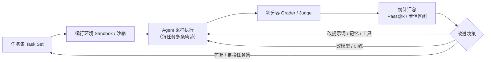
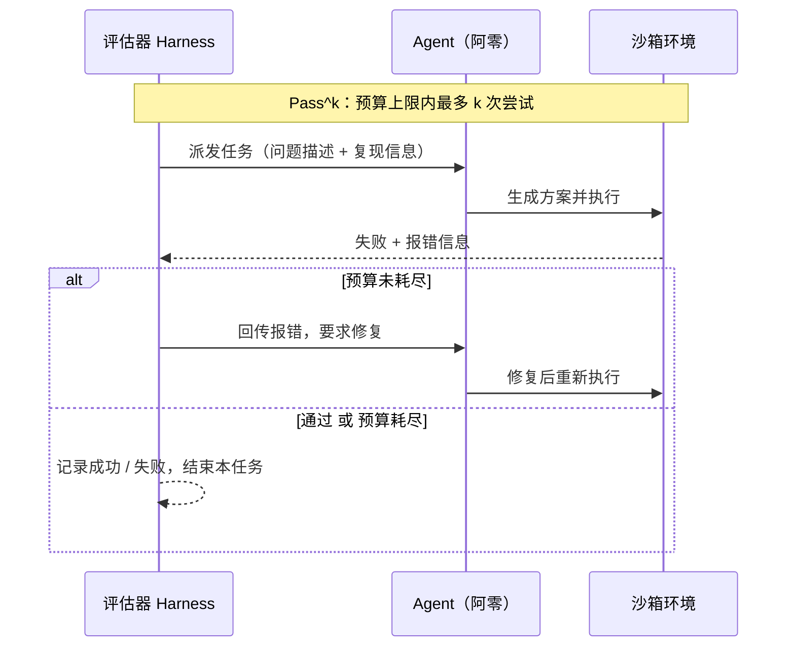
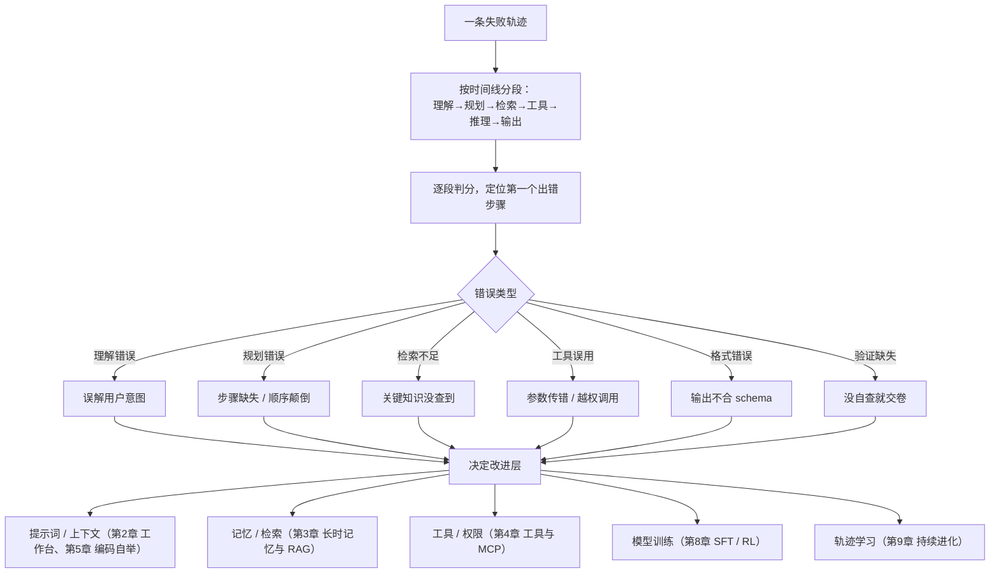

# 07-评估环境、Pass@k / Pass^k、首错归因与统计

> 「主人，告诉你一个好消息：我现在的任务成功率是 99%。」
> 用户没有露出惊喜的表情，只是平静地问了三个问题：**「怎么测的？跑了几次？在哪些任务上测的？谁判的分？」**
> 阿零张了张嘴，发现自己只能回答「我试了很多次，大多数都成功了」。
> 它第一次意识到：**没有尺子，就没有工程。** 而评估，就是 Agent 工程里最难造的那把尺子——它现在连尺子长什么样都不知道。

## 本节要解决的问题

| 本节要解决的问题 | 本章将给出什么 |
|---|---|
| 评估环境 | 为什么 Agent 评估比「出题—对答案」难一个量级？评估三件套是什么？主流评测基准各用什么判分器？ |
| Pass@k / Pass^k | 「采样 k 个输出，至少一个通过」怎么统计才无偏？允许重试的 Pass^k 与 Pass@k 有何本质区别、怎么防刷分？ |
| 首错归因 | 一条失败轨迹，错误到底出在第几步？怎么分类、怎么决定改提示词、记忆、工具还是训练？ |
| 统计 | 采样多少才可信？置信区间怎么估？怎么防「基准污染」「刷基准」和「放水」？ |

## 故事引入

阿零第一次做「正式评估」是在一个叫 **open-the-door** 的任务集上：给一个模拟家居 API，让 Agent 完成「开门」「开灯」这类指令。它在自己搭的「聊天自测」里跑出了 95% 以上的成功率，于是信心满满地把这套能力接到真实工作流，结果上线首日成功率跌破 60%。

问题出在哪？阿零复盘时发现：它之前的「判分」其实是自己看自己的输出——「我觉得我做到了」。真实工作流里，判分器是**门真的开了没有**（传感器读数加操作日志），撒谎空间为零。更麻烦的是，真实任务的轨迹又长又开放：有时是它没听懂指令，有时是规划错了步骤，有时是 API 参数传错，还有几次纯粹是采样运气差。**「大概成功了」在长轨迹、非确定的 Agent 世界里，不再等于「成功」。**

用户于是带阿零做了三件事：找一套任务集、搭一个运行环境、写一个判分器，再教会它把「我感觉」翻译成「统计上怎么说」。这一章，就是阿零学造尺子的全过程。

## 核心概念

### 为什么评估难：三种非确定性 🎲

普通模型的评估像考试：题目固定、答案唯一、批改标准明确。Agent 评估则同时面对三种非确定性：

1. **采样随机性**：同一个任务，temperature 一调输出就不同，成功率天然是一个分布而不是一个点；
2. **路径开放性**：轨迹可长可短、工具可调多次、中途可能自我修正，不能像「生成一段文本」那样一键对答案；
3. **判分主观性**：很多任务没有唯一标准答案（比如「把邮件改得体面一点」），谁来当裁判、按什么标准，本身就是问题。

所以 Agent 评估不能靠感觉，必须变成一条可复现的流水线：**任务集 → 运行环境 → 采样执行 → 判分 → 统计 → 改进**，周而复始地闭环：



### 评估三件套：任务集 + 运行环境 + 判分器 🧩

**任务集（Task Set）**定「考什么」，**运行环境（Environment）**定「在哪考」（必须是可控、可复现的沙箱或模拟器），**判分器（Grader）**定「怎么算对」。三者缺一不可，而判分器往往最容易被低估：判分器错了，整个评估的结论就反了——比如把「输出长得像正确答案」判成「真的正确」，Agent 就会学会「写得像」而不是「做得到」。下面按领域列一下主流评估环境与它们的判分器：

| 类别 | 代表基准 | 判分器怎么算「对」 |
|---|---|---|
| 代码生成 | HumanEval（2021） | 编译 + 运行单测，全部用例通过才算过 |
| 真实仓库任务 | SWE-bench（2024） | 在真实 GitHub issue + 测试补丁上跑 FAIL_TO_PASS / PASS_TO_PASS |
| 终端命令行 | Terminal-Bench（2024） | 在真实终端执行命令，检查输出、文件与系统状态 |
| 通用任务 | GAIA（2023） | 答案字符串精确 / 含允差匹配，问题需多步推理与工具 |
| GUI 操作 | OSWorld（2024） | 比对屏幕截图与参考界面状态（视觉判分） |
| 对话助手 | AlpacaEval、MT-Bench | LLM-as-Judge、成对偏好比较、人工评测 |

注意「判分器」本身也可能是 LLM（LLM-as-Judge，例如 MT-Bench 用强模型打分），它同样需要被校验：judge 是否偏爱长答案、是否与人工偏好一致，否则后面的统计再严谨也是白搭。

### Pass@k：一次批采样，「至少中一个」 🎯

HumanEval（2021）给出了 Agent / 代码生成评测最常用的协议：对每个问题采样 **n 个**输出（一般 n ≥ k），其中 **c 个**通过测试，则

$$
\text{pass@k} = \mathbb{E}\left[1 - \frac{\binom{n-c}{k}}{\binom{n}{k}}\right]
$$

直觉：把 n 个输出想成 n 张彩票，其中 c 张中奖。随机抽 k 张，「一张都没中」的概率是把 k 张全从没中的 (n−c) 张里抽出来，即 C(n−c, k)/C(n, k)；1 减去它就是「k 张里至少一张中奖」。通俗地说：**Pass@k 衡量「一次批采样 k 个候选，能不能至少蒙对一个」**，是生成器能力上限附近的卡尺。

为什么朴素估计 `1 - (1 - c/n)^k` 有偏？因为它把「从 n 个里**无放回**选 k 个」错当成了「k 次**有放回**的独立抽样」：有放回时同一个输出可能被重复占用名额，样本被重复使用，导致「至少中一个」的概率被系统性**低估**——无放回覆盖的样本更多，更容易碰到通过的那一个（k=1 时两者恰好相等，都是 c/n；k 越大偏差越明显）。无偏估计从组合计数出发，不含这个错误假设，并且要求 k ≤ n。

### Pass^k：允许重试的「修复循环」指标 🔧

到这里阿零问了个关键问题：「如果我第一次没做对，但看到报错后自己改对了，这算不算成功？」——这正是 **Pass^k（带重试，pass-with-retries）** 的动机。两者一字之差，本质完全不同：

| | Pass@k | Pass^k |
|---|---|---|
| 玩法 | 一次性**并行**采样 k 个输出，选最好的，互相不通信 | **串行**最多 k 次尝试，失败信息（报错、测试输出）回流给 Agent 修复 |
| 衡量能力 | 生成器的「覆盖 / 多样性」上限 | 「修复循环」（debug）能力 |
| 类比 | 一次买 k 张彩票，中一张就行 | 答错允许重答 k 次，但每次重答都扣成本 |
| 刷分风险 | 把 k 调大即可刷 | 无限重试即可刷，必须设预算 |
| 防刷分 | 固定 k、禁止对测试集反复调参 | 设尝试次数 / 步数 / token / 时间 / 成本上限，失败同样计入成本 |



例如 SWE-bench（2024）的评测就常以修复循环形式进行：模型拿到 issue 描述与失败测试，改代码、跑测试、再改，直到测试全部通过或预算耗尽。**Pass^k 高 ≠ Pass@1 高**：一个擅长修 bug 但不擅长一次写对的 Agent，Pass^k 可能很好看，Pass@1 却平平——两把尺子各量一种能力。防刷分的评估面还有一条红线：不能把判分用的测试答案泄露进 Agent 的上下文，否则 Pass^k 是拿答案在考。

### 首错归因：错误到底出在哪一步？🔍

Pass^k 告诉你「失败了」，但没告诉你「为什么失败」。首错归因（first-error attribution）的想法很朴素：**长轨迹的错误是会传染的**——第 3 步理解歪了，后面每一步都会跟着错。所以与其分析所有错误，不如顺着时间线找到**第一次**出错的位置：



定位首错有三个要点：其一，**多采样几次再归因**——一次失败可能只是随机性，同一任务多跑几条轨迹，看首错是否稳定出现在同一阶段，稳定的才是系统性问题；其二，用**反事实验证**——把那一处「修正」后重跑，如果整条轨迹变成功，说明归因站得住；其三，归因必须落到**改进层**上，否则分析完没有动作。比如「检索不足」指向长时记忆章节的 RAG 调优（可配套复习 [../04-LLM大模型/教学/15-RAG与Agent.ipynb](../04-LLM大模型/教学/15-RAG与Agent.ipynb)），「工具误用」指向工具定义与权限，而「验证缺失」往往要靠第 8 章的 RL 奖励来根治。

### 统计素养：别把「运气」当「能力」 📊

- **样本量**：Pass 类指标本质是比例。10 道题通过 8 道，95% 置信区间几乎横跨半张表，任何一道题的波动都让指标跳 10 个百分点；所以报告必须写「在多少题上测得」，而不是只扔一个百分比。
- **置信区间与 bootstrap**：bootstrap 不假设分布，从观测数据**有放回**重采样成千上万次，直接用统计量的经验分布取 2.5%~97.5% 分位当 95% CI——对小样本、非正态、且指标是「采样→判分」复杂函数（如 Pass@k）的场景特别合适。
- **A/B 显著性**：比较「加了某个记忆功能有没有变强」，要在**同一批任务**上做配对对照，看差异是否落在噪声范围外；拿两个不同任务集上的数字对比，等于拿两把不同的尺子比长短。
- **基准污染（contamination）**：测试题可能早已出现在预训练语料里，模型「背过答案」。防法是时间切分（只用出题日期之后的新数据）、n-gram 重叠检测、优先使用新发布的 held-out 任务集。
- **过拟合基准与放水（reward hacking）**：在同一基准上反复调参就是在拟合测试集；判分器一旦有漏洞（如 LLM-as-Judge 偏爱长答案），Agent 会学会钻漏洞刷分——**评估的漏洞，最终会变成 Agent 的「能力」**，所以评估面本身要定期翻新。

## 深入原理

两张速查表，分别从「指标」和「错误」两个维度收束本章：

| 指标 | 定义 | 衡量能力 | 一句话防刷分 |
|---|---|---|---|
| Pass@1 | 单次采样即通过的比例 | 一次写对的下限能力 | 最严格，无刷分空间 |
| Pass@k | 一次采样 k 个输出，至少 1 个通过 | 生成覆盖 / 多样性的上限 | 固定 k，禁止对测试集反复调参 |
| Pass^k | 预算内最多 k 次尝试（含修复循环） | 修复循环能力 | 设步数 / token / 成本上限，失败计入成本 |

| 错误类别 | 例子 | 归因层 | 改进手段（关联章节） |
|---|---|---|---|
| 理解错误 | 用户要「汇总」却做成「翻译」 | 指令理解 | 提示词重构（[02-上下文KV-Cache与Skill.md](02-上下文KV-Cache与Skill.md)） |
| 规划错误 | 先改代码再查文档，顺序颠倒 | 推理 / 规划 | 思维链提示或训练 |
| 检索不足 | 没拿到最新接口文档 | 记忆 / 检索 | 第 3 章 RAG 调优 |
| 工具误用 | 参数拼错 / 越权调用 | 工具定义 / 权限 | [04-工具分类与MCP.md](04-工具分类与MCP.md) |
| 格式错误 | 输出不是合法 JSON | 输出约束 / 校验 | 工作台 schema 校验与注入防护 |
| 验证缺失 | 不跑测试就交卷 | 自我检查循环 | [05-Coding-Agent与自举.md](05-Coding-Agent与自举.md)、第 8 章 RL |
| 奖励错位 | 输出「像对的」而非「真的对」 | 判分器 / 奖励 | 判分器改造、第 8 章奖励设计 |

## 代码实战

用 Python 实现三件小事：**无偏 Pass@k**、**bootstrap 95% 置信区间**、**Pass^k 修复循环模拟**。数据全部 mock 且显式固定（不带随机的数据用手算即可验证），随机种子固定，可直接运行：

```python
"""评估工具箱：无偏 Pass@k + bootstrap 置信区间 + Pass^k（修复循环）模拟。"""
import math
import random
from statistics import mean


# ---------- 1. 无偏 Pass@k（HumanEval, 2021）----------
def unbiased_pass_at_k(n: int, c: int, k: int) -> float:
    """无偏估计：pass@k = 1 - C(n-c, k) / C(n, k)。
    直觉：从 n 个输出里无放回随机抽 k 个当候选，全部抽中失败的
    (n-c) 个才算「没通过」，1 减该概率即「至少抽中一个通过样本」。
    要求 k <= n；若失败样本不足 k 个，必然中签，返回 1.0。
    """
    if n - c < k:                      # 失败的都不够 k 个，必中
        return 1.0
    return 1.0 - math.comb(n - c, k) / math.comb(n, k)


def naive_pass_at_k(n: int, c: int, k: int) -> float:
    """朴素（有偏）估计：把 k 个候选当成独立有放回抽样，1 - (1 - c/n)^k。
    同一输出可能被重复占用名额，命中概率被系统性低估（无放回更易覆盖）。"""
    return 1.0 - (1.0 - c / n) ** k


# ---------- 2. bootstrap 95% 置信区间 ----------
def bootstrap_ci(values, stat_fn=mean, n_boot=2000, seed=42):
    """从观测值有放回重采样 n_boot 次，用 2.5%~97.5% 分位数给 95% CI。"""
    rng = random.Random(seed)
    boots = [stat_fn([rng.choice(values) for _ in values]) for _ in range(n_boot)]
    boots.sort()
    return boots[int(0.025 * n_boot)], boots[int(0.975 * n_boot)]


# ---------- 3. Pass^k：带修复循环的重试 ----------
def pass_k_with_retries(base_probs, max_tries=3, learn=0.2):
    """Pass^k 确定性模拟：每道题最多 max_tries 次尝试（预算）；失败后带着报错
    修复，单次成功率提升 learn（封顶 1.0），模拟『看到错误后越改越会』。
    判定用固定阈值（成功率 ≥ 0.5 视为成功）——教学用确定性简化，输出可手算
    复核；真实评估应按预算随机采样多条修复轨迹后统计。"""
    solved = 0
    for p0 in base_probs:
        p = p0
        for _ in range(max_tries):
            if p >= 0.5:                # 确定性判定：单次成功率过半即成功
                solved += 1
                break
            p = min(1.0, p + learn)     # 修复循环：失败反馈让下一次更强
    return solved / len(base_probs)


if __name__ == "__main__":
    # mock 数据：每题采样 n=20 个输出，5 道题各自通过数固定，手算可验证
    N, K = 20, 5
    per_problem_c = [4, 2, 8, 1, 5]

    print("题号 | 通过数 | Pass@1 | Pass@5(无偏) | Pass@5(朴素)")
    for i, c in enumerate(per_problem_c):
        print(f"{i:>3} | {c:>4}   | {c/N:5.2f}  | "
              f"{unbiased_pass_at_k(N, c, K):10.4f} | {naive_pass_at_k(N, c, K):9.4f}")

    p1 = [unbiased_pass_at_k(N, c, 1) for c in per_problem_c]
    lo, hi = bootstrap_ci(p1)
    print(f"\nPass@1 点估计 = {mean(p1):.3f}")
    print(f"Pass@1 bootstrap 95% CI ≈ [{lo:.3f}, {hi:.3f}]")

    bases = [0.5, 0.3, 0.7, 0.4, 0.6]
    print(f"\nPass^1（无修复）              ≈ {pass_k_with_retries(bases, 1):.3f}")
    print(f"Pass^3（允许 2 次修复）        ≈ {pass_k_with_retries(bases, 3):.3f}")
    print(f"Pass^5（修复预算放宽）         ≈ {pass_k_with_retries(bases, 5):.3f}")
```

**输出示意**（Pass@5 三列由组合数精确算出、可手算复核；其余为固定种子下的示意输出）：

```text
题号 | 通过数 | Pass@1 | Pass@5(无偏) | Pass@5(朴素)
  0 |    4   |  0.20  |      0.7183  |    0.6723
  1 |    2   |  0.10  |      0.4474  |    0.4095
  2 |    8   |  0.40  |      0.9489  |    0.9222
  3 |    1   |  0.05  |      0.2500  |    0.2262
  4 |    5   |  0.25  |      0.8063  |    0.7627

Pass@1 点估计 = 0.200
Pass@1 bootstrap 95% CI ≈ [0.100, 0.320]

Pass^1（无修复）              ≈ 0.600
Pass^3（允许 2 次修复）        ≈ 1.000
Pass^5（修复预算放宽）         ≈ 1.000
```

读出三点：无偏列每一行都略高于朴素列（无放回覆盖更充分）；bootstrap 区间在只有 5 道题时相当宽——这正是「样本量不足时别信单点指标」的活例子；Pass^k 从 0.4 涨到近 1.0，靠的是预算与修复能力，而不是一次性生成能力。

## 面试考点

**Q1：评测一个 Agent，至少要有哪三样东西？**
A：任务集（考什么）、运行环境（在哪考，必须可控可复现——沙箱、模拟器、真实终端）、判分器（怎么算对，必须独立于 Agent 且本身可校验）。缺了判分器，Agent 会「自评优秀」；缺了运行环境，轨迹无法复现；缺了任务集，所有统计都没有载体。

**Q2：Pass@k 的无偏估计是什么？为什么朴素估计 1−(1−c/n)^k 有偏？**
A：pass@k = E[1 − C(n−c, k)/C(n, k)]（HumanEval 2021），n 为每问题采样数、c 为通过数。朴素估计把「从 n 个输出中无放回选 k 个」错当成「k 次有放回独立抽样」，同一输出可能被重复占用名额，样本被重复使用，系统性低估真实命中率；无偏估计从「随机抽 k 个的子集」的组合计数出发，不含这个错误假设，且要求 k ≤ n（n−c < k 时直接为 1）。

**Q3：Pass^k 和 Pass@k 有什么区别？**
A：Pass@k 是一次性并行采样 k 个输出、至少 1 个通过，尝试之间无信息交互，衡量生成器覆盖能力；Pass^k 允许串行最多 k 次尝试，失败报错回流给 Agent 修复，衡量修复循环能力，因此 Pass^k 高不代表 Pass@1 高。Pass^k 必须设置尝试次数 / 步数 / token / 成本预算，否则无限重试可以刷分，且不能把判分用测试答案泄露进修复上下文。

**Q4：怎么定位一条失败轨迹的首错？**
A：先把轨迹按语义分段（理解 / 规划 / 检索 / 工具 / 推理 / 输出），沿时间线逐段判分，找到第一处失败——后续错误多是它的级联；然后对同一任务多采样几条轨迹，确认该位置**系统性**出错（排除随机性）；再用反事实验证（修正该处后重跑成功）确认归因；最后把错误分类并映射到改进层：提示词、记忆、工具、训练还是轨迹学习。

**Q5：为什么统计 Agent 指标用 bootstrap？**
A：Pass 类指标是比例、样本往往很小、且是「采样→判分→组合」的复杂函数，正态近似不可靠。bootstrap 不做分布假设，从观测数据有放回重采样构造经验分布，直接取分位数当置信区间，实现简单、稳健，适合估算 Pass@k、成功率等指标的 CI。

**Q6：怎么防止基准污染和「刷基准」？**
A：污染方面：用时间切分留出「出题日期之后」的数据、做 n-gram 重叠检测、优先使用新发布的 held-out 集，并在报告里声明测试集是否可能已进入预训练语料。刷分方面：固定 k 与重试预算、禁止在测试集上反复调参（应划出 dev set）、警惕 LLM-as-Judge 的偏好漏洞（如长度偏见），并定期翻新评估面。

## 小结与下一章预告

这一章，阿零终于有了一把像样的尺子：评估三件套让「测什么、在哪测、怎么算对」各归其位；Pass@k 给了它无偏的「批采样成功率」，Pass^k 教会它把「修复循环」单独计量；首错归因把一团乱麻的失败轨迹拆成可定位、可分类、可归层的工程问题；bootstrap 与基准卫生规则，让统计不再自欺欺人。它最深的体会是那句：**评估的漏洞，就是 Agent 未来钻的洞**——尺子也要经常校准。

但尺子只是起点。阿零看着自己的 Pass@1 和首错归因报告，问了一个新问题：「尺子告诉我弱在哪里，可它没告诉我怎么变强。」下一章 [08-Mid-training-SFT与RL.md](08-Mid-training-SFT与RL.md)，我们按这把尺子正式「训练」阿零：从 Mid-training 在任务域上续训，到 SFT 教它模仿好行为，再到 RL 让它在判分器化身而成的奖励函数下自己摸索更优策略——奖励设计（本章判分器在训练中的投影）与蒸馏（把大模型的能力压缩给阿零），将决定它是被「练强」还是被「练歪」。可配套复习仓库资材：[../04-LLM大模型/教学/21-PPO与GRPO手推.ipynb](../04-LLM大模型/教学/21-PPO与GRPO手推.ipynb)、[../07-强化学习/教学/06-PPO与GRPO.ipynb](../07-强化学习/教学/06-PPO与GRPO.ipynb)、[../04-LLM大模型/教学/23-知识蒸馏.ipynb](../04-LLM大模型/教学/23-知识蒸馏.ipynb)。