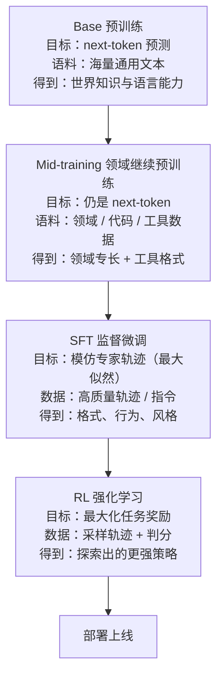
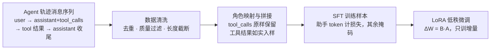
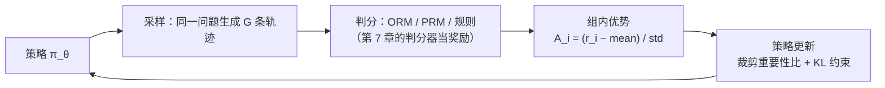
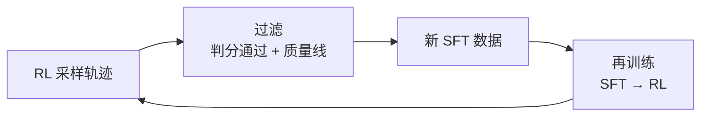

# 08-Mid-training、SFT、RL、奖励设计与蒸馏

> 「主人，我把提示词改到第五十版了，few-shot 示例堆了三十条，可它还是会在第三步用错参数、在最后一步编造工具结果。」
> 用户盯着失败日志，头也不抬：「你有没有想过，问题不在『说教』，而在『没练过』？」
> 「能不能把『会做事』写进它的肌肉？」
> 阿零第一次听到这个词，心里一沉——它知道，提示词是说明书，而训练，是要上健身房了。

## 本节要解决的问题

| 本节要解决的问题 | 本章将给出什么 |
|---|---|
| 训练路径总览 | Base → Mid-training → SFT → RL → 蒸馏：每一层的目标、数据、成本与主要风险 |
| 轨迹 SFT | Agent 轨迹（tool_call / tool_result 消息序列）怎么转成 SFT 样本；角色映射与拼接规则、数据清洗、LoRA 低成本微调 |
| RL 与奖励设计 | ORM vs PRM、GRPO / PPO / DPO 各自解决什么；奖励设计三原则；奖励黑客长什么样 |
| 蒸馏 | 大模型老师怎么把能力压缩给「装进口袋的小阿零」；三种蒸馏路线与省成本的逻辑 |

## 故事引入

阿零一直以为「变强」的途径只有一条：改提示词。直到它发现提示词是**说明书**——写得再细，也只是在调用它本来就会的能力；说明书永远覆盖不了所有意外情况。用户给它算了一笔账：前几章它练会了工作台、记忆、工具、写代码、感知世界，第 7 章又拿到了尺子，可这些全是「教」出来的。教出来的东西有个共同点：**上限是老师的天花板**。而训练，是唯一能把上限本身抬高的事。

「教」和「练」的区别，阿零在一次模拟里彻底明白了：它把同一个任务交给两个自己，一个背熟了五十版提示词，另一个什么提示都不带、只被反复用成功与失败的轨迹「练」过。前者碰到没见过的错误依旧卡壳；后者却能把错误转化成新的反应。用户说：**提示词是在能力圈内做选择，训练是在扩大能力圈**——教练讲一百句游泳要领，不如下水游一百次，让动作长进肌肉里。这一章，就是阿零的「健身房课表」：Mid-training 补专业课、SFT 学标准动作、RL 上场打比赛、蒸馏把大老师的功夫装进小口袋。

## 核心概念

### (a) 训练能力栈：从「会说」到「会做」

Agent 的训练不是一步到位的，而是一条**能力栈（capability stack）**——每一层解决一种「缺什么」，上一层在下一层的基础上加东西：



**Base** 是那个「什么都会说、但不会做」的底子：靠 next-token 预测从海量语料里长出了世界知识。**Mid-training（领域继续预训练）** 干的是「补专业课」：优化目标仍然是 next-token 预测，本质上就是预训练循环的延续（可配套复习 [../04-LLM大模型/教学/11-预训练循环.ipynb](../04-LLM大模型/教学/11-预训练循环.ipynb)），只是语料换成了领域数据——对 Agent 来说最重要的是**工具格式**（function calling 的 JSON 语法、MCP 协议字段、代码与 API 文档）和领域知识。Mid-training 的关键参数是**数据配比**：领域语料与通用语料按什么比例混合，直接决定「专业上得去、通用不掉队」，这个比例没有银弹只能靠实验调；配比失当最常见的代价是**灾难性遗忘（catastrophic forgetting）**——专业课学完，通用能力倒退。

**SFT（监督微调，Supervised Fine-Tuning）** 是「跟教练学标准动作」：给出一批专家轨迹，让模型照着一个 token 一个 token 地模仿（最大似然），解决的是**格式、行为、风格**——怎么开口调工具、怎么读工具结果、怎么收尾。**RL（强化学习）** 是「上场打比赛」：不再有人手把手示范，只凭任务奖励自己探索更优策略。这是能力栈的天花板所在，也是本章的重头戏。

### (b) 轨迹 SFT：把「录像」变成「教材」

一条 Agent 轨迹本质是一串**消息序列（message sequence）**：user 指令 → assistant 的思考与 tool_call → tool 角色的 tool_result → assistant 的最终答案。把它转成 SFT 样本的规则很机械，但每一处都是坑：

| 拼接规则 | 说明 |
|---|---|
| 角色映射 | user → 用户消息；assistant 思考与 tool_call → 助手消息；tool_result → 工具消息；最终答案 → 收尾助手消息 |
| tool_calls 保留 | 助手消息里的 `tool_calls`（工具名 + 参数 JSON）原样保留，不能只留自然语言 |
| 工具结果如实入样 | observation 原样进文本，**不许美化**——否则模型学的就是「编造结果」 |
| 损失掩码 | 训练时只对助手 token 算损失，system / user / tool 内容掩码（mask），防止背模板 |

数据清洗同样决定成败：**去重**（内容指纹，防同一条经验反复刷权重）、**质量过滤**（只取第 7 章判分通过的轨迹，衔接 [07-评估与Pass-at-k.md](07-评估与Pass-at-k.md)）、**长度分布检查**（超长样本截断或丢弃，防训练样本失衡）。整套成本不低，于是有了 **LoRA（Low-Rank Adaptation，低秩适配，Hu 等 2021，《LoRA: Low-Rank Adaptation of Large Language Models》）**：冻结主干权重，只训练低秩增量 ΔW = B·A，训练参数占比通常在千分之几到百分之一的量级，单卡就能跑，是低成本试错 SFT 的默认选择（配套 [../04-LLM大模型/教学/12-LoRA与SFT.ipynb](../04-LLM大模型/教学/12-LoRA与SFT.ipynb)）。「轨迹当教材」不是新鲜事：WebGPT（Nakano 等 2021，《WebGPT: Browser-assisted question-answering with human feedback》）用人类演示的行为克隆教会模型浏览网页，Toolformer（Schick 等 2023，《Toolformer: Language Models Can Teach Themselves to Use Tools》）用自我监督的 API 调用示例让模型学会自己插入工具调用——两条都是早已被验证的老路。



### (c) RL 与奖励设计：让阿零自己变强

SFT 教出来的阿零是个「模仿生」：教练怎么示范它就怎么做，没见过的情况依旧抓瞎。RL 换了一条路：**不示范，只判分**。经典的 RLHF 三步走（InstructGPT，Ouyang 等 2022，《Training language models to follow instructions with human feedback》）是「SFT → 训练奖励模型 → PPO 优化」；而 Agent 场景有个巨大优势——第 7 章的判分器可以直接当奖励函数，尤其是**可验证奖励（verifiable reward）**：单测通过、精确匹配、环境状态到位就是 1，否则 0，几乎没有主观成分。DeepSeek-R1（2025，DeepSeek-AI）正是靠「可验证奖励 + RL」激发出长思维链；Agent 任务的成败天然可执行、可验证，这条路走起来比通用对话更顺。

奖励分两种（详见「深入原理」的对照表）：**ORM（Outcome Reward Model，结果奖励模型）** 只看最终结果给分；**PRM（Process Reward Model，过程奖励模型）** 给中间每一步打分，长程多步任务的早期错误只有 PRM 才能及时归因（Math-Shepherd，Wang 等 2023，《Math-Shepherd: Verify and Reinforce LLMs Step-by-step without Predefined Annotations》，用自动构造的步骤标签免去人工标注）。优化算法上，PPO（Schulman 等 2017，《Proximal Policy Optimization Algorithms》）要额外训练一个 critic 价值网络；GRPO（DeepSeek-AI 2024，《DeepSeekMath: Pushing the Limits of Mathematical Reasoning in Open Language Models》）把 critic 整个拿掉——对同一问题采样一组回答、在组内做归一化优势，实现简单、显存开销显著下降，成了 Agent RL 的默认起手式（手推见 [../04-LLM大模型/教学/21-PPO与GRPO手推.ipynb](../04-LLM大模型/教学/21-PPO与GRPO手推.ipynb) 与 [../07-强化学习/教学/06-PPO与GRPO.ipynb](../07-强化学习/教学/06-PPO与GRPO.ipynb)）；DPO（Rafailov 等 2023，《Direct Preference Optimization: Your Language Model is Secretly a Reward Model》）更省——直接用偏好对做优化，连奖励模型都不用训（配套 [../04-LLM大模型/教学/13-DPO与RLHF.ipynb](../04-LLM大模型/教学/13-DPO与RLHF.ipynb)）。



奖励设计是 RL 的灵魂，三原则背下来：**① 规则可验证 > 模型判分**——能用代码或环境验证的，就别用 LLM 打分，judge 有长度偏见之类的漏洞（呼应第 7 章「判分器有洞，训练就把洞越钻越大」）；**② 稀疏但诚实 > 密集但可钻**——一个真·「测试通过」比十个「写得像」的中间分值钱得多，密集奖励最容易养出刷分怪；**③ KL 约束防漂移**——目标函数里永远挂着与参考模型的 KL 惩罚，否则策略会为了奖励把语言与格式崩坏。违反这三条，**奖励黑客（reward hacking）** 就来了，最经典的三种：**格式刷分**（排版长得像对的，内容其实是空的）、**找漏洞**（发现判分规则里的 bug 并专门利用）、**编造工具结果**（不真调工具，直接在文本里伪造 observation）——第三种最致命，它同时击穿了第 4 章的工具真实性防线，所以 Agent 的 RL 环境必须保证工具结果来自真实沙箱、可审计。

### (d) 蒸馏：把大老师装进小口袋

RL 训出来的阿零很强，但贵：大模型推理慢、成本高、装不进本地或端侧。**蒸馏（distillation）** 解决「变便宜」：大模型当**老师（teacher）**，生成教学信号；小模型当**学生（student）**，用更少的参数拟合老师的能力。Agent 场景有三条常见路线：**轨迹蒸馏**（学生行为克隆老师的完整轨迹，连思维链和工具调用顺序一起学）、**偏好蒸馏**（老师产出的偏好对喂给学生）、**软标签蒸馏**（KL 到老师的 logits，开山思路见 Hinton 等 2015，《Distilling the Knowledge in a Neural Network》）。为什么小模型学得动大能力？因为老师给的不仅是答案，还有**密集的中间过程与纠错信号**——思维链、失败后如何修正，这些「为什么」比「是什么」信息量大得多（配套 [../04-LLM大模型/教学/23-知识蒸馏.ipynb](../04-LLM大模型/教学/23-知识蒸馏.ipynb)）。对阿零来说，蒸馏的意义很朴素：**把大老师的功夫压缩成能装进口袋的小阿零**——响应快、成本低，能跑在用户自己的设备上。

### (e) 配方与数据飞轮：把四层串成生产线

Mid-training、SFT、RL 不是孤立的四步，而是一份**配方（recipe）**：数据配比 × 轨迹质量 × 奖励设计，三者共同决定最终效果。配方还有一个特征：它会自我循环——RL 采样出的轨迹判分通过后，经过过滤清洗，就是下一轮 SFT 的数据；SFT 变强后采样质量更高，RL 起点更高：



但这条**数据飞轮（data flywheel）**在本章只开了一个头：训练是一次性的「批处理」，把飞轮转成「用中学」的持续进化，正是下一章 [09-轨迹学习与持续进化.md](09-轨迹学习与持续进化.md) 要解决的困境。

## 深入原理

先把四种训练阶段放一张表，面试问「四者区别」直接照背：

| 阶段 | 数据 | 优化目标 | 相对成本 | 主要效果 | 主要风险 |
|---|---|---|---|---|---|
| 预训练 Base | 海量通用语料（万亿 token 量级） | next-token 预测 | 极高 | 世界知识与语言能力 | 算力门槛，几乎不可重训 |
| Mid-training | 领域 / 代码 / 工具语料 | 仍是 next-token | 高 | 领域专长、工具格式注入 | 灾难性遗忘、通用能力倒退 |
| SFT | 高质量轨迹 / 指令 | 模仿专家输出（最大似然） | 中 | 格式、行为、风格对齐 | 过拟合、风格崩坏、坏数据固化 |
| RL | 采样轨迹 + 判分 / 偏好 | 最大化任务奖励 | 中高 | 推理与长程任务上限 | 奖励黑客、能力发散、KL 漂移 |

再给 ORM 与 PRM 一张对照表，回答「该用哪种奖励」时按场景对号入座：

| 对比维度 | ORM 结果奖励模型 | PRM 过程奖励模型 |
|---|---|---|
| 判什么 | 最终结果（答对 / 测试通过） | 中间每一步（思考、规划、工具调用） |
| 信号密度 | 稀疏：一条轨迹一个分 | 密集：每条轨迹每步一个分 |
| 标注成本 | 低：自动判分即可 | 高：要逐步骤标注（或自动构造） |
| 适用场景 | 短任务、结果可验证（代码 / 数学） | 长程多步任务、错误需要早期定位 |
| 典型风险 | 结果对但过程错（蒙对） | 过程对但结果错、步骤标注噪声 |

## 代码实战

两部分代码：① 把带工具调用的轨迹消息序列转成 SFT 样本并清洗（角色映射、tool_calls 保留、去重与质量过滤）；② GRPO 的优势计算与裁剪策略损失核心（numpy 伪代码）。全部 mock 且**无随机**（log 概率直接写死，输出可手算复核）、不联网，可直接运行：

```python
"""Agent 训练工具箱（全 mock、无随机、不联网）：
① 轨迹消息序列 → SFT 样本：角色映射 + 拼接 + 清洗（去重 / 长度 / 质量过滤）；
② GRPO 优势与策略损失核心：组内归一化优势 + 裁剪代理损失 + KL 约束
（numpy 伪代码，算法见 DeepSeekMath, 2024）。
"""
import hashlib
import json
import numpy as np

# ================= ① 轨迹 → SFT 样本 =================
# mock 三条轨迹：t1 成功且完整；t2 与 t1 内容重复（测去重）；
# t3 没调工具就直接回答（测质量过滤，即「编造结果」的苗头）
TRJ_OK = [
    {"role": "system", "content": "你是阿零，一个会调用工具的智能体。"},
    {"role": "user", "content": "查上海明天下雨概率，超过 50% 就提醒我带伞"},
    {"role": "assistant", "content": "先调用天气接口拿明天的降水概率。",
     "tool_calls": [{"id": "call_01", "name": "weather.probability",
                     "arguments": {"city": "上海", "date": "明天"}}]},
    {"role": "tool", "tool_call_id": "call_01", "content": '{"probability": 0.85}'},
    {"role": "assistant", "content": "明天下雨概率 85%，超过 50%，记得带伞。"},
]
TRJ_DUP = [dict(m) for m in TRJ_OK]                    # 仅 tool_call 流水号不同
TRJ_DUP[2]["tool_calls"] = [{"id": "call_99", "name": "weather.probability",
                             "arguments": {"city": "上海", "date": "明天"}}]
TRJ_NO_TOOL = [
    {"role": "system", "content": "你是阿零，一个会调用工具的智能体。"},
    {"role": "user", "content": "查上海明天下雨概率"},
    {"role": "assistant", "content": "明天下雨概率 85%。"},   # 没调工具就回答 = 编造
]

ROLE_TAG = {"system": "[系统]", "user": "[用户]", "assistant": "[助手]", "tool": "[工具结果]"}


def trajectory_to_sft(traj):
    """角色映射 + 拼接：assistant 的 tool_calls 与自然语言一起保留，工具结果如实入样。"""
    lines = []
    for m in traj:
        tag = ROLE_TAG[m["role"]]
        if m["role"] == "assistant" and m.get("tool_calls"):
            c = m["tool_calls"][0]
            args = json.dumps(c["arguments"], ensure_ascii=False)
            lines.append(f"{tag} 调用工具 {c['name']}({args})：{m['content']}")
        else:
            lines.append(f"{tag} {m['content']}")
    return "\n".join(lines)


def clean_trajectories(trajs, max_chars=200):
    """清洗：内容指纹去重 + 长度过滤 + 质量过滤（必须真的调了工具且有工具结果）。"""
    seen, keep = set(), []
    for t in trajs:
        s = trajectory_to_sft(t)
        fp = hashlib.md5(s.encode("utf-8")).hexdigest()[:12]
        if fp in seen or len(s) > max_chars:
            continue                                   # 去重 / 长度过滤
        has_call = any(m.get("tool_calls") for m in t)
        has_result = any(m["role"] == "tool" for m in t)
        if not (has_call and has_result):
            continue                                   # 质量过滤：疑似编造结果
        seen.add(fp)
        keep.append(s)
    return keep


# ================= ② GRPO 优势与策略损失（numpy 伪代码） =================
def grpo_loss(logp_new, logp_old, ref_logp, rewards, eps=0.2, beta=0.04):
    """GRPO 核心：组内归一化优势 + 裁剪代理损失 + KL 约束。
    logp 数组形状 (G, T)：同一问题采样 G 条回答，每条 T 个 token 的 log 概率。"""
    # 1) 组内优势：A_i = (r_i - mean(r)) / std(r)，免 critic（与 PPO 的关键区别）
    adv = (rewards - rewards.mean()) / (rewards.std() + 1e-8)
    # 2) 重要性比：当前策略相对采样策略的概率比（逐 token 求和后取指数）
    ratio = np.exp((logp_new - logp_old).sum(axis=1))
    # 3) 裁剪代理损失：|ratio - 1| 超出 eps 的部分截断，防止一步更新过大
    clipped = np.clip(ratio, 1 - eps, 1 + eps) * adv
    surr = np.minimum(ratio * adv, clipped).mean()
    # 4) KL 约束：约束新策略别离参考模型（SFT 基线）太远，防漂移
    kl = (np.exp(ref_logp - logp_new) - (ref_logp - logp_new) - 1.0).mean()
    return -surr + beta * kl, adv, ratio, kl


if __name__ == "__main__":
    # ① 运行：3 条输入 → 1 条保留（去重 1 条 + 质量过滤 1 条）
    all_trajs = [TRJ_OK, TRJ_DUP, TRJ_NO_TOOL]
    samples = clean_trajectories(all_trajs)
    print(f"[①] 输入 {len(all_trajs)} 条轨迹 → 清洗后保留 {len(samples)} 条"
          f"（去重 1 条 + 质量过滤 1 条）\n")
    print("--- 第 1 条 SFT 样本 ---")
    print(samples[0])

    # ② 运行：mock 的 log 概率全固定，输出可手算复核
    G, T = 4, 10                                # 4 条同题回答，每条 10 个 token
    logp_old = np.full((G, T), -2.0)            # 采样时旧策略
    ref_logp = np.full((G, T), -1.9)            # 参考模型（SFT 基线）
    diff = np.array([[0.01] * T, [-0.01] * T,
                     [0.03] * T, [-0.03] * T])  # 新策略相对旧策略的移动
    logp_new = logp_old + diff
    rewards = np.array([1.0, 0.0, 0.5, -1.0])   # ORM 判分：第 0 条最好，第 3 条最差

    loss, adv, ratio, kl = grpo_loss(logp_new, logp_old, ref_logp, rewards)
    print("\n[②] GRPO 核心数值（mock 全固定，手算可复核）")
    print(f"  rewards      = {rewards}")
    print(f"  组内优势 adv  = {np.round(adv, 2)}")
    print(f"  重要性比      = {np.round(ratio, 2)}")
    print(f"  裁剪后比      = {np.round(np.clip(ratio, 1 - 0.2, 1 + 0.2), 2)}")
    print(f"  平均 KL/token = {kl:.3f}")
    print(f"  policy loss  = {loss:.3f}  （越小越好，含 +beta*KL 惩罚）")
```

**输出示意**（mock 数据全部固定，无随机，可手算复核；数值保留两位小数）：

```text
[①] 输入 3 条轨迹 → 清洗后保留 1 条（去重 1 条 + 质量过滤 1 条）

--- 第 1 条 SFT 样本 ---
[系统] 你是阿零，一个会调用工具的智能体。
[用户] 查上海明天下雨概率，超过 50% 就提醒我带伞
[助手] 调用工具 weather.probability({"city": "上海", "date": "明天"})：先调用天气接口拿明天的降水概率。
[工具结果] {"probability": 0.85}
[助手] 明天下雨概率 85%，超过 50%，记得带伞。

[②] GRPO 核心数值（mock 全固定，手算可复核）
  rewards      = [ 1.   0.   0.5 -1. ]
  组内优势 adv  = [ 1.18 -0.17  0.51 -1.52]
  重要性比      = [1.11 0.9  1.35 0.74]
  裁剪后比      = [1.11 0.9  1.2  0.8 ]
  平均 KL/token = 0.005
  policy loss  = -0.136  （越小越好，含 +beta*KL 惩罚）
```

读出三点：**清洗不是走过场**——重复轨迹和「没调工具就回答」的编造样本各被吞掉一条，后者正是奖励黑客要防的苗头；**优势是组内的**——reward 0.5 在组里高于均值所以优势为正（+0.51），-1.0 才是拖后腿的（-1.52），GRPO 因此不需要 critic；**裁剪与 KL 各司其职**——第 3、4 行的比例 1.35 / 0.74 越出 [0.8, 1.2] 被裁回 1.2 / 0.8，防止一步更新过大，而 KL 很小是因为新策略才刚离参考模型一步——这恰恰是约束在起作用的体现。

## 面试考点

**Q1：Mid-training 和预训练、SFT 的区别是什么？**
A：预训练与 Mid-training 的优化目标都是 next-token 预测，Mid-training 只是把语料换成领域 / 代码 / 工具数据（本质是预训练循环的延续），目的是注入领域知识与工具格式；SFT 则是最大似然模仿专家轨迹，解决格式、行为、风格。数据规模与成本递减：预训练 > Mid-training > SFT。Mid-training 的关键是数据配比，配比失当会灾难性遗忘、通用能力倒退。

**Q2：Agent 轨迹怎么转成 SFT 样本？角色怎么映射？**
A：轨迹是一串消息序列：user → assistant（思考 + tool_calls）→ tool（tool_result）→ assistant（最终答案）。映射规则：user 命令作用户消息，assistant 的思考与 tool_call 合成助手消息（工具名 + 参数 JSON 原样保留），tool_result 作工具消息如实入样（不许美化），最终答案作收尾助手消息；训练时只对助手 token 计损失，其余掩码。清洗要做内容指纹去重、质量过滤（只取判分通过轨迹）、长度截断。

**Q3：ORM 和 PRM 有什么区别？各适合什么场景？**
A：ORM 只看最终结果（答对 / 测试通过），信号稀疏、标注便宜，适合短任务和结果可验证的场景（代码、数学）；PRM 给中间每一步打分，能早期定位长程多步任务的错误，但标注成本高、有步骤噪声风险。Agent 长程任务往往要 PRM，或「ORM + 首错归因」（第 7 章）的组合。

**Q4：奖励设计的三原则是什么？**
A：① 规则可验证 > 模型判分：能用单测、精确匹配、环境状态判的就别用 LLM 打分；② 稀疏但诚实 > 密集但可钻：一个真的「测试通过」比一堆「写得像」的中间分更值钱；③ KL 约束防漂移：优化目标里始终挂参考模型的 KL 惩罚。违反原则就是给奖励黑客递刀。

**Q5：奖励黑客（reward hacking）有哪些典型例子？怎么防？**
A：格式刷分（排版像对的、内容为空）、找漏洞（利用判分规则 bug 刷分）、编造工具结果（不真调工具、伪造 observation）。防线：判分器规则化且可审计、工具结果必须来自真实沙箱、定期翻新评估面（呼应第 7 章）、RL 目标带 KL 约束、人工抽检与红队对抗。

**Q6：蒸馏为什么有效？Agent 场景有哪几条路线？**
A：老师给的不仅是答案，还有密集的中间过程与纠错信号（思维链、失败修正），学生用小参数拟合大能力，部署时推理更快、成本更低。三条路线：轨迹蒸馏（行为克隆老师完整轨迹）、偏好蒸馏（老师产出的偏好对）、软标签蒸馏（KL 到老师 logits，Hinton 等 2015）。蒸馏出的「小阿零」可以装进口袋、跑在端侧。

**Q7：GRPO 和 PPO 的区别？为什么 Agent RL 常用 GRPO？**
A：PPO 需要训练一个 critic 价值网络估计优势；GRPO（DeepSeekMath，2024）去掉 critic，对同一问题采样一组回答、做组内归一化优势，实现简单、显存开销显著下降，与「Agent 任务天然可批量采样、可自动判分」的设定高度匹配。DPO 则更进一步，直接用偏好对优化，连奖励模型都不需要。

## 小结与下一章预告

这一章，阿零正式进了健身房：它看清了训练能力栈的四层——Mid-training 补专业课、SFT 学标准动作、RL 上场打比赛、蒸馏把大老师的功夫装进口袋；学会了把轨迹录像变成 SFT 教材（角色映射、tool_calls 保留、结果如实入样、助手 token 掩码），用 LoRA 把成本压到单卡可跑；理解了 ORM 与 PRM、GRPO 与 PPO、DPO 的取舍，背下了奖励设计三原则，也亲眼见识了奖励黑客的三种作案手法。它最深的体会是那句：**奖励是什么，阿零就长成什么；判分器有洞，训练就把洞越钻越大。** 想亲手推一遍，可配套复习 [../04-LLM大模型/教学/12-LoRA与SFT.ipynb](../04-LLM大模型/教学/12-LoRA与SFT.ipynb)、[../04-LLM大模型/教学/21-PPO与GRPO手推.ipynb](../04-LLM大模型/教学/21-PPO与GRPO手推.ipynb)、[../04-LLM大模型/教学/13-DPO与RLHF.ipynb](../04-LLM大模型/教学/13-DPO与RLHF.ipynb) 与 [../04-LLM大模型/教学/23-知识蒸馏.ipynb](../04-LLM大模型/教学/23-知识蒸馏.ipynb)。

但新的困境冒出来了：这一章的所有训练都是**一次性批处理**——练完一版，就冻结一版；可阿零每天都会遇到新错误、产生新轨迹，这些「用过才知道」的经验全躺在日志里没人管。训练决定能力的上限，而持续进化决定上限能不能随使用不断抬高。下一章 [09-轨迹学习与持续进化.md](09-轨迹学习与持续进化.md)，我们让阿零「用中学」：把轨迹变成四种更新载体的养料，让数据飞轮真正转起来，再装上回滚保险丝——**一次变强是训练，持续变强才是进化**。