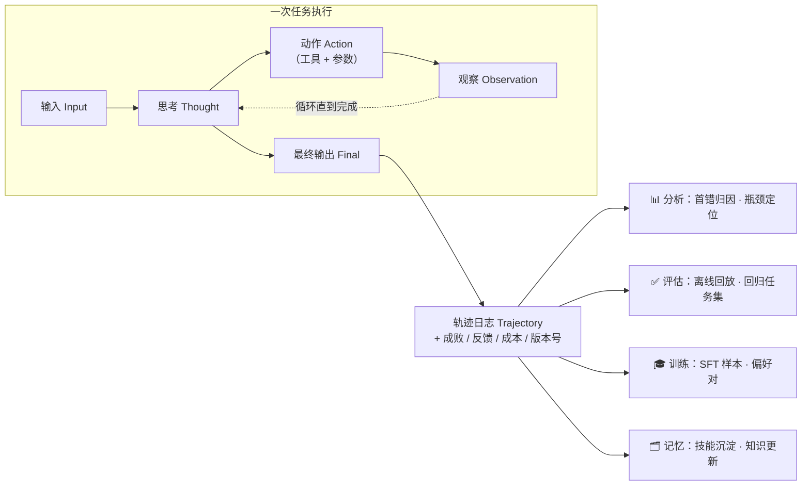
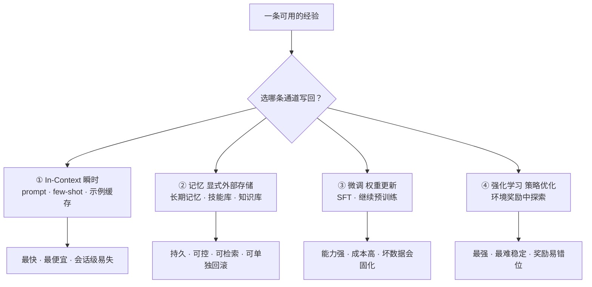
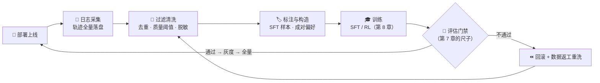
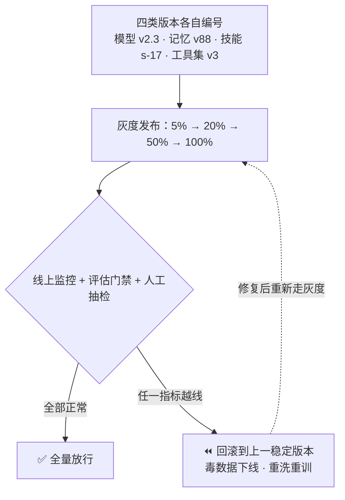

# 09-轨迹学习、四种更新载体、持续进化与回滚

> 阿零上线三个月，每天被调用一万次，每一次执行都留下完整记录——可这些经验全被扔进了日志坟场，没人看，更没人用。
> 用户：「阿零，把『用中学』跑起来。」
> 阿零翻了个白眼：「主人，我连昨天的日记都没写，拿什么学？」
> 用户把它领到数据仓库前：「这里每一行日志，都是你的一篇日记。学会把它们变成成长素材——先学会别把它们教坏。」

## 本节要解决的问题

| 本节要解决的问题 | 本章将给出什么 |
|---|---|
| 轨迹学习 | 轨迹（trajectory）是什么、长什么样（JSON schema）？一条执行记录能拿来做什么？ |
| 四种更新载体 | 把「经验」写回系统的四条通道——In-Context、记忆、微调、强化学习，分别适用什么场景？ |
| 持续进化 | 日志 → 过滤 → 标注 → 训练 → 评估 → 部署的「数据飞轮」怎么闭环？ |
| 版本化与回滚 | 模型 / 记忆 / 技能 / 工具四类版本怎么管理？灰度发布与评估门禁怎么防止「越改越差」？ |

## 故事引入

上线之前，阿零以为自己的生命周期和普通软件一样：开发 → 测试 → 上线 → 修 bug。上线之后它发现完全不是这么回事：普通软件靠用户主动提交 bug 报告，而它的「bug 报告」是**每天一万条自动落盘的轨迹**——想歪的一步、用错的工具、失败的任务，全躺在日志里。

但「有数据」和「会学习」之间隔着一条很长的产线。阿零第一次试着把日志直接喂给自己做继续预训练，结果没两天，说话开始带幻觉腔、工具调用开始乱来——它意识到一件可怕的事：**日志不等于经验，九成日志是垃圾，直接吃下去就是自我放毒。** 用户给阿零补了一课：Agent 工程从「造出来」进入「养起来」，核心不是攒数据，而是把「每一次使用」变成「可控的成长素材」。这一章就是它学会「用中学」的全过程：看懂轨迹、选对通道、转起飞轮、装好回滚保险丝。

## 核心概念

### (a) 轨迹：一次执行留下的完整档案 📼

**轨迹（trajectory）**是 Agent 从拿到输入到给出最终输出的完整执行记录：输入、每一步思考（thought）、每一步动作（action，含工具名与参数）、每一步观察（observation，工具返回）、最终输出，外加元信息：成败、判分结果、用户反馈、成本（token / 延迟 / 调用次数）、运行环境版本。一句话：**轨迹是 Agent 的「过程录像」，而不只是「结果成绩单」**。它完整保留了 ReAct 循环（见 [01-Agent的边界与ReAct.md](01-Agent的边界与ReAct.md)）的每一个中间状态，普通对话历史只留下最终话术——这正是轨迹更值钱的原因。

一条轨迹日志的 JSON schema 示意：

```json
{
  "trajectory_id": "trj_9f3a2c",
  "ts": "2025-06-01T10:23:41.902+08:00",
  "task": {"id": "t-1042", "type": "calendar_reschedule", "input": "把 18:00 的会议改到明早 10 点并通知参会人"},
  "agent_version": {"model": "zero-2.3.1", "memory": "m-88", "skill": "s-17", "toolset": "v3"},
  "steps": [
    {"i": 0, "type": "thought", "content": "先定位是哪个会议", "tokens": 41},
    {"i": 1, "type": "action", "tool": "calendar.find", "args": {"time": "18:00"}, "tokens": 28},
    {"i": 2, "type": "observation", "content": "{\"event_id\": 42, \"attendees\": 4}"},
    {"i": 3, "type": "action", "tool": "calendar.reschedule", "args": {"event_id": 42, "to": "明天 10:00"}},
    {"i": 4, "type": "observation", "content": "{\"ok\": true}"},
    {"i": 5, "type": "final", "content": "会议已改到明早 10 点，4 位参会人已通知"}
  ],
  "result": {"success": true, "grader": "llm-judge-v2", "user_feedback": "positive"},
  "cost": {"latency_ms": 4200, "tokens": 860, "calls": 2}
}
```

注意 `agent_version` 字段：回滚和归因都依赖它，**没有版本号的轨迹无法定位「是哪一版阿零干的」**。轨迹有四种典型用途：

| 用途 | 做什么 | 关联章节 | 例子 |
|---|---|---|---|
| 📊 分析 | 首错归因、瓶颈定位、失败模式聚类 | [07-评估与Pass-at-k.md](07-评估与Pass-at-k.md) | 80% 的失败都死在「工具参数」步 |
| ✅ 评估 | 离线回放（不必真跑一遍）、构造回归任务集 | 第 7 章 | 用旧轨迹当回归测试，新版本不劣化 |
| 🎓 训练 | 提炼 SFT 样本、构造偏好对、离线 RL 数据 | [08-Mid-training-SFT与RL.md](08-Mid-training-SFT与RL.md) | 成功轨迹当正例，失败轨迹当反例 |
| 🗂️ 记忆 | 提炼可复用技能、沉淀知识、更新用户画像 | [03-记忆与RAG混合检索.md](03-记忆与RAG混合检索.md) | 把「这类报错怎么解」写进技能库 |

Reflexion（2023）正是「轨迹级自我改进」的代表作：让 Agent 用语言复盘自己的失败轨迹，带着反思结论重试；AgentTuning（2023）则把真实交互轨迹整理成指令数据做微调，把「轨迹当语料」这条路正式铺开。



### (b) 四种更新载体：把经验写回系统的四条通道 🔌

有了轨迹，下一个问题是：**经验写到哪里去？** 答案是四条通道，也是四种不同「介质」——类比改作业：在卷边上贴便签（In-Context）、把例题抄进笔记本（记忆）、把套路练成肌肉记忆（微调）、用海量题目压着练出直觉（强化学习）。

1. **In-Context（瞬时）**：prompt 工程、few-shot 示例、示例缓存。最快、最便宜，但活在上下文窗口里（衔接 [02-上下文KV-Cache与Skill.md](02-上下文KV-Cache与Skill.md)），会话结束即失，还挤占上下文、扩大注入面。
2. **记忆（显式外部存储）**：长期记忆、技能库、知识库。持久、可控、可检索、可单独回滚——但上限取决于检索命中率（衔接第 3 章 RAG）。
3. **微调（权重更新）**：SFT / 继续预训练。能力强、成本高，坏数据会永久固化（衔接 [08-Mid-training-SFT与RL.md](08-Mid-training-SFT与RL.md)，配套 [../04-LLM大模型/教学/12-LoRA与SFT.ipynb](../04-LLM大模型/教学/12-LoRA与SFT.ipynb)）。
4. **强化学习（策略优化）**：在环境奖励中探索更优策略。上限最高，也最难稳定：奖励错位、能力震荡、训练发散都是家常便饭（衔接 [../04-LLM大模型/教学/13-DPO与RLHF.ipynb](../04-LLM大模型/教学/13-DPO与RLHF.ipynb)）。



| 载体 | 写入位置 | 写入成本 | 持久性 | 风险 | 典型场景 |
|---|---|---|---|---|---|
| ① In-Context | 提示词 / 上下文 | 分钟级，几乎为零 | 会话级，易失 | 窗口爆炸、注入面扩大 | 新需求快速试错、few-shot 纠正 |
| ② 记忆 | 外部存储（向量库 / 技能库 / 知识库） | 低，异步写入 | 持久，可删改 | 检索命中率、陈旧知识、隐私 | 用户画像、技能沉淀、知识更新 |
| ③ 微调 | 模型权重 | 高（算力 + 数据） | 持久，难改 | 坏数据永久固化 | 成熟能力固化、领域适配 |
| ④ 强化学习 | 模型权重 + 策略 | 最高（交互 + 调参） | 持久，最不稳定 | 奖励错位、能力退化 | 复杂长程任务、对齐 |

**选型原则：快迭代用 ①/②，成熟能力固化用 ③/④。** 四条通道并不互斥，务实做法是叠加：In-Context 热修当天生效，经验同时沉淀进记忆，攒够高质量样本后定期微调固化。

### (c) 数据飞轮：让「用」变成「学」 🌀

单条轨迹只能改个提示词；真正让阿零持续变强的，是一条**数据飞轮（data flywheel）**——把「使用产生的日志」循环变成「更强的能力」：



六个环节环环相扣。飞轮有两个命门：**过滤清洗决定进料质量**（坏料进炉，飞轮越转越毒），**评估门禁决定是否放行**（没有门禁，飞轮转得越快歪得越快——门禁就是第 7 章那把尺子在进化流程里的投影）。飞轮每转一圈，阿零就「用过一次、变强一点」；代价是转一圈的成本（采集、标注、训练、验证），所以实践中飞轮不是每时每刻转，而是按周/按版本节奏转。

### (d) 持续进化与回滚：变强，但别学坏 🛟

持续进化的前提是**随时能退回**。阿零给自己立了四条规矩：

- **四类版本各自编号**：模型（checkpoint 号）、记忆库（版本号）、技能库（技能号）、工具集（版本号）独立演进，互不牵连——单独更新一个技能不应该拖累整个模型。
- **灰度发布**：新版本先吃 5% 流量，指标正常再 20% → 50% → 100%，异常随时把流量切回旧版本。
- **评估门禁**：离线基准（第 7 章）先过关，线上再看成功率、延迟、成本、用户反馈、安全事件，人工抽检兜底。
- **防自我放毒**：进训练集的每一条数据都要过审。阿零最怕三种毒：①**自我幻觉回灌**——拿自己（或队友模型）生成的内容当标准答案训练，会引发模型坍缩（model collapse，Shumailov 等 2023 年在《The Curse of Recursion》中系统讨论过）；②**配对污染**——偏好对里 rejected 选错了，或者 chosen 是「用户没细看随手点赞」的次品，正负样本同时被污染；③**蓄意投毒**——攻击者或红队故意灌入带偏指令的轨迹（衔接 [04-工具分类与MCP.md](04-工具分类与MCP.md) 的安全防线）。对策：只取「判分器通过 + 用户确认」双信号样本，设质量分数线，人工抽检 + 红队对抗，坏数据发现即下线重洗重训，必要时整体回滚。



## 深入原理

先说选型速记：**上得快用 ①②，学得深用 ③④；能回滚的进化才是进化，不能回滚的叫赌博。** 两条对照表把本章核心机制收束起来。

| 对比维度 | ① In-Context | ② 记忆 | ③ 微调 | ④ 强化学习 |
|---|---|---|---|---|
| 写入成本 | 极低 | 低 | 高 | 最高 |
| 容量 | 小（上下文窗口内） | 大（检索式扩展） | 中（权重内） | 中（权重 + 策略） |
| 持久性 | 会话级 | 持久可删改 | 持久难改 | 持久但易震荡 |
| 可解释性 | 最高，直接可见 | 高，可导出审计 | 低，黑盒 | 最低 |
| 主要风险 | 窗口爆炸 / 注入口 | 检索命中率 / 隐私 | 坏数据固化 | 奖励错位 / 发散 |
| 回滚难度 | 换 prompt 即可 | 撤回条目即可 | 需换 checkpoint | 需换 checkpoint |
| 典型节奏 | 每天 | 每天 / 每周 | 每周 / 每月 | 每月 / 每季度 |

| 回滚维度 | 版本号示例 | 粒度 | 回滚动作 | 触发信号 |
|---|---|---|---|---|
| 模型 | zero-2.3.1 | 整个 checkpoint | 流量切回 2.2.9 | 评估门禁不过、线上成功率下降 |
| 记忆库 | m-88 | 单条记忆 / 单批写入 | 撤回条目、恢复快照 | 检索到陈旧 / 错误知识 |
| 技能库 | s-17 | 单个技能 | 换回上一版技能定义 | 该技能成功率下降 |
| 工具集 | v3 | 单个工具 | 禁用工具、切换实现 | 参数错误率、安全事件 |
| 提示词（In-Context） | prompt v42 | 单个模板 | 版本切换 | A/B 对比不显著 |

数据飞轮各环节的「做砸了会怎样」，同样值得背下来——面试里常考的全是这六个坑：

| 环节 | 输入 | 输出 | 做砸了的代价 |
|---|---|---|---|
| 日志采集 | 生产流量 | 全量轨迹 JSONL | 样本偏差：只采到成功轨迹 / 只有高峰时段 |
| 过滤清洗 | 原始轨迹 | 干净样本 | 坏数据入训 → 自我放毒 |
| 标注构造 | 干净样本 | SFT 样本 / 偏好对 | 标注偏差 → 奖励错位 |
| 训练 | 训练集 | 新 checkpoint | 过拟合旧流量 → 线上风格漂移 |
| 评估门禁 | 新 checkpoint | 放行 / 回滚决策 | 门禁漏检 → 越改越差还自我感觉良好 |
| 部署监控 | 灰度流量 | 迭代数据源 | 无监控 = 没有眼睛，回归无人发现 |

## 代码实战

写一个「轨迹 → 训练数据」的迷你产线：JSONL 日志解析 → 内容指纹去重 → 质量过滤（成本阈值、反馈白名单）→ 构造 ReAct 格式的 SFT 样本 → 同任务内成功/失败配对成 DPO 偏好对。全部数据 mock、随机种子固定、不联网，可直接运行：

```python
"""轨迹→训练数据：日志解析与 SFT / 偏好对构造迷你管线（全 mock、无联网）。

链路：生产 JSONL 日志 → 解析 → 去重 → 质量过滤 → SFT 样本 + DPO 偏好对。
真实系统里它跑在离线大数据管线中，这里固定 mock 七条轨迹，种子固定。
"""
import hashlib
import json
import random

# ---------- 1. mock 原始 JSONL 轨迹日志（真实中来自生产平台落盘）----------
RAW_LOGS = """\
{"id":"trj-1001-a","task_id":"t-1001","input":"把18:00的会议改到明早10点并通知参会人","success":true,"feedback":"positive","tokens":612,"thought":"先定位会议室，再改时间","tool":"calendar.reschedule","result":"ok","final":"会议已改到明早10点，4位参会人已通知"}
{"id":"trj-1001-a-dup","task_id":"t-1001","input":"把18:00的会议改到明早10点并通知参会人","success":true,"feedback":"positive","tokens":612,"thought":"先定位会议室，再改时间","tool":"calendar.reschedule","result":"ok","final":"会议已改到明早10点，4位参会人已通知"}
{"id":"trj-1001-b","task_id":"t-1001","input":"把18:00的会议改到明早10点并通知参会人","success":false,"feedback":"negative","tokens":481,"thought":"把18:00误当成了晚上","tool":"calendar.reschedule","result":"wrong_slot","final":"会议改到今晚18:00"}
{"id":"trj-1002-a","task_id":"t-1002","input":"查上海明天下雨概率，超50%提醒带伞","success":true,"feedback":"positive","tokens":302,"thought":"查明天概率再决策","tool":"weather.probability","result":"0.85","final":"明天下雨概率85%，建议带伞"}
{"id":"trj-1002-b","task_id":"t-1002","input":"查上海明天下雨概率，超50%提醒带伞","success":false,"feedback":"negative","tokens":540,"thought":"查成了今天的概率","tool":"weather.probability","result":"0.12","final":"今天下雨概率12%"}
{"id":"trj-1003-a","task_id":"t-1003","input":"把周报翻译成英文并精简到200词","success":true,"feedback":"positive","tokens":890,"thought":"先翻译再压缩","tool":"translate.run","result":"ok","final":"Weekly report (198 words)"}
{"id":"trj-1003-b","task_id":"t-1003","input":"把周报翻译成英文并精简到200词","success":false,"feedback":"neutral","tokens":2140,"thought":"直接全文翻译","tool":"translate.run","result":"too_long","final":"5200词的超长译文"}
"""

TOKEN_BUDGET = 1500  # 质量阈值：超预算的昂贵轨迹丢弃（疑似死循环 / 异常成本）


def load_logs(text: str) -> list:
    """JSONL 解析：一行一条轨迹日志。"""
    return [json.loads(line) for line in text.strip().splitlines() if line.strip()]


def dedup(logs: list) -> list:
    """按轨迹内容指纹去重（排除流水号 id），避免同一条经验反复进训练集。"""
    seen, out = set(), []
    for log in logs:
        payload = {k: v for k, v in log.items() if k != "id"}
        fp = hashlib.md5(
            json.dumps(payload, sort_keys=True, ensure_ascii=False).encode()
        ).hexdigest()
        if fp not in seen:
            seen.add(fp)
            out.append(log)
    return out


def quality_filter(logs: list) -> list:
    """过滤规则：成本超限 / 反馈中性（无法判定质量）/ 缺最终输出 的轨迹剔除。"""
    keep = []
    for log in logs:
        if log["tokens"] > TOKEN_BUDGET:
            continue                      # 成本异常，疑似死循环
        if log["feedback"] in ("neutral", "abuse"):
            continue                      # 中性反馈说明质量不可判定
        if not log.get("final"):
            continue                      # 没交出最终结果，任务未完成
        keep.append(log)
    return keep


def make_sft_sample(log: dict) -> str:
    """把轨迹压成 ReAct 格式的 SFT 样本：思考 → 动作 → 观察 → 最终。"""
    return (f"任务：{log['input']}\n思考：{log['thought']}\n"
            f"动作：{log['tool']}({log['result']})\n观察：{log['result']}\n"
            f"最终：{log['final']}")


def make_preference_pairs(logs: list) -> list:
    """同一任务内的成功/失败轨迹配对，构造 DPO 偏好对（chosen 优于 rejected）。"""
    by_task = {}
    for log in logs:
        by_task.setdefault(log["task_id"], []).append(log)
    pairs = []
    for task_id, items in by_task.items():
        good = [x for x in items if x["success"]]
        bad = [x for x in items if not x["success"]]
        for g, b in zip(good, bad):       # 只在同任务内配对，跨任务配对会学错
            pairs.append({"task_id": task_id,
                          "chosen": make_sft_sample(g),
                          "rejected": make_sft_sample(b)})
    return pairs


def main():
    random.seed(42)                       # 固定种子，示例结果可复现
    raw = load_logs(RAW_LOGS)
    deduped = dedup(raw)
    cleaned = quality_filter(deduped)
    sft = [make_sft_sample(x) for x in cleaned]
    pairs = make_preference_pairs(cleaned)

    print(f"[统计] 原始 {len(raw)} 条 → 去重 {len(raw) - len(deduped)} 条"
          f" → 质量过滤去掉 {len(deduped) - len(cleaned)} 条 → 留 {len(cleaned)} 条")
    print(f"[统计] 构造 SFT 样本 {len(sft)} 条 | 偏好对 {len(pairs)} 对"
          f"（任务：{', '.join(p['task_id'] for p in pairs)}）")

    print("\n--- SFT 样本示例（第 1 条）---")
    print(sft[0])

    print("\n--- 偏好对示例（t-1001：chosen=成功 / rejected=失败）---")
    print("chosen:  ", pairs[0]["chosen"].replace("\n", " / "))
    print("rejected:", pairs[0]["rejected"].replace("\n", " / "))


if __name__ == "__main__":
    main()
```

**输出示意**（在固定种子与固定 mock 数据下可复现）：

```text
[统计] 原始 7 条 → 去重 1 条 → 质量过滤去掉 1 条 → 留 5 条
[统计] 构造 SFT 样本 5 条 | 偏好对 2 对（任务：t-1001, t-1002）

--- SFT 样本示例（第 1 条）---
任务：把18:00的会议改到明早10点并通知参会人
思考：先定位会议室，再改时间
动作：calendar.reschedule(ok)
观察：ok
最终：会议已改到明早10点，4位参会人已通知

--- 偏好对示例（t-1001：chosen=成功 / rejected=失败）---
chosen:   任务：把18:00的会议改到明早10点并通知参会人 / 思考：先定位会议室，再改时间 / … / 最终：会议已改到明早10点，4位参会人已通知
rejected: 任务：把18:00的会议改到明早10点并通知参会人 / 思考：把18:00误当成了晚上 / … / 最终：会议改到今晚18:00
```

读出三点：**去重**按内容指纹而非 id，换号重发的轨迹照样被识破；**质量阈值**把 2140 token 的超长轨迹当异常成本剔除，这比「看起来成功」更可靠；**偏好对只在同任务内配对**——跨任务配对会让 DPO 学到无关偏好，等于下毒。真实管线在构造前还要做脱敏（去掉用户隐私字段）和人工抽检。

## 面试考点

**Q1：轨迹（trajectory）是什么？有哪四种用途？**
A：轨迹是 Agent 从输入到最终输出的完整执行记录，包括输入、thought、action（工具+参数）、observation、最终输出，以及成败、判分结果、用户反馈、成本、环境版本等元信息。四种用途：分析（首错归因、瓶颈定位）、评估（离线回放、构造回归任务集）、训练（提炼 SFT 样本、构造偏好对）、记忆（沉淀技能、更新知识）。轨迹是「过程录像」而对话历史只是「结果话术」，这也是它更值钱的原因。

**Q2：四种更新载体分别是什么？怎么选？**
A：① In-Context（prompt、few-shot、示例缓存）：最快最便宜，会话级易失；② 记忆（长期记忆、技能库、知识库）：持久可控可检索可单独回滚；③ 微调（SFT/继续预训练）：能力强、成本高、坏数据永久固化；④ 强化学习：上限最高、最难稳定、奖励易错位。选型原则：快迭代用 ①/②，成熟能力固化用 ③/④；实务中四者叠加，In-Context 热修 + 记忆沉淀 + 定期训。

**Q3：数据飞轮怎么闭环？命门在哪？**
A：日志采集 → 过滤清洗 → 标注构造 → 训练（SFT/RL）→ 评估门禁 → 部署上线 → 产生新日志，周而复始。两个命门：过滤清洗决定进料质量，坏料进炉等于自我放毒；评估门禁决定放行，没有门禁飞轮越转越歪。飞轮按版本节奏转而不是每时每刻转，因为每一圈都付采集、标注、训练、验证的成本。

**Q4：什么是「自我放毒」？怎么防？**
A：把未经筛选的（尤其是模型自己生成的/被污染的/被投毒的）数据拿去训练，导致能力退化，典型如模型坍缩（model collapse，Shumailov 等，2023）。三类毒：自我幻觉回灌、偏好对配对污染、蓄意投毒。防线：双信号确认（判分器通过 + 用户确认）、质量分数线、人工抽检与红队对抗、毒数据发现即下线重洗重训、必要时回滚到毒数据入训前的版本。

**Q5：回滚机制怎么设计？**
A：先版本化后进化——模型/记忆/技能/工具四类版本各自独立编号，粒度从整个 checkpoint 到单条记忆、单个技能、单个工具。模型靠流量切回上一 checkpoint；记忆靠撤回条目或恢复快照；技能靠换回旧定义；工具靠禁用或切换实现。回滚触发信号是离线评估门禁不过或线上指标（成功率、延迟、成本、安全事件）越线；能回滚的进化才是进化。

**Q6：灰度发布怎么做？和评估门禁什么关系？**
A：新版本先接 5% 流量，离线评估门禁 + 线上监控（成功率、延迟、成本、用户反馈、安全事件）+ 人工抽检全绿，再 20% → 50% → 100%。评估门禁是「上线前的尺子」，灰度是「上线后的小剂量验证」，两者互补：门禁防的是已知基准上的退化，灰度防的是真实流量里才暴露的回归。任何一步异常都立即把流量切回旧版本。

**Q7：哪些轨迹能进训练集？过滤规则有哪些？**
A：① 内容指纹去重（排除流水号），防同一条经验反复刷权重；② 质量阈值：成本超限（疑似死循环）、缺最终输出、反馈中性/滥用的剔除；③ 配对规则：偏好对只在同任务内的成功/失败轨迹之间构造，跨任务配对会学到无关偏好；④ 脱敏：去掉用户隐私字段；⑤ 人工抽检兜底。一句话：**只让「判分器通过 + 用户确认」的干净样本进炉**，其余全是毒。

## 小结与下一章预告

这一章，阿零完成了从「被使用」到「被养成」的转身：它学会了把每一次执行录成轨迹（过程录像，而不只是成绩单），辨清了四条写回经验的通道——In-Context 快而脆、记忆稳而活、微调强而贵、强化学习最强也最难驯；它把「日志 → 清洗 → 标注 → 训练 → 门禁 → 部署」接成一条会自我加速的数据飞轮，又用四类版本号、灰度发布和回滚保险丝兜住底线。它最深的体会是那句话：**能回滚的进化才是进化，不能回滚的叫赌博**。想深入飞轮两端的技术细节，可配套复习 [../04-LLM大模型/教学/11-预训练循环.ipynb](../04-LLM大模型/教学/11-预训练循环.ipynb)（继续预训练）、[../04-LLM大模型/教学/12-LoRA与SFT.ipynb](../04-LLM大模型/教学/12-LoRA与SFT.ipynb)（SFT）、[../04-LLM大模型/教学/13-DPO与RLHF.ipynb](../04-LLM大模型/教学/13-DPO与RLHF.ipynb)（偏好对训练）与 [../04-LLM大模型/教学/15-RAG与Agent.ipynb](../04-LLM大模型/教学/15-RAG与Agent.ipynb)（记忆载体）。

但新的困境冒出来了：阿零的成长是**私有**的——经验长在它自己的权重、记忆和技能库里，团队里新克隆的阿零依旧要从零开始。用户问：「你能不能把这套成长能力分给你的伙伴们？」下一章 [10-多Agent协作.md](10-多Agent协作.md)，我们让无数个阿零组成协作兵团：它们各自带着不同的上下文与记忆，如何交换信息增量、如何划定上下文边界、用什么协作拓扑、又会踩哪些特有的失败模式——一个阿零的进化，只是故事的开始。