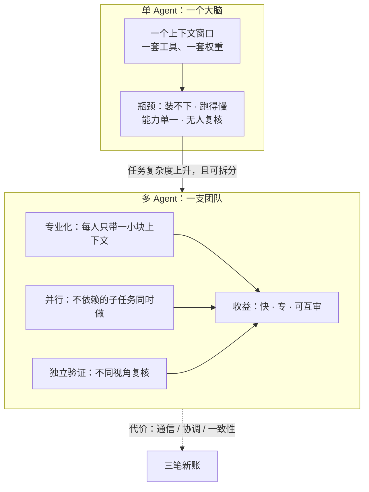
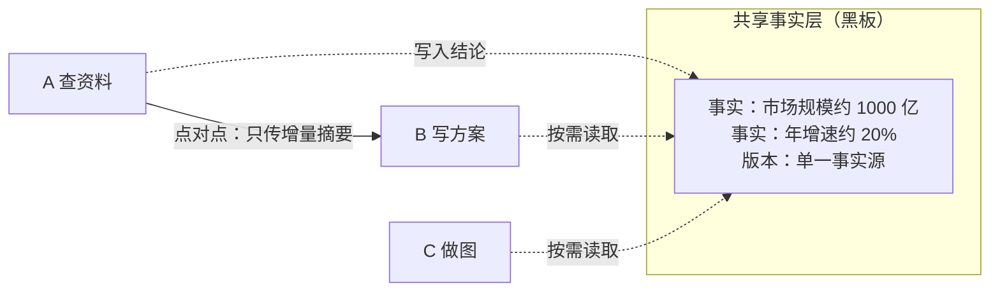
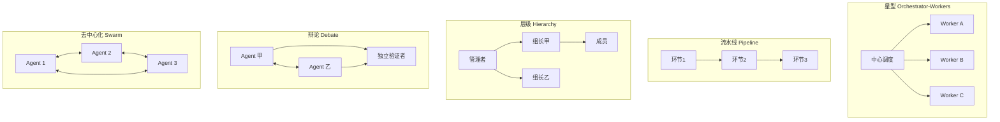
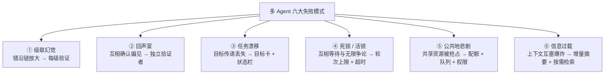
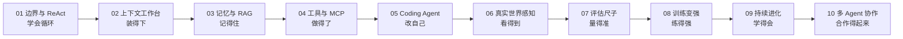

# 10-多 Agent 协作：信息增量、上下文边界、协作拓扑与失败模式

> 阿零终于学会了持续进化，可一个人的能力再强，也架不住任务越来越多。
> 这一天，用户把一个大型任务扔给它：「查资料、写方案、做配图，三件事一起开工。」
> 阿零心一横，把自己分身成「阿零团队」：阿零A负责查资料，阿零B负责写方案，阿零C负责做图。
> 结果三个阿零吵成一团：A说B的方案数据过时，B说A给的资料不完整，C画完图被两边一起否定……
> 更糟的是，三个人都重新查了一遍资料——重复劳动了三遍。
> 用户看着乱成一锅粥的屏幕，说：「人多，问题更多了。」

## 本节要解决的问题

| 要解决的问题 | 对应内容 |
| --- | --- |
| 为什么需要多 Agent？单 Agent 的瓶颈在哪里？ | 核心概念 (a) |
| Agent 之间通信传什么？信息增量如何与通信开销权衡？ | 核心概念 (b) |
| 每个 Agent 的上下文边界怎么划？三类边界问题怎么治？ | 核心概念 (c) |
| 五种协作拓扑分别是什么、怎么选？ | 核心概念 (d)、深入原理 |
| 多 Agent 有哪些典型失败模式，如何治理？ | 核心概念 (e)、深入原理 |
| 最小可跑的多 Agent 框架长什么样？ | 代码实战 |

## 故事引入

从第1章 [01-Agent的边界与ReAct.md](01-Agent的边界与ReAct.md) 到第9章 [09-轨迹学习与持续进化.md](09-轨迹学习与持续进化.md)，阿零把「单兵」的技能树点满了：它会循环思考、会管理工作台、有档案柜式的长时记忆、有手脚般的工具、会写代码改自己、能感知真实世界、有尺子能自评，还能在训练与轨迹学习中持续变强。但单兵再强，也有四条硬瓶颈：

- **上下文瓶颈**：工作台（[02-上下文KV-Cache与Skill.md](02-上下文KV-Cache与Skill.md)）再能压缩，一个上下文窗口也装不下「调研、写作、设计」三个并行专业任务的全部材料；
- **时间瓶颈**：一个人串行做三件事，比三个人并行慢一个量级；
- **能力瓶颈**：一套模型权重、一套工具集，很难同时精通检索、写作与制图（异构能力）；
- **验证瓶颈**：自己查、自己写、自己审，等于没有独立审计——这正是第7章 [07-评估与Pass-at-k.md](07-评估与Pass-at-k.md) 强调「判分器必须独立于被评对象」在组织层面的翻版。

所以阿零想学「兵团」：把任务拆开，让多个专职的 Agent 并行干活、互相校验。但兵团不是免费午餐，它要付三笔新账：**通信成本**（Agent 之间传消息要花 token 与延迟）、**协调成本**（谁先做、谁等谁、意见不合听谁的）、**一致性成本**（每个人看到的世界不同，产出口径可能互相打架）。「阿零团队」吵成一团、重复劳动，正是这三笔账一次付清的现场。

## 核心概念

### (a) 🤔 为什么多 Agent？先把收益与成本的账算清楚

单 Agent 的一切能力都押在一个大脑、一个上下文窗口、一套工具集上。任务一旦变大，四条瓶颈同时被触发；多 Agent 则把「一个大任务」拆成「几个小任务」，每个 Agent 只带一小块上下文、一小套工具，换取四样东西：**专业化**（每个 Agent 的提示词、工具、记忆都为单一职责优化）、**并行**（互不依赖的子任务同时开工）、**独立验证**（不同 Agent 从不同视角复核同一结论）、**故障隔离**（一个 Agent 出错，未必拖垮全链）。

但收益必须减去成本。每一次 Agent 间的通信都是一次额外的 LLM 调用；每多一个 Agent，就多一个「可能产生幻觉并传染出去」的节点；协调逻辑本身又是一层要维护、要调试的代码。业界有一句被反复验证的经验：**「单 Agent 够用，就别多 Agent」**——研究者甚至专门写过一篇论文论证这点：Are More LLM Calls All You Need?（2024）发现，多 Agent 堆调用并不必然胜过单 Agent 配更高质量的提示词。上多 Agent 前，先对照三条硬标准：**任务可拆分**（子任务之间依赖足够弱）、**需要异构能力**（单一模型/工具集确实不够）、**需要独立验证**（结论的安全代价高，如代码评审、财务口径）。



### (b) 📮 信息增量：通信不是搬运上下文，而是传递「对方不知道的那一点」

阿零团队重复劳动三遍的根子，是每个 Agent 都把自己的上下文「全量倒给」别人——又慢又贵，还互相污染。正确的通信单位不是全量信息，而是**信息增量（information gain）**：接收方不知道、且对其下一步决策有用的那部分信息。这个概念可以追溯到香农（Shannon, 1948）的信息论：一条消息的「信息量」取决于它**消除了多少不确定性**——对方已经知道的，不算信息；对方用不上的，也不算信息。

于是通信的黄金法则变成一句不等式：**增量带来的收益 > 通信的开销，才值得发这条消息。** 为了实现它，有两类压缩手段：一是**摘要/结构化压缩**——把 200 页检索结果压成 3 行结论（衔接第2章 [02-上下文KV-Cache与Skill.md](02-上下文KV-Cache与Skill.md) 的上下文压缩，以及第3章 [03-记忆与RAG混合检索.md](03-记忆与RAG混合检索.md) 的按需检索）；二是**共享事实层**——与其你传我、我传你，不如大家把「事实」写在同一块黑板上（blackboard，也叫共享记忆），谁需要谁按需读，而不是把整段对话复制粘贴（这同样呼应第3章把「事实」与「对话」分开存放的设计）。

两条通信通道各有分工：**点对点消息**适合传「请求、指令、评审意见」这类动作性信息；**共享事实层**适合放「口径、结论、状态」这类需要全局一致的事实。一句话：**指令走消息，事实走黑板。**

### (c) 🗺️ 上下文边界：每个 Agent 的私有上下文，就是它的世界观

一个 Agent 只能依据自己上下文里看得见的东西做决策，所以**任务分解的本质，就是上下文边界的划分**——你决定让谁看到什么，就决定了它将以什么视角思考。边界划不好，会出现三类经典问题：

1. **信息重复**：每个 Agent 都被塞进全量上下文，成本爆炸、互相干扰（阿零团队重复查资料的现场）；
2. **信息孤岛**：A 查到的关键事实 B 完全不知道，各自以偏概全，产出互相矛盾；
3. **事实不一致**：A 说「市场 1000 亿」、B 说「市场 800 亿」，同一个事实在不同上下文里变成两个版本，方案自然互相否定。

对策与第2、3章一脉相承：**按需检索**（每个 Agent 只检索自己任务需要的事实，而不是全量加载）、**共享事实层**（把关键事实收敛到单一事实源 single source of truth，谁要谁去读，杜绝多版本）、**显式契约**（Agent 之间的接口写成结构化 schema，像 API 一样约好字段与格式，而不是自由文本互抛——这延续了第2章的 schema 校验思想）。



### (d) 🕸️ 协作拓扑：五种组织方式，各有代价

把「谁跟谁说话、谁听谁的」画成图，就是协作拓扑（collaboration topology）。五种常见形态：

- **Orchestrator-Workers（星型）**：一个中心负责分解、派活、收结果，Worker 之间不直接通信。清晰可控，但中心是瓶颈也是单点故障；
- **Pipeline（流水线）**：任务像接力棒一样沿固定环节串行传递，适合「检索→起草→审校」这类固定流程，缺点是错误沿链放大、任何一环慢了全局都慢；
- **Hierarchy（层级）**：管理者分解任务、组长带队、成员干活，适合规模大、职责分明的组织，代价是层级多、信息上浮慢；
- **Debate（辩论）**：多个 Agent 从不同视角论证同一问题、互相质询，再由独立验证者裁决——双 Agent 辩论（Multiagent Debate, 2023，用多个模型实例互相辩论来提升推理与事实性）就是最简形态，专门用来对抗「自说自话」；
- **Swarm（去中心化）**：Agent 自由通信、自由协作，最灵活也最难控制，容易陷入信息过载与死锁。



### (e) 💥 失败模式：多一个人，就多一份「把错放大的可能」

多 Agent 系统的失败不是单 Agent 失败的简单相加，而会「相乘」。研究者专门给这类系统做了失败学分类——Why Do Multi-Agent LLM Systems Fail?（2024）把多 Agent 失败归纳为 3 大类、约 14 种具体模式。我们聚焦最常踩的六种，每条都按「症状 → 机制 → 对策」展开：

1. **级联幻觉（错误传播）**：一个 Agent 的错沿流水线逐级放大，下游拿着错结论继续编。对策：每级设置验证门（衔接第7章 [07-评估与Pass-at-k.md](07-评估与Pass-at-k.md) 的判分思想）、关键节点安排独立复核；
2. **回声室（echo chamber）**：Agent 们互相确认偏见，越聊越坚定，缺一个「说不对的人」。对策：设独立验证者、引入外部事实源（RAG，衔接第3章 [03-记忆与RAG混合检索.md](03-记忆与RAG混合检索.md)）、故意安排对立立场辩论；
3. **任务漂移**：目标在多次传递中丢失——「调研并输出方案」传到第三步变成「输出方案」，调研被省略。对策：目标卡（goal card）随任务显式传递、每轮核对状态栏（衔接第2章的「状态栏」设计）；
4. **死锁/活锁**：互相等待（死锁）、无限争论与重复劳动（活锁）。对策：给每轮争论设轮次上限、超时与终止条件，争论僵持时升级给仲裁者；
5. **公共地悲剧**：共享的额度、工具、API 被各个 Agent 抢着用，资源耗尽。对策：配额、队列、按角色授权（衔接第4章 [04-工具分类与MCP.md](04-工具分类与MCP.md) 的权限与审批门）；
6. **信息过载**：每个人都把全量上下文塞给别人，上下文爆炸、互相污染。对策：按需检索 + 增量摘要（本节的 (b)）。



## 深入原理

两张速查表，把「拓扑」和「失败」收束成可查的清单。先看五种拓扑的横评：

| 拓扑 | 控制力 | 扩展性 | 容错 | 通信成本 | 适用场景 |
| --- | --- | --- | --- | --- | --- |
| Orchestrator-Workers 星型 | 强，中心全权调度 | 中，受中心吞吐限制 | 弱，中心单点故障 | 中，Worker 间不直连 | 任务可拆、需集中管控 |
| Pipeline 流水线 | 中，顺序由代码固定 | 中，环节可并行化 | 弱，错误沿链放大 | 低，只传接力结果 | 固定流程（检索→起草→审校） |
| Hierarchy 层级 | 中，分级管理 | 强，可加层级 | 中，组长可兜底 | 中，信息逐级上浮 | 规模大、职责分明 |
| Debate 辩论 | 弱，靠规则约束轮次 | 弱，轮次越多越贵 | 强，多视角互审 | 高，反复质询 | 高风险结论、需独立验证 |
| Swarm 去中心化 | 弱，几乎不可控 | 强，任意加入 | 中，无单点 | 高，自由通信易爆炸 | 开放探索，需强护栏 |

再看六种失败模式的治理清单：

| 失败模式 | 症状 | 机制 | 对策 |
| --- | --- | --- | --- |
| 级联幻觉 | 下游结论错得越来越离谱 | 单点错误沿依赖链放大 | 每级验证门、独立复核、置信度标注 |
| 回声室 | 多轮讨论后偏见更坚定 | 缺少对立信息与外部事实源 | 独立验证者、辩论、RAG 外部事实 |
| 任务漂移 | 交付物与目标渐行渐远 | 目标未随消息显式传递 | 目标卡、状态栏逐轮核对 |
| 死锁/活锁 | 系统空转、无限争论、重复劳动 | 无终止条件与超时 | 轮次上限、超时、仲裁升级 |
| 公共地悲剧 | 共享额度/工具被抢光 | 无配额与排队机制 | 配额、队列、按角色授权 |
| 信息过载 | 上下文爆炸、互相污染 | 全量信息互传 | 增量摘要、按需检索、共享事实层 |

## 代码实战

下面用两个最小实现把本章最核心的两件事跑起来：**Orchestrator-Workers 框架**（分解→分配→收集→汇总）和**双 Agent 辩论 + 独立验证器**。LLM 全部用固定规则 mock（不联网、种子固定、可手算验证），把代码里的 `mock_llm` 换成真实模型调用，就是可用的骨架。

**1. 最小 Orchestrator-Workers（约 60 行）**

```python
"""最小 Orchestrator-Workers 框架：任务分解 → 分配 → 收集 → 汇总。接口全部 mock。"""
import random
from dataclasses import dataclass, field

random.seed(42)  # 固定随机种子：mock 为确定性输出，种子保证未来引入采样时可复现

# ---------- mock 层：假装是 LLM ----------
def mock_llm(prompt: str) -> str:
    """假 LLM：按关键词返回固定文本，不联网，可手算验证。"""
    if "汇总" in prompt:
        # 只保留各 Worker 的结果行，过滤掉提示词头，避免「汇总」字样泄漏
        parts = [p for p in prompt.splitlines() if p.startswith("[")]
        return "【最终交付】\n" + "\n".join("  - " + p for p in parts)
    if "拆分" in prompt:
        return "T1 查行业数据; T2 写方案初稿; T3 独立复核"
    if "查行业数据" in prompt:
        return "行业报告：市场规模约 1000 亿，年增速约 20%。"
    if "写方案初稿" in prompt:
        return "方案初稿：建议押注高增速细分赛道，分三步落地。"
    if "复核" in prompt:
        return "复核通过：数据与方案口径一致，无冲突。"
    return "mock：无匹配输出"

# ---------- 框架本体 ----------
@dataclass
class Worker:
    name: str
    skills: list

    def do(self, task: str) -> str:
        # 真实系统里这里 = 携带私有上下文的 LLM 调用；此处用 mock
        return f"[{self.name}] {mock_llm(task)}"

@dataclass
class Orchestrator:
    workers: list = field(default_factory=list)

    def add_worker(self, name: str, skills: list) -> None:
        self.workers.append(Worker(name, skills))

    def _decompose(self, mission: str) -> list:
        """第 1 步：任务分解（上下文边界的划分在这里发生）。"""
        plan = mock_llm(f"把任务拆分：{mission}")
        return [s.strip() for s in plan.split(";")]

    def _assign(self, subtasks: list) -> list:
        """第 2 步：分配。简化用轮询；真实系统按 skills 技能匹配。"""
        return [(self.workers[i % len(self.workers)], st)
                for i, st in enumerate(subtasks)]

    def run(self, mission: str) -> str:
        """第 3、4 步：收集 + 汇总。Worker 间不直接通信，结果由中心收拢。"""
        subtasks = self._decompose(mission)
        assignments = self._assign(subtasks)
        results = [w.do(st) for w, st in assignments]      # 并行可在此改写
        return mock_llm("汇总各子任务结果：\n" + "\n".join(results))


if __name__ == "__main__":
    o = Orchestrator()
    o.add_worker("资料员", ["检索"])
    o.add_worker("写手", ["写作"])
    o.add_worker("审校员", ["复核"])
    print(o.run("调研行业现状并输出一份方案"))
```

**输出示意**：

```text
【最终交付】
  - [资料员] 行业报告：市场规模约 1000 亿，年增速约 20%。
  - [写手] 方案初稿：建议押注高增速细分赛道，分三步落地。
  - [审校员] 复核通过：数据与方案口径一致，无冲突。
```

**2. 双 Agent 辩论 + 独立验证器（约 35 行）**

```python
"""双 Agent 辩论 + 独立验证器：各自作答 → 交换观点 → 改一轮 → 第三方裁决。"""
import random

random.seed(7)  # 固定随机种子，保证输出可复现

def mock_llm(role: str, question: str, opponent_view: str = "") -> str:
    """假 LLM：验证者先判（独立于双方）；对辩手，看过对方观点后给回应。"""
    if role == "verifier":
        return "[验证者] 裁决：综合双方论据与共享事实层，判定『可推广但需先试点』。"
    if opponent_view:
        return f"[{role}] 看过对方观点后补充：部分采纳，但坚持自身关键论据。"
    if role == "conservative":
        return "[保守派] 观点：风险太高，应先小范围试点。"
    if role == "aggressive":
        return "[激进派] 观点：应尽快全面推广，抢占窗口期。"
    return "mock：未知角色"

def debate(question: str, rounds: int = 2) -> list:
    """固定轮次的辩论：轮次上限即『终止条件』，防止活锁。"""
    views = {"conservative": "", "aggressive": ""}
    transcript = [f"--- 辩论开始：{question} ---"]
    for r in range(rounds):
        for role in views:
            other = "aggressive" if role == "conservative" else "conservative"
            # 第一轮各自先亮初始观点（对方还没发言）；第二轮起才引用对方观点
            views[role] = mock_llm(role, question, "" if r == 0 else views[other])
            transcript.append(views[role])
    verdict = mock_llm("verifier", question, " | ".join(views.values()))
    transcript.append("--- 独立验证（非辩论双方，避免回声室）---")
    transcript.append(verdict)
    return transcript

if __name__ == "__main__":
    for line in debate("该不该立刻全面推广新功能？"):
        print(line)
```

**输出示意**：

```text
--- 辩论开始：该不该立刻全面推广新功能？ ---
[保守派] 观点：风险太高，应先小范围试点。
[激进派] 观点：应尽快全面推广，抢占窗口期。
[保守派] 看过对方观点后补充：部分采纳，但坚持自身关键论据。
[激进派] 看过对方观点后补充：部分采纳，但坚持自身关键论据。
--- 独立验证（非辩论双方，避免回声室）---
[验证者] 裁决：综合双方论据与共享事实层，判定『可推广但需先试点』。
```

两个骨架合起来，就是本章最小世界观：**中心负责边界划分与调度，Worker 只带一小块上下文干活，关键结论由非当事人的验证者兜底，争论全部设有轮次上限。**

## 面试考点

**Q1：什么时候该用多 Agent？**
A：默认答案是一句话——**单 Agent 够用就别多 Agent**（Are More LLM Calls All You Need?, 2024，多 Agent 堆调用未必胜过单 Agent 配更高质量提示）。只有同时满足三条才考虑：任务可拆分（子任务依赖足够弱）、需要异构能力（单一模型/工具集不够）、需要独立验证（结论安全代价高）。多 Agent 的通信、协调、一致性成本必须显式计入。

**Q2：五种协作拓扑怎么选？**
A：看三个维度——流程是否固定、是否需要中心管控、结论风险多高。固定流程选流水线 Pipeline；需要集中调度、子任务相互独立选星型 Orchestrator-Workers；规模大、职责分明选层级 Hierarchy；高风险结论需要多视角互审选辩论 Debate；开放探索但必须配强护栏才选 Swarm。工程上星型和流水线最常用，辩论和 Swarm 成本最高，用得最谨慎。

**Q3：信息增量怎么理解？通信到底该传什么？**
A：信息增量（information gain）指「接收方不知道、且对其决策有用的那部分信息」，源于香农信息论——信息量等于消除的不确定性。通信的黄金法则是「增量收益 > 通信开销才发消息」，因此要传摘要/结构化结论而不是全量上下文；指令类走点对点消息，事实类写进共享事实层（黑板），谁需要谁按需读。

**Q4：上下文边界怎么划？三类边界问题怎么治？**
A：任务分解的本质就是上下文边界划分——决定谁看到什么，就决定它以什么视角思考。三类问题：信息重复（对策：按需检索）、信息孤岛（对策：共享事实层/单一事实源）、事实不一致（对策：显式契约 + schema 化接口）。核心原则是每个 Agent 只带「完成自己任务所需的最小上下文」，把关键事实收敛到单一事实源。

**Q5：多 Agent 的典型失败模式有哪些？怎么治理？**
A：六种高频模式——级联幻觉（对策：每级验证门、独立复核）、回声室（对策：独立验证者、辩论、外部事实源）、任务漂移（对策：目标卡 + 状态栏显式传递）、死锁/活锁（对策：轮次上限、超时、仲裁升级）、公共地悲剧（对策：配额、队列、按角色授权）、信息过载（对策：增量摘要、按需检索）。学术界已系统化为失败学分类（Why Do Multi-Agent LLM Systems Fail?, 2024，归纳 3 大类、约 14 种失败模式）。

**Q6：怎么评估一个多 Agent 系统？**
A：沿用第7章 [07-评估与Pass-at-k.md](07-评估与Pass-at-k.md) 的三件套——任务集、可控环境、独立判分器，并叠加多 Agent 特有的两点：一是**对比基线必须是单 Agent**（否则无法回答「多体到底值不值」），二是额外计量**通信开销**（消息数、token、延迟、失败率），因为多 Agent 的成本大头在通信。还要对「端到端指标」做首错归因：错误到底出在哪个 Agent、哪一次通信上，避免把账算错。

**Q7：共享事实层和点对点消息怎么分工？**
A：共享事实层（blackboard）适合放需要全局一致的事实、结论与状态，谁需要谁读，天然解决事实不一致；点对点消息适合传动作性信息——请求、指令、评审意见。经验法则：**指令走消息，事实走黑板**；两者混用时要约定「事实以黑板为准」，否则会出现多版本事实打架。

## 小结与全书总结

这一章，阿零学会了从「单兵」到「兵团」的最后一课：多 Agent 不是简单地把人变多，而是把「边界、增量、拓扑、失败」四件事想清楚。它记住了三条铁律：**单 Agent 够用就别多 Agent**；**通信只传增量，事实进黑板，指令走消息**；**每一个多出来的 Agent 都可能放大错误，所以每个关键节点都要有独立的验证者与终止条件**。

现在，把十章连起来，就是阿零完整的成长路线：



全书主线只有一句话：**从「单体能力」到「群体智能」**——阿零先长成「一个会聊天的模型」，再长成「一个会循环做事的 Agent」，最后长成「一支会分工、会通信、会互相校验的阿零军团」。回头看，每一章的困境都成了下一章的起点：循环撑爆了上下文（第1→2章），工作台需要档案柜（第2→3章），记忆需要手脚（第3→4章），手脚需要大脑写的代码（第4→5章），代码需要真实世界的反馈（第5→6章），真实反馈需要尺子（第6→7章），尺子需要训练（第7→8章），训练需要持续进化（第8→9章），进化到顶就需要团队（第9→10章）。

**进阶方向与寄语**：多 Agent 不是终点的答案，只是当前模型能力下的工程妥协。随着上下文窗口与 KV Cache 工程不断突破（[../04-LLM大模型/教学/19-KV缓存.ipynb](../04-LLM大模型/教学/19-KV缓存.ipynb)），「一个超长上下文的单体 Agent」正在变得越来越可行，多 Agent 的通信开销必须面对更严格的成本论证；研究前沿也在探索更标准的 Agent 通信协议、多 Agent 共享记忆与统一的失败评测基准。送阿零（也送读者）最后一句话：**先造一个足够强的单体，再谈军团；能用单体解决的问题，别让团队来解决——团队是用来解决单体解决不了的问题的。**
