# 🚀 12-智能体开发（Agent 开发全景）

> 从「一个会聊天的模型」，到「一支会协作的智能体军团」——这是本模块的完整故事主线。
> 全模块围绕主角智能体 **「阿零」** 展开：它如何学会决策（第1章）、管理上下文（第2章）、记住用户与知识（第3章）、长出手脚（第4章）、写代码改自己（第5章）、感知真实世界（第6章）、被科学评估（第7章）、被训练变强（第8章）、持续进化（第9章），最终与无数个自己组成协作社会（第10章）。
>
> 每一章都遵循 **图文（mermaid 原理图）＋代码（可运行的 Python 教学示例）＋文本（故事化讲解）** 三结合，并以「阿零遇到的真实困境」开场、以「下一章要解决的问题」收尾，章节之间环环相扣。

## 📑 章节总览（章节 → 解决的问题）

| 章节 | 解决的问题 | 一句话主线（阿零的成长） |
|------|-----------|--------------------------|
| 1 | [Agent 的边界、ReAct、Harness、工作流与自主](01-Agent的边界与ReAct.md) | 阿零第一次「动起来」：从一次生成到循环决策 |
| 2 | [上下文、KV Cache、Skill、状态栏、压缩和注入防护](02-上下文KV-Cache与Skill.md) | 阿零学会管理自己的「工作台」——上下文 |
| 3 | [用户记忆、RAG、混合检索和结构化知识](03-记忆与RAG混合检索.md) | 阿零长出「档案柜 + 图书馆」——长时记忆 |
| 4 | [工具分类、MCP、主动发现、权限和安全](04-工具分类与MCP.md) | 阿零长出「手脚」——工具系统与安全护栏 |
| 5 | [Coding Agent、文件系统、代码即思考、自举](05-Coding-Agent与自举.md) | 阿零学会写代码、改代码、扩展自己 |
| 6 | [异步事件、语音、Computer Use、机器人](06-异步事件语音与Computer-Use.md) | 阿零开始感知真实世界 |
| 7 | [评估环境、Pass@k / Pass^k、首错归因、统计](07-评估与Pass-at-k.md) | 我们给阿零一把「尺子」——科学评估 |
| 8 | [Mid-training、SFT、RL、奖励设计、蒸馏](08-Mid-training-SFT与RL.md) | 我们把「会做事」训练进阿零的肌肉 |
| 9 | [轨迹学习、四种更新载体、持续进化和回滚](09-轨迹学习与持续进化.md) | 阿零开始「用中学」——持续进化 |
| 10 | [多 Agent 信息增量、上下文边界、协作拓扑和失败模式](10-多Agent协作.md) | 无数个阿零组成协作社会（含全书总结） |

## 🗺️ 全书故事线

```mermaid
flowchart LR
    A["第1章 决策循环<br/>边界 / ReAct / Harness"] --> B["第2章 工作台<br/>上下文 / KV Cache / Skill / 注入防护"]
    B --> C["第3章 档案柜<br/>记忆 / RAG / 混合检索 / 结构化知识"]
    C --> D["第4章 手脚<br/>工具 / MCP / 权限安全"]
    D --> E["第5章 代码脑<br/>Coding Agent / 自举"]
    E --> F["第6章 感官<br/>异步事件 / 语音 / Computer Use / 机器人"]
    F --> G["第7章 尺子<br/>评估 / Pass@k / 首错归因"]
    G --> H["第8章 训练<br/>Mid-training / SFT / RL / 蒸馏"]
    H --> I["第9章 进化<br/>轨迹学习 / 四种更新载体 / 回滚"]
    I --> J["第10章 军团<br/>多 Agent 协作 / 失败模式"]
```



**主线一句话：单体能力（想 → 记 → 动手 → 感知）→ 科学度量（评估）→ 能力固化（训练）→ 用中学（进化）→ 群体智能（协作）。**

## 📁 目录结构

```
12-智能体开发/
├── README.md                    # 本文件：章节总览 + 故事线 + 学习路线
├── 01-Agent的边界与ReAct.md     # 第1章：Agent 定义、ReAct、Harness、工作流与自主度
├── 02-上下文KV-Cache与Skill.md  # 第2章：上下文工作台、KV Cache、Skill、状态栏、压缩、注入防护
├── 03-记忆与RAG混合检索.md      # 第3章：记忆分层、用户记忆、RAG、混合检索、知识图谱
├── 04-工具分类与MCP.md          # 第4章：工具分类、function calling、MCP、权限与安全
├── 05-Coding-Agent与自举.md     # 第5章：Coding Agent 能力栈、代码即思考、测试循环、自举
├── 06-异步事件语音与Computer-Use.md  # 第6章：事件驱动、语音、GUI 操作、机器人
├── 07-评估与Pass-at-k.md        # 第7章：评估环境、Pass@k/Pass^k、首错归因、统计
├── 08-Mid-training-SFT与RL.md   # 第8章：训练能力栈、SFT/RL、奖励设计、蒸馏
├── 09-轨迹学习与持续进化.md     # 第9章：轨迹、四种更新载体、数据飞轮、回滚
├── 10-多Agent协作.md            # 第10章：多 Agent 信息增量、上下文边界、拓扑、失败模式
└── 教学/                        # Jupyter Notebook 可运行版（与上方 md 一一对应）
    ├── 01-Agent的边界与ReAct.ipynb
    ├── 02-上下文KV-Cache与Skill.ipynb
    ├── 03-记忆与RAG混合检索.ipynb
    ├── 04-工具分类与MCP.ipynb
    ├── 05-Coding-Agent与自举.ipynb
    ├── 06-异步事件语音与Computer-Use.ipynb
    ├── 07-评估与Pass-at-k.ipynb
    ├── 08-Mid-training-SFT与RL.ipynb
    ├── 09-轨迹学习与持续进化.ipynb
    └── 10-多Agent协作.ipynb
```

## 📓 教学 Notebook（可运行版）

每章配一份 Jupyter Notebook（`教学/` 目录），与 md 速查版**内容一一对应**：文本讲解进 markdown cell（含 mermaid 原理图源码，GitHub / VSCode + mermaid 插件可渲染），Python 示例进可运行的 code cell（mock 接口、不联网、固定随机种子，输出可复现；代码块内的 `if __name__ == "__main__":` 保护已改写为 notebook 顶层直接执行）。打开方式：`jupyter lab 教学/01-Agent的边界与ReAct.ipynb`，从上到下依次运行即可。

| Notebook | 对应章节 | 可运行代码演示 |
|---|---|---|
| [01-Agent的边界与ReAct.ipynb](教学/01-Agent的边界与ReAct.ipynb) | 第1章 | 最小 ReAct Agent（lookup / calculator / mark_done） |
| [02-上下文KV-Cache与Skill.ipynb](教学/02-上下文KV-Cache与Skill.ipynb) | 第2章 | 上下文预算管理器（截断→摘要→检索式降级链） |
| [03-记忆与RAG混合检索.ipynb](教学/03-记忆与RAG混合检索.ipynb) | 第3章 | 简化 BM25 + mock 向量检索 + RRF 融合 |
| [04-工具分类与MCP.ipynb](教学/04-工具分类与MCP.ipynb) | 第4章 | 工具调度台（注册→校验→审批→执行） |
| [05-Coding-Agent与自举.ipynb](教学/05-Coding-Agent与自举.ipynb) | 第5章 | 极简 Coding Agent（读→测→修→再测循环） |
| [06-异步事件语音与Computer-Use.ipynb](教学/06-异步事件语音与Computer-Use.ipynb) | 第6章 | 事件引擎（订阅-发布+幂等）+ Computer Use 闭环 |
| [07-评估与Pass-at-k.ipynb](教学/07-评估与Pass-at-k.ipynb) | 第7章 | 无偏 Pass@k + bootstrap CI + Pass^k |
| [08-Mid-training-SFT与RL.ipynb](教学/08-Mid-training-SFT与RL.ipynb) | 第8章 | 轨迹→SFT 样本 + GRPO 优势/裁剪/KL 核心 |
| [09-轨迹学习与持续进化.ipynb](教学/09-轨迹学习与持续进化.ipynb) | 第9章 | 日志去重/质量过滤/偏好对构造（数据飞轮） |
| [10-多Agent协作.ipynb](教学/10-多Agent协作.ipynb) | 第10章 | Orchestrator-Workers 框架 + 双 Agent 辩论 |

## 🧭 学习路线（三轮）

1. **第一轮 · 打底（1-4 章）**：把「单个 Agent 怎么工作」看明白。先看第1章把循环讲透（ReAct + Harness 手写示例），再依次看上下文管理、记忆与工具——这四章是任何 Agent 产品的地基。
2. **第二轮 · 进阶（5-7 章）**：代码 Agent（面试最常问）、多模态与 Computer Use（行业热点）、评估体系（决定你「会不会造尺子」）。第7章的 Pass@k 无偏估计公式建议亲手写一遍代码。
3. **第三轮 · 冲刺（8-10 章）**：训练范式（衔接 `04-LLM大模型` 的 SFT/RL 手推）、持续进化（数据飞轮与四类更新载体）、多 Agent 协作与失败模式（高频加分项）。第10章含全书总结，可当成「面试前 30 分钟速览」。

## 🎯 面试视角

- 本模块贴合 **LLM 应用 / Agent 方向岗位**的高频考点：ReAct vs CoT、Agent vs 工作流、KV Cache 显存、RAG 流程、MCP 协议、function calling、Pass@k、奖励设计、多 Agent 拓扑与失败模式。
- 每章末尾的「面试考点」都是 Q&A 形式，建议**先盲答再对照**。
- 与仓库其他模块的衔接：第2章 KV Cache 基础见 [04-LLM大模型/教学/19-KV缓存.ipynb](../04-LLM大模型/教学/19-KV缓存.ipynb)、第3章 RAG 流程见 [04-LLM大模型/教学/15-RAG与Agent.ipynb](../04-LLM大模型/教学/15-RAG与Agent.ipynb)、第8章训练范式见 [04-LLM大模型/教学/12-LoRA与SFT.ipynb](../04-LLM大模型/教学/12-LoRA与SFT.ipynb)、[04-LLM大模型/教学/21-PPO与GRPO手推.ipynb](../04-LLM大模型/教学/21-PPO与GRPO手推.ipynb)、[07-强化学习/教学/06-PPO与GRPO.ipynb](../07-强化学习/教学/06-PPO与GRPO.ipynb)。

## ✅ 自测标准

- [ ] 能手画 / 口述：ReAct 循环时序、上下文分区、RAG 完整流程、MCP 架构（N×M→1×N）、训练能力栈、多 Agent 五种拓扑
- [ ] 能默写：pass@k 无偏估计公式 `E[1 - C(n-c,k)/C(n,k)]`
- [ ] 能对比：CoT vs ReAct、Agent vs 工作流、BM25 vs 向量检索、Pass@k vs Pass^k、ORM vs PRM、In-Context vs 记忆 vs 微调 vs RL
- [ ] 能列出：注入攻击的两种形态与防御四件套、多 Agent 六类失败模式与对策
- [ ] 每章文末「面试考点」都能独立答出