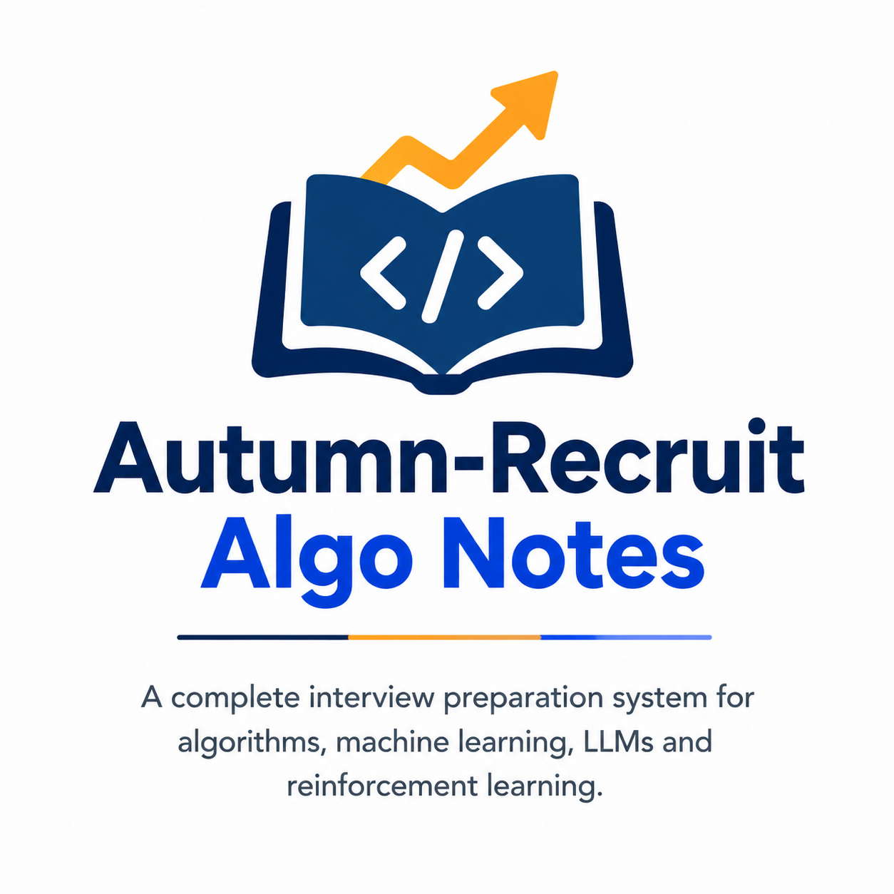

<p align="center">
  
</p>

<h1 align="center">🎯 Autumn-Recruit Algo Notes</h1>

<p align="center">
  <b>面向大模型时代的算法、工程与 AI 学习共建仓库</b><br/>
  从数学基础、数据结构，到机器学习、深度学习、LLM、Agent、AI-Infra、语音与数据科学，
  通过「理解 → 推导 → 手写 → 运行 → 验证 → 复盘」构建可持续迭代的知识体系。
</p>

<p align="center">
  
  
  
  
  
  
</p>

---

## 🌱 为什么做这个项目

学习算法和 AI，往往会遇到三个问题：

1. **资料很多，但知识之间缺少连接**：公式、代码、论文、工程实践和面试题分散在不同地方；
2. **看懂不等于会做**：读过推导，未必能独立写出实现；跑过代码，也未必真正理解为什么这样设计；
3. **技术变化太快**：大模型、Agent、推理优化、具身智能等方向不断演进，静态的学习清单很快会过时。

这个仓库尝试把学习过程整理成一条可执行、可验证、可复盘的路径：

> **把知识讲清楚，把公式写出来，把代码跑起来，把结果验证掉，再把自己的理解沉淀下来。**

它不是一份“标准答案”，也不是一个已经完成的教材，而是一个持续建设中的公开学习基地。内容中难免存在不准确、不完整或可以改进的地方，欢迎大家指出问题、补充案例、分享经验，一起把它变得更好。

---

## 🚀 项目愿景

我们希望把这个仓库逐步建设成一个：

- **对初学者友好**：尽量用直觉、生活类比和小例子解释抽象概念；
- **对进阶者有用**：保留公式、边界条件、实现细节、复杂度和工程权衡；
- **对面试准备有效**：能够从一个知识点延伸到手撕代码、系统设计和追问；
- **对实践者可验证**：代码尽量自包含、可运行、有断言、有数值对照；
- **对社区开放共建**：欢迎不同背景的学习者贡献内容、勘误、图示和实践经验；
- **能够持续迭代**：随着模型、工具和工程范式变化，持续更新目录、案例和学习方法。

如果这个项目对你有帮助，欢迎：

- 点一个 Star，帮助更多同学发现它；
- 提交 Issue，指出错误、过时内容或难以理解的地方；
- 提交 Pull Request，补充推导、代码、图示、习题或工程经验；
- 分享你的学习路线和面试复盘，让体系获得更多真实反馈。

每一条认真反馈，都会帮助这个项目更接近“真正可学、可用、可复现”的目标。

---

## 🧭 大模型时代下，学习正在发生什么变化

传统学习往往是：找资料 → 阅读 → 做笔记 → 背诵。

在大模型时代，我们可以把学习升级为一个**人机协作、代码驱动、持续验证的闭环**：

```text
提出问题
   ↓
让模型帮助检索资料、解释概念、比较方案
   ↓
自己追问假设、边界和反例
   ↓
把公式翻译成最小可运行代码
   ↓
用实验、断言、可视化验证理解
   ↓
与框架实现、论文结论或真实数据对照
   ↓
整理成自己的笔记、模板和面试表达
   ↓
分享给他人，接受反馈，再次修订
```

### 这套新范式的核心原则

#### 1. 不只问“答案是什么”，还要问“为什么”

大模型可以快速给出解释，但解释不一定正确，也不一定适合你的背景。建议继续追问：

- 这个结论依赖哪些假设？
- 如果输入规模、分布或硬件变化，会不会失效？
- 有没有反例？
- 公式中的每一个符号分别代表什么？
- 能否用一个最小例子验证？

#### 2. 不只阅读代码，还要让代码接受测试

一个算法是否真正理解，至少可以尝试：

- 用 NumPy 从零实现核心步骤；
- 与 sklearn、PyTorch 或参考实现对照；
- 固定随机种子，验证输出形状和数值；
- 构造边界样例，检查空输入、极端值和异常情况；
- 用图把中间过程展示出来。

#### 3. 不把大模型当作替代思考，而把它当作学习伙伴

大模型适合帮助我们：

- 解释难点、生成反例、模拟面试官；
- 检查代码、补充测试、比较实现；
- 把同一个概念换成不同层次的表达；
- 帮助整理知识图谱和复习计划。

但关键的判断、实验设计、结果核验和最终表达，仍然应该由学习者自己完成。

#### 4. 从“记住一个答案”转向“建立可迁移的模型”

真正有价值的不是背下某个模型的细节，而是理解：

- 它解决了什么问题？
- 为什么采用这个结构？
- 和前一代方法相比改进了什么？
- 代价是什么？
- 换到新的任务、数据或硬件上，如何调整？

---

## ✨ 内容特色

- **手写优先**：排序、DP、LR、SVM、PCA、GBDT、CNN、RNN、DQN、PPO、Transformer、KV Cache、FlashAttention 等尽量从零实现；
- **推导与直觉并重**：不仅给结论，也解释公式、变量、假设和推导过程；
- **代码可以运行**：Notebook 尽量自包含，配合固定随机种子、数值对照和安全断言；
- **图示帮助理解**：用流程图、结构图、时序图和实验曲线解释抽象概念；
- **连接学习与面试**：每个模块尽量包含高频问题、手撕清单、易错点和自测题；
- **关注工程现实**：讨论延迟、显存、吞吐、稳定性、可解释性、部署和数据问题；
- **持续吸收反馈**：内容不是一次性定稿，欢迎社区共同修正和扩展。

---

## 📊 当前规模

当前仓库包含 **23 个主题模块、232 篇教学 Notebook**，并持续增加中。

| 类别 | 内容 |
|---|---|
| 基础 | 数学基础、数据结构与算法、编程语言 |
| 理论与模型 | 机器学习、深度学习、优化算法、强化学习、推荐系统、图神经网络 |
| 大模型与智能体 | LLM 大模型、智能体开发、AI-Infra、多模态大模型 |
| 感知与交互 | 计算机视觉、自然语言处理、语音、具身智能 |
| 数据与工程 | 时间序列、数据分析、数据科学、大数据与数仓、八股与工程 |
| 复盘 | 面试复盘与个人学习记录 |

Notebook 数量会随着内容扩充而变化，README 中的统计是阶段性快照，具体以仓库目录为准。

---

## 🧩 模块总览

| 模块 | 主要内容 | 入口 |
|---|---|---|
| 00-数学基础 | 高数、线代、概率统计、信息论、最优化、机器人学基础 | [进入模块](00-数学基础/README.md) |
| 01-数据结构与算法 | 排序、哈希、链表、树、回溯、DP、图、堆、位运算 | [进入模块](01-数据结构与算法/README.md) |
| 02-机器学习 | 回归、分类、聚类、SVM、PCA、GBDT、树模型、特征工程 | [进入模块](02-机器学习/README.md) |
| 03-深度学习 | BP、CNN、RNN、LSTM、Transformer、Mamba、GAN、VAE、扩散 | [进入模块](03-深度学习/README.md) |
| 04-LLM大模型 | Transformer、预训练、LoRA、SFT、DPO、RAG、MoE、推理扩展 | [进入模块](04-LLM大模型/README.md) |
| 05-八股与工程 | Python、操作系统、网络、数据库、Redis、分布式、工程工具 | [进入模块](05-八股与工程/README.md) |
| 06-面试复盘 | 面试经历、问题记录、复盘模板和改进计划 | [进入模块](06-面试复盘/) |
| 07-强化学习 | MDP、DP、MC、TD、DQN、策略梯度、PPO、连续控制、多智能体、离线 RL | [进入模块](07-强化学习/README.md) |
| 08-优化算法 | 优化理论、梯度方法、二阶方法、约束优化与工程调参 | [进入模块](08-优化算法/README.md) |
| 09-计算机视觉 | CNN、检测、分割、视觉基础模型、3D 视觉、NeRF、3DGS | [进入模块](09-计算机视觉/README.md) |
| 10-自然语言处理 | 词向量、序列模型、文本分类、信息抽取、NLP 面试 | [进入模块](10-自然语言处理/README.md) |
| 11-时间序列 | 预测、异常检测、评估、特征工程和面试题 | [进入模块](11-时间序列/README.md) |
| 12-智能体开发 | ReAct、记忆、RAG、MCP、Coding Agent、评估、持续进化、多 Agent | [进入模块](12-智能体开发/README.md) |
| 13-编程语言 | Python、C++、ROS、Docker、Git、SQL、Linux、Go、Java | [进入模块](13-编程语言/README.md) |
| 14-具身智能 | 机器人、感知、规划控制、VLA、仿真、数据与 sim2real | [进入模块](14-具身智能/README.md) |
| 15-AI-Infra | 推理引擎、GEMM、混合精度、并行训练、NCCL、KV Cache、量化、FlashAttention | [进入模块](15-AI-Infra/README.md) |
| 16-语音 | 信号处理、ASR、TTS、语音增强、声纹、SVC、语音大模型 | [进入模块](16-语音/README.md) |
| 17-数据科学 | 统计推断、AB 实验、因果推断、实验评估与业务实践 | [进入模块](17-数据科学/README.md) |
| 18-数据分析 | 业务指标、数据处理、留存漏斗、RFM 分层、数据分析面试 | [进入模块](18-数据分析/README.md) |
| 19-推荐系统 | 召回、排序、CTR 预估、冷启动、多目标优化、评估指标 | [进入模块](19-推荐系统/README.md) |
| 20-多模态大模型 | CLIP、ViT、视觉语言模型、跨模态检索与生成 | [进入模块](20-多模态大模型/README.md) |
| 21-大数据与数仓 | Hadoop、Spark、Flink、Hive 数仓、Kafka、数据平台 | [进入模块](21-大数据与数仓/README.md) |
| 22-图神经网络与知识图谱 | 图表示、GCN/GAT/GraphSAGE、知识图谱构建与推理 | [进入模块](22-图神经网络与知识图谱/README.md) |

---

## 🗺️ 推荐学习路线

### 路线 A：算法与机器学习基础

```text
数学基础 → 数据结构与算法 → 机器学习 → 深度学习 → 经典模型面试
```

适合从基础开始建立完整算法直觉的同学。

### 路线 B：大模型应用与训练

```text
深度学习 → Transformer → LLM → 预训练/微调 → RAG → Agent → 评估与部署
```

适合希望理解大模型原理，并进一步做应用、训练或平台开发的同学。

### 路线 C：AI 工程与系统优化

```text
Python/C++/Linux → 操作系统与网络 → AI-Infra → 推理优化 → 分布式 → 性能分析
```

适合关注模型服务、推理效率、显存、吞吐和系统稳定性的同学。

### 路线 D：感知与具身智能

```text
数学/线代 → 计算机视觉 → 语音/NLP → 机器人学 → VLA → 仿真与 sim2real
```

适合希望把模型能力连接到视觉、语音、机器人和真实环境的同学。

完整阶段计划见 [ROADMAP.md](ROADMAP.md)。

---

## 🚀 快速开始

```bash
git clone https://github.com/Akun-python/autumn-recruitment.git
cd autumn-recruitment

# 建议使用 Python 3.9+
pip install numpy matplotlib jupyter nbclient

# 按需安装机器学习/深度学习依赖
pip install scikit-learn torch

# 打开一个 Notebook
jupyter notebook "18-数据分析/教学/03-留存分析与同期群.ipynb"
```

建议第一次学习时：

1. 先阅读 Markdown 中的问题和直觉解释；
2. 逐个 cell 运行代码，不要只看最终输出；
3. 修改一个参数，观察结果如何变化；
4. 尝试不看答案重新实现核心函数；
5. 完成每篇 Notebook 末尾的自测与面试题；
6. 把自己的理解、错误和补充记录到 `06-面试复盘`。

大部分示例使用合成数据或离线数据，不依赖联网下载。个别对照实验可能需要 `scikit-learn` 或 `torch`；GPU 通常不是运行基础示例的前提。

---

## ✅ 可验证性与质量标准

这个项目尽量把“能运行”作为学习内容的一部分，而不是事后检查：

- Notebook 从上到下执行，避免只验证零散 cell；
- 绘图 cell 显式使用 `plt.show()`，保证打开 Notebook 时能看到过程图；
- 关键数值使用断言、误差上限或参考实现进行对照；
- 随机实验尽量固定随机种子，方便复现；
- 发现错误时记录原因，而不是简单删除失败断言；
- 新增内容优先补充直觉、公式、代码、实验和自测，而不是只增加文字。

本地批量验证示例：

```bash
# 验证一个模块
python tools/_run_verify.py "15-AI-Infra/教学"

# 调试某个失败 Notebook
python tools/_debug_cell.py "15-AI-Infra/教学/05-KV Cache与推理内存.ipynb"
```

如果你的环境中没有 `a` 命令，请使用：

```bash
python tools/_run_verify.py "15-AI-Infra/教学"
```

验证结果和 Notebook 数量会随仓库更新而变化，请以最新运行结果为准。

---

## 🤝 欢迎加入共建

这是一个开放式学习项目，欢迎不同阶段的同学参与。你不需要一次性完成大型贡献，一个小修正也很有价值：

### 适合贡献的内容

- 修正公式、代码、错别字或过时表述；
- 补充容易理解的类比、反例和边界条件；
- 增加 NumPy 手写实现、数值验证或可视化；
- 补充面试追问、手撕题和真实项目经验；
- 更新论文、模型、工具链和工程实践；
- 改善 Notebook 顺序、排版、字体和可读性；
- 增加测试、验证脚本和复现说明；
- 分享适合不同基础的学习路线。

### 提交 Issue 时可以提供

```text
问题位置：文件名 / Notebook / cell 或行号
问题描述：哪里不准确、难理解或无法运行
复现环境：Python、主要依赖和操作系统
建议方案：如果已经有修复思路，可以一并说明
```

### 提交 Pull Request 的建议

1. 一个 PR 尽量聚焦一个主题；
2. 新增 Notebook 尽量包含直觉、公式、代码、输出和自测；
3. 代码应尽量离线可运行，并固定随机种子；
4. 绘图请显式调用 `plt.show()`，并注意中文字体；
5. 修改后运行对应模块的验证脚本；
6. 在 PR 描述中说明改了什么、如何验证、是否有已知限制。

无论是刚开始学习，还是已经有丰富工程经验，都欢迎参与。我们会尽量以开放、友善、尊重事实和鼓励讨论的方式交流。

---

## 🔄 持续更新计划

项目会围绕以下方向持续迭代：

- 补足基础模块之间的知识连接；
- 更新大模型、Agent、推理优化和多模态内容；
- 增加更多小型、可复现、无需大算力的实验；
- 完善 Notebook 的可执行性、断言和输出；
- 建立更清晰的学习路线、难度标记和先修关系；
- 收集社区反馈，定期清理过时内容和不准确表述；
- 逐步补充真实项目中的数据、部署、监控和故障排查案例。

技术会变化，知识体系也应该变化。这个仓库不会追求“一次写完”，而是希望在持续使用和持续反馈中逐步成长。

---

## 📚 相关文档

- [学习路线与阶段计划](ROADMAP.md)
- [项目许可证](LICENSE)
- 各模块目录下的 `README.md`
- 各模块目录下的 `高频面试题.md`、`专题笔记.md` 与 `教学/`
- [GitHub Issues](https://github.com/Akun-python/autumn-recruitment/issues)

---

## 🙏 免责声明

这是一个个人发起、社区共建的学习资料仓库，内容主要用于学习、交流和面试准备，不构成任何岗位、课程或考试承诺。部分内容来自公开资料的整理与二次表达，引用或配图如有遗漏、错误或版权问题，欢迎通过 Issue 联系，我们会及时核查和修正。

项目中的示例代码以教学清晰和可复现为优先，不代表生产环境的完整方案。用于真实系统前，请结合具体场景进行安全、性能、稳定性和合规性评估。

---

## 📄 License

本项目遵循 [MIT License](LICENSE)。欢迎学习、引用、修改和贡献；使用时请保留原项目说明，并尊重各个子项目、论文和配图的原始许可。

<p align="center">
  <br/>
  <b>欢迎交流，欢迎纠错，欢迎共建。</b><br/>
  <sub>愿我们一起把“知道一个概念”，变成“能够解释、能够实现、能够验证、能够迁移”。</sub>
</p>
